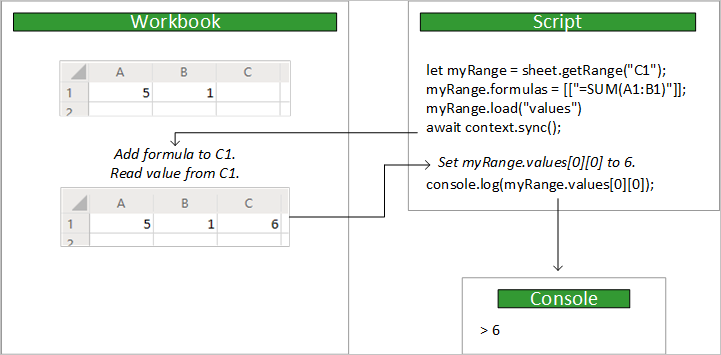

# <a name="using-the-office-scripts-async-apis-to-support-legacy-scripts"></a>Uso de las API asincrónicas de scripts de Office para admitir scripts heredados

En este artículo se explica cómo escribir scripts mediante el uso de las API heredadas, asincrónicas. Estas API tienen la misma funcionalidad principal que las API de scripts de Office estándar y sincrónicas, pero requieren que el script controle la sincronización de datos entre el script y el libro.

> [!IMPORTANT]
> El modelo Async solo se puede usar con scripts creados antes de la implementación del [modelo de API](scripting-fundamentals.md?view=office-scripts)actual. Los scripts se bloquean permanentemente en el modelo de API que tienen tras la creación. Esto también significa que si desea convertir un script heredado en el nuevo modelo, debe usar un nuevo script de marca. Le recomendamos que actualice los scripts antiguos al nuevo modelo cuando realice cambios, ya que el modelo actual es más fácil de usar. La sección [convertir secuencias de comandos asincrónicas heredadas en el modelo actual](#converting-legacy-async-scripts-to-the-current-model) tiene consejos sobre cómo realizar esta transición.

## <a name="main-function"></a>Función `main`

Los scripts que usan las API asincrónicas tienen una `main` función diferente. Es una `async` función que tiene un `Excel.RequestContext` como el primer parámetro.

```TypeScript
async function main(context: Excel.RequestContext) {
    // Your async Office Script
}
```

## <a name="context"></a>Context

La función `main` acepta un parámetro de `Excel.RequestContext`, denominado `context`. Considere `context` como el puente entre el script y el libro. El script obtiene acceso al libro con el objeto `context` y usa ese `context` para enviar datos hacia adelante y hacia atrás.

El objeto `context` es necesario porque el script y Excel se ejecutan en diferentes procesos y ubicaciones. El script tendrá que realizar cambios o consultar datos en el libro en la nube. El objeto `context` administra estas transacciones.

## <a name="sync-and-load"></a>Sync y Load

Como el script y el libro se ejecutan en distintas ubicaciones, cualquier transferencia de datos entre ambos necesita tiempo. En la API asincrónica, los comandos se ponen en cola hasta que el script llame explícitamente `sync` a la operación para sincronizar el script y el libro. El script puede funcionar de forma independiente hasta que necesite realizar cualquiera de las siguientes acciones:

- Lea los datos del libro (después de una operación `load` o método que devuelve un [ClientResult](/javascript/api/office-scripts/excelscript/excelscript.clientresult?view=office-scripts-async)).
- Escribir datos en el libro (por lo general, porque el script ha terminado).

En la imagen siguiente se muestra un ejemplo de flujo de control entre el script y el libro:



### <a name="sync"></a>Sync

Siempre que el script asincrónico necesite leer datos de un libro o escribir datos en él, llame al `RequestContext.sync` método como se muestra a continuación:

```TypeScript
await context.sync();
```

> [!NOTE]
> Se llama de forma implícita a `context.sync()` cuando finaliza un script.

Una vez completada la operación `sync`, el libro se actualiza para reflejar las operaciones de escritura que haya especificado el script. Una operación de escritura consiste en establecer cualquier propiedad en un objeto de Excel (por ejemplo, `range.format.fill.color = "red"`) o llamar a un método para cambiar una propiedad (por ejemplo, `range.format.autoFitColumns()`). La operación `sync` también lee cualquier valor del libro solicitado por el script mediante una operación `load` o un método que devuelve un `ClientResult`(como se describe en la sección siguiente).

Sincronizar el script con el libro puede tardar un tiempo, según la red. Minimice el número de `sync` llamadas para ayudar a que el script se ejecute rápidamente. De lo contrario, las API asincrónicas no son más rápidas las API estándar y sincrónicas.

### <a name="load"></a>Load

Un script asincrónico debe cargar datos del libro antes de leerlo. Sin embargo, si se cargan datos de todo el libro, se reduce en gran medida la velocidad del script. El `load` método permite que su script indique específicamente qué datos deben recuperarse del libro.

El método `load` está disponible en cada objeto de Excel. El script debe cargar las propiedades de un objeto antes de poder leerlas. Si no lo hace, se producirá un error.

Los ejemplos siguientes usan un objeto `Range` para mostrar las tres formas en que se puede usar el método `load` para cargar datos.

|Objetivo |Comando de ejemplo | Efecto |
|:--|:--|:--|
|Cargar una propiedad |`myRange.load("values");` | Carga una única propiedad, en este caso la matriz bidimensional de valores en este rango. |
|Cargar varias propiedades |`myRange.load("values, rowCount, columnCount");`| Carga todas las propiedades de una lista delimitada por comas, en este ejemplo, los valores, el número de filas y el número de columnas. |
|Cargar todo | `myRange.load();`|Carga todas las propiedades en el rango. Esta solución no se recomienda, ya que ralentizará el script al obtener datos innecesarios. Úsela solamente mientras prueba el script o si necesita todas las propiedades del objeto. |

El script debe llamar a `context.sync()` antes de leer cualquier valor cargado.

```TypeScript
/**
 * This script uses the async API to get the row count for a range.
 * It shows how to load a property in the async model.
 */
async function main(context: Excel.RequestContext) {
    let selectedSheet = context.workbook.worksheets.getActiveWorksheet();
    let range = selectedSheet.getRange("A1:B3");

    // Load the property.
    range.load("rowCount");

    // Synchronize with the workbook to get the property.
    await context.sync();

    // Read and log the property value (3).
    console.log(range.rowCount);
}
```

También puede cargar propiedades de toda la colección. Cada objeto de colección de la API asincrónica tiene una `items` propiedad que es una matriz que contiene los objetos de esa colección. El uso de `items` como inicio de una llamada jerárquica (`items\myProperty`) a `load` carga las propiedades especificadas en cada uno de esos elementos. El ejemplo siguiente carga la propiedad `resolved` en cada objeto `Comment` del objeto `CommentCollection` de una hoja de cálculo.

```TypeScript
/**
 * This script uses the async API to get resolved property on every comment in the worksheet.
 * It shows how to load a property from every object in a collection.
 */
async function main(context: Excel.RequestContext){
    let selectedSheet = context.workbook.worksheets.getActiveWorksheet();
    let comments = selectedSheet.comments;

    // Load the `resolved` property from every comment in this collection.
    comments.load("items/resolved");

    // Synchronize with the workbook to get the properties.
    await context.sync();
}
```

### <a name="clientresult"></a>ClientResult

Los métodos de la API asíncrona que devuelven información del libro tienen un patrón similar al `load` / `sync` paradigma. Por ejemplo, `TableCollection.getCount` obtiene el número de tablas de la colección. `getCount`devuelve a `ClientResult<number>` , lo que significa que la `value` propiedad en el devuelto [`ClientResult`](/javascript/api/office-scripts/excelscript/excelscript.clientresult?view=office-scripts-async) es un número. El script no puede acceder a ese valor hasta que se llama a `context.sync()`. De forma muy similar a la carga de una propiedad, el `value` es un valor local "vacío" hasta esa llamada `sync`.

El siguiente script obtiene el número total de tablas en el libro y registra ese número en la consola.

```TypeScript
/**
 * This script uses the async API to get the table count of the workbook.
 * It shows how ClientResult objects return workbook information.
 */
async function main(context: Excel.RequestContext) {
    let tableCount = context.workbook.tables.getCount();

    // This sync call implicitly loads tableCount.value.
    // Any other ClientResult values are loaded too.
    await context.sync();

    // Trying to log the value before calling sync would throw an error.
    console.log(tableCount.value);
}
```

## <a name="converting-legacy-async-scripts-to-the-current-model"></a>Conversión de scripts asincrónicos heredados al modelo actual

El modelo de API actual no usa `load` , `sync` o a `RequestContext` . Esto hace que los scripts sean mucho más fáciles de escribir y mantener. El mejor recurso para convertir secuencias de comandos antiguas es [desbordamiento de pila](https://stackoverflow.com/questions/tagged/office-scripts). Allí puede solicitar ayuda a la comunidad para escenarios específicos. Las siguientes instrucciones le ayudarán a describir los pasos generales que tendrá que realizar.

1. Cree un nuevo script y copie en él el código asincrónico anterior. Asegúrese de no incluir la firma del `main` método anterior, utilizando la actual `function main(workbook: ExcelScript.Workbook)` en su lugar.

2. Quite todas las `load` `sync` llamadas y. Ya no son necesarios.

3. Se han quitado todas las propiedades. Ahora tiene acceso a los objetos mediante `get` y `set` métodos, por lo que tendrá que cambiar las referencias de propiedades a llamadas a métodos. Por ejemplo, en lugar de establecer el color de relleno de una celda mediante el acceso a propiedades como este: `mySheet.getRange("A2:C2").format.fill.color = "blue";` , ahora usará métodos como este:`mySheet.getRange("A2:C2").getFormat().getFill().setColor("blue");`

4. Las clases de colección se han reemplazado por matrices. Los `add` `get` métodos y de las clases de colección se movieron al objeto que poseía la colección, por lo que las referencias deben actualizarse en consecuencia. Por ejemplo, para obtener un gráfico denominado "MyChart" de la primera hoja de cálculo del libro, use el siguiente código: `workbook.getWorksheets()[0].getChart("MyChart");` . Tenga en cuenta el `[0]` para obtener acceso al primer valor de la `Worksheet[]` devuelta por `getWorksheets()` .

5. Se ha cambiado el nombre de algunos métodos para mayor claridad y se ha agregado para mayor comodidad. Consulte la referencia de la [API de scripts de Office](/javascript/api/office-scripts/overview?view=office-scripts) para obtener más información.

## <a name="office-scripts-async-api-reference-documentation"></a>Documentación de referencia de API asincrónica de scripts de Office

[!INCLUDE [Async reference documentation](../includes/async-reference-documentation-link.md)]
