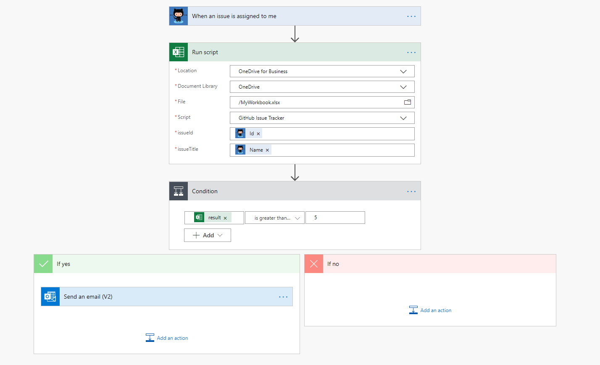

# <a name="run-office-scripts-with-power-automate"></a><span data-ttu-id="2c683-103">Ejecutar scripts de Office con Power automatization</span><span class="sxs-lookup"><span data-stu-id="2c683-103">Run Office Scripts with Power Automate</span></span>

<span data-ttu-id="2c683-104">La [automatización de energía](https://flow.microsoft.com) permite agregar scripts de Office a un flujo de trabajo más grande y automatizado.</span><span class="sxs-lookup"><span data-stu-id="2c683-104">[Power Automate](https://flow.microsoft.com) lets you add Office Scripts to a larger, automated workflow.</span></span> <span data-ttu-id="2c683-105">Puede usar la función automatizar acciones, como agregar el contenido de un correo electrónico a una tabla de una hoja de cálculo o crear acciones en las herramientas de administración de proyectos en función de los comentarios del libro.</span><span class="sxs-lookup"><span data-stu-id="2c683-105">You can use Power Automate do things like add the contents of an email to a worksheet's table or create actions in your project management tools based on workbook comments.</span></span>

## <a name="getting-started"></a><span data-ttu-id="2c683-106">Introducción</span><span class="sxs-lookup"><span data-stu-id="2c683-106">Getting started</span></span>

<span data-ttu-id="2c683-107">Si es la novedad de la automatización de energía, le recomendamos que visite [Introducción a Power Automate](/power-automate/getting-started).</span><span class="sxs-lookup"><span data-stu-id="2c683-107">If you are new to Power Automate, we recommend visiting [Get started with Power Automate](/power-automate/getting-started).</span></span> <span data-ttu-id="2c683-108">Aquí puede obtener más información sobre todas las posibilidades de automatización disponibles.</span><span class="sxs-lookup"><span data-stu-id="2c683-108">There, you can learn more about all the automation possibilities available to you.</span></span> <span data-ttu-id="2c683-109">Los documentos aquí se centran en cómo funcionan los scripts de Office con la automatización energética y cómo esto puede ayudar a mejorar la experiencia de Excel.</span><span class="sxs-lookup"><span data-stu-id="2c683-109">The documents here focus on how Office Scripts work with Power Automate and how that can help improve your Excel experience.</span></span>

<span data-ttu-id="2c683-110">Para empezar a combinar la automatización de la alimentación y los scripts de Office, siga el tutorial [comenzar a usar scripts con Power automatization](../tutorials/excel-power-automate-manual.md).</span><span class="sxs-lookup"><span data-stu-id="2c683-110">To begin combining Power Automate and Office Scripts, follow the tutorial [Start using scripts with Power Automate](../tutorials/excel-power-automate-manual.md).</span></span> <span data-ttu-id="2c683-111">Esto le enseñará a crear un flujo que llame a un script sencillo.</span><span class="sxs-lookup"><span data-stu-id="2c683-111">This will teach you how to create a flow that calls a simple script.</span></span> <span data-ttu-id="2c683-112">Una vez que haya completado ese tutorial y los [datos de paso a scripts en un tutorial de flujo automático de energía](../tutorials/excel-power-automate-trigger.md) , vuelva aquí para obtener información detallada sobre la conexión de scripts de Office a la automatización de flujos de alimentación.</span><span class="sxs-lookup"><span data-stu-id="2c683-112">After you've completed that tutorial and the [Pass data to scripts in an automatically-run Power Automate flow](../tutorials/excel-power-automate-trigger.md) tutorial, return here for detailed information about connecting Office Scripts to Power Automate flows.</span></span>

## <a name="excel-online-business-connector"></a><span data-ttu-id="2c683-113">Conector de Excel online (Business)</span><span class="sxs-lookup"><span data-stu-id="2c683-113">Excel Online (Business) connector</span></span>

<span data-ttu-id="2c683-114">Los [conectores](/connectors/connectors) son los puentes entre las aplicaciones y la automatización de la alimentación.</span><span class="sxs-lookup"><span data-stu-id="2c683-114">[Connectors](/connectors/connectors) are the bridges between Power Automate and applications.</span></span> <span data-ttu-id="2c683-115">El [conector de Excel online (Business)](/connectors/excelonlinebusiness) proporciona a los flujos acceso a los libros de Excel.</span><span class="sxs-lookup"><span data-stu-id="2c683-115">The [Excel Online (Business) connector](/connectors/excelonlinebusiness) gives your flows access to Excel workbooks.</span></span> <span data-ttu-id="2c683-116">La acción "ejecutar script" permite llamar a cualquier script de Office accesible a través del libro seleccionado.</span><span class="sxs-lookup"><span data-stu-id="2c683-116">The "Run script" action lets you call any Office Script accessible through the selected workbook.</span></span> <span data-ttu-id="2c683-117">También puede conceder a sus scripts los parámetros de entrada para que el flujo pueda proporcionar los datos o hacer que el script devuelva información para pasos posteriores en el flujo.</span><span class="sxs-lookup"><span data-stu-id="2c683-117">You can also give your scripts input parameters so data can be provided by the flow, or have your script return information for later steps in the flow.</span></span>

> [!IMPORTANT]
> <span data-ttu-id="2c683-118">La acción "ejecutar script" da a los usuarios que usan el conector de Excel acceso significativo al libro y a sus datos.</span><span class="sxs-lookup"><span data-stu-id="2c683-118">The "Run script" action gives people who use the Excel connector significant access to your workbook and its data.</span></span> <span data-ttu-id="2c683-119">Además, existen riesgos de seguridad con los scripts que realizan llamadas externas a la API, como se explica en [llamadas externas de la automatización de la alimentación](external-calls.md).</span><span class="sxs-lookup"><span data-stu-id="2c683-119">Additionally, there are security risks with scripts that make external API calls, as explained in [External calls from Power Automate](external-calls.md).</span></span> <span data-ttu-id="2c683-120">Si su administrador está preocupado por la exposición de datos extremadamente confidenciales, puede desactivar el conector de Excel online o restringir el acceso a los scripts de Office a través de los [controles de administrador de scripts de Office](/microsoft-365/admin/manage/manage-office-scripts-settings).</span><span class="sxs-lookup"><span data-stu-id="2c683-120">If your admin is concerned with the exposure of highly sensitive data, they can either turn off the Excel Online connector or restrict access to Office Scripts through the [Office Scripts administrator controls](/microsoft-365/admin/manage/manage-office-scripts-settings).</span></span>

## <a name="data-transfer-in-flows-for-scripts"></a><span data-ttu-id="2c683-121">Transferencia de datos en flujos para scripts</span><span class="sxs-lookup"><span data-stu-id="2c683-121">Data transfer in flows for scripts</span></span>

<span data-ttu-id="2c683-122">La automatización de energía permite pasar datos entre los pasos de su flujo.</span><span class="sxs-lookup"><span data-stu-id="2c683-122">Power Automate lets you pass pieces of data between steps of your flow.</span></span> <span data-ttu-id="2c683-123">Los scripts se pueden configurar para que acepten los tipos de información que necesite y devuelvan cualquier elemento del libro que desee en su flujo.</span><span class="sxs-lookup"><span data-stu-id="2c683-123">Scripts can be configured to accept whatever types of information you need and return anything from your workbook that you want in your flow.</span></span> <span data-ttu-id="2c683-124">La entrada para el script se especifica agregando parámetros a la `main` función (además de `workbook: ExcelScript.Workbook` ).</span><span class="sxs-lookup"><span data-stu-id="2c683-124">Input for your script is specified by adding parameters to the `main` function (in addition to `workbook: ExcelScript.Workbook`).</span></span> <span data-ttu-id="2c683-125">El resultado del script se declara agregando un tipo de valor devuelto a `main` .</span><span class="sxs-lookup"><span data-stu-id="2c683-125">Output from the script is declared by adding a return type to `main`.</span></span>

> [!NOTE]
> <span data-ttu-id="2c683-126">Cuando se crea un bloque "Run script" en el flujo, se rellenan los parámetros aceptados y los tipos devueltos.</span><span class="sxs-lookup"><span data-stu-id="2c683-126">When you create a "Run Script" block in your flow, the accepted parameters and returned types are populated.</span></span> <span data-ttu-id="2c683-127">Si cambia los parámetros o tipos de valores devueltos del script, deberá rehacer el bloque "ejecutar script" del flujo.</span><span class="sxs-lookup"><span data-stu-id="2c683-127">If you change the parameters or return types of your script, you'll need to redo the "Run script" block of your flow.</span></span> <span data-ttu-id="2c683-128">Esto garantiza que los datos se analizan correctamente.</span><span class="sxs-lookup"><span data-stu-id="2c683-128">This ensures the data is being parsed correctly.</span></span>

<span data-ttu-id="2c683-129">En las secciones siguientes se describen los detalles de entrada y salida de las secuencias de comandos que se usan en la automatización de la energía.</span><span class="sxs-lookup"><span data-stu-id="2c683-129">The following sections cover the details of input and output for scripts used in Power Automate.</span></span> <span data-ttu-id="2c683-130">Si desea obtener un enfoque práctico para aprender este tema, pruebe [a pasar los datos a los scripts en un tutorial de flujo de automatización de ejecución automática](../tutorials/excel-power-automate-trigger.md) o explorar el escenario de ejemplo de [avisos de tareas automatizadas](../resources/scenarios/task-reminders.md) .</span><span class="sxs-lookup"><span data-stu-id="2c683-130">If you'd like a hands-on approach to learning this topic, try out the [Pass data to scripts in an automatically-run Power Automate flow](../tutorials/excel-power-automate-trigger.md) tutorial or explore the [Automated task reminders](../resources/scenarios/task-reminders.md) sample scenario.</span></span>

### <a name="main-parameters-passing-data-to-a-script"></a><span data-ttu-id="2c683-131">`main` Parámetros: pasar datos a un script</span><span class="sxs-lookup"><span data-stu-id="2c683-131">`main` Parameters: Passing data to a script</span></span>

<span data-ttu-id="2c683-132">Todas las entradas de script se especifican como parámetros adicionales para la `main` función.</span><span class="sxs-lookup"><span data-stu-id="2c683-132">All script input is specified as additional parameters for the `main` function.</span></span> <span data-ttu-id="2c683-133">Por ejemplo, si desea que un script acepte un `string` que represente un nombre como entrada, cambiaría la `main` firma a `function main(workbook: ExcelScript.Workbook, name: string)` .</span><span class="sxs-lookup"><span data-stu-id="2c683-133">For example, if you wanted a script to accept a `string` that represents a name as input, you would change the `main` signature to `function main(workbook: ExcelScript.Workbook, name: string)`.</span></span>

<span data-ttu-id="2c683-134">Si está configurando un flujo con la automatización de la alimentación, puede especificar la entrada del script como valores estáticos, [expresiones](/power-automate/use-expressions-in-conditions)o contenido dinámico.</span><span class="sxs-lookup"><span data-stu-id="2c683-134">When you're configuring a flow in Power Automate, you can specify script input as static values, [expressions](/power-automate/use-expressions-in-conditions), or dynamic content.</span></span> <span data-ttu-id="2c683-135">Para obtener información sobre el conector de un servicio individual, vaya a la [documentación del conector Power Automated](/connectors/).</span><span class="sxs-lookup"><span data-stu-id="2c683-135">Details on an individual service's connector can be found in the [Power Automate Connector documentation](/connectors/).</span></span>

<span data-ttu-id="2c683-136">Al agregar parámetros de entrada a la función de una secuencia de comandos `main` , tenga en cuenta las siguientes restricciones y concesiones.</span><span class="sxs-lookup"><span data-stu-id="2c683-136">When adding input parameters to a script's `main` function, consider the following allowances and restrictions.</span></span>

1. <span data-ttu-id="2c683-137">El primer parámetro debe ser de tipo `ExcelScript.Workbook` .</span><span class="sxs-lookup"><span data-stu-id="2c683-137">The first parameter must be of type `ExcelScript.Workbook`.</span></span> <span data-ttu-id="2c683-138">El nombre del parámetro no importa.</span><span class="sxs-lookup"><span data-stu-id="2c683-138">Its parameter name does not matter.</span></span>

2. <span data-ttu-id="2c683-139">Cada parámetro debe tener un tipo (por ejemplo, `string` o `number` ).</span><span class="sxs-lookup"><span data-stu-id="2c683-139">Every parameter must have a type (such as `string` or `number`).</span></span>

3. <span data-ttu-id="2c683-140">`string` `number` `boolean` `any` `unknown` `object` `undefined` Se admiten los tipos básicos,,,,, y.</span><span class="sxs-lookup"><span data-stu-id="2c683-140">The basic types `string`, `number`, `boolean`, `any`, `unknown`, `object`, and `undefined` are supported.</span></span>

4. <span data-ttu-id="2c683-141">Se admiten las matrices de los tipos básicos enumerados anteriormente.</span><span class="sxs-lookup"><span data-stu-id="2c683-141">Arrays of the previously listed basic types are supported.</span></span>

5. <span data-ttu-id="2c683-142">Las matrices anidadas se admiten como parámetros (pero no como tipos devueltos).</span><span class="sxs-lookup"><span data-stu-id="2c683-142">Nested arrays are supported as parameters (but not as return types).</span></span>

6. <span data-ttu-id="2c683-143">Los tipos de Unión están permitidos si son una Unión de literales que pertenecen a un tipo único (como `"Left" | "Right"` ).</span><span class="sxs-lookup"><span data-stu-id="2c683-143">Union types are allowed if they are a union of literals belonging to a single type (such as `"Left" | "Right"`).</span></span> <span data-ttu-id="2c683-144">También se admiten las uniones de un tipo compatible con undefined (como `string | undefined` ).</span><span class="sxs-lookup"><span data-stu-id="2c683-144">Unions of a supported type with undefined are also supported (such as `string | undefined`).</span></span>

7. <span data-ttu-id="2c683-145">Los tipos de objeto están permitidos si contienen propiedades de tipo `string` ,, `number` `boolean` , matrices admitidas u otros objetos admitidos.</span><span class="sxs-lookup"><span data-stu-id="2c683-145">Object types are allowed if they contain properties of type `string`, `number`, `boolean`, supported arrays, or other supported objects.</span></span> <span data-ttu-id="2c683-146">En el ejemplo siguiente se muestran los objetos anidados que se admiten como tipos de parámetro:</span><span class="sxs-lookup"><span data-stu-id="2c683-146">The following example shows nested objects that are supported as parameter types:</span></span>

    ```TypeScript
    // Office Scripts can return an Employee object because Position only contains strings and numbers.
    interface Employee {
        name: string;
        job: Position;
    }

    interface Position {
        id: number;
        title: string;
    }
    ```

8. <span data-ttu-id="2c683-147">Los objetos deben tener su definición de interfaz o clase definida en el script.</span><span class="sxs-lookup"><span data-stu-id="2c683-147">Objects must have their interface or class definition defined in the script.</span></span> <span data-ttu-id="2c683-148">Un objeto también puede definirse de forma anónima en línea, como en el ejemplo siguiente:</span><span class="sxs-lookup"><span data-stu-id="2c683-148">An object can also be defined anonymously inline, as in the following example:</span></span>

    ```TypeScript
    function main(workbook: ExcelScript.Workbook): {name: string, email: string}
    ```

9. <span data-ttu-id="2c683-149">Los parámetros opcionales están permitidos y se pueden marcar como tales mediante el modificador Optional `?` (por ejemplo, `function main(workbook: ExcelScript.Workbook, Name?: string)` ).</span><span class="sxs-lookup"><span data-stu-id="2c683-149">Optional parameters are allowed and can be denoted as such by using the optional modifier `?` (for example, `function main(workbook: ExcelScript.Workbook, Name?: string)`).</span></span>

10. <span data-ttu-id="2c683-150">Se permiten los valores predeterminados de parámetro (por ejemplo,) `async function main(workbook: ExcelScript.Workbook, Name: string = 'Jane Doe')` .</span><span class="sxs-lookup"><span data-stu-id="2c683-150">Default parameter values are allowed (for example `async function main(workbook: ExcelScript.Workbook, Name: string = 'Jane Doe')`.</span></span>

### <a name="returning-data-from-a-script"></a><span data-ttu-id="2c683-151">Devolución de datos de un script</span><span class="sxs-lookup"><span data-stu-id="2c683-151">Returning data from a script</span></span>

<span data-ttu-id="2c683-152">Los scripts pueden devolver datos del libro que se van a usar como contenido dinámico en un flujo de automatización energética.</span><span class="sxs-lookup"><span data-stu-id="2c683-152">Scripts can return data from the workbook to be used as dynamic content in a Power Automate flow.</span></span> <span data-ttu-id="2c683-153">Al igual que con los parámetros de entrada, la automatización de energía coloca algunas restricciones en el tipo de valor devuelto.</span><span class="sxs-lookup"><span data-stu-id="2c683-153">As with input parameters, Power Automate places some restrictions on the return type.</span></span>

1. <span data-ttu-id="2c683-154">Se admiten los tipos básicos `string` , `number` ,, `boolean` `void` y `undefined` .</span><span class="sxs-lookup"><span data-stu-id="2c683-154">The basic types `string`, `number`, `boolean`, `void`, and `undefined` are supported.</span></span>

2. <span data-ttu-id="2c683-155">Los tipos de unión usados como tipos de valor devuelto siguen las mismas restricciones que los que se usan cuando se usan como parámetros de script.</span><span class="sxs-lookup"><span data-stu-id="2c683-155">Union types used as return types follow the same restrictions as they do when used as script parameters.</span></span>

3. <span data-ttu-id="2c683-156">Los tipos de matriz están permitidos si son del tipo `string` , `number` o `boolean` .</span><span class="sxs-lookup"><span data-stu-id="2c683-156">Array types are allowed if they are of type `string`, `number`, or `boolean`.</span></span> <span data-ttu-id="2c683-157">También se permiten si el tipo es una Unión compatible o un tipo literal admitido.</span><span class="sxs-lookup"><span data-stu-id="2c683-157">They are also allowed if the type is a supported union or supported literal type.</span></span>

4. <span data-ttu-id="2c683-158">Los tipos de objeto que se usan como tipos de valor devuelto siguen las mismas restricciones que cuando se usan como parámetros de script.</span><span class="sxs-lookup"><span data-stu-id="2c683-158">Object types used as return types follow the same restrictions as they do when used as script parameters.</span></span>

5. <span data-ttu-id="2c683-159">Se admite la escritura implícita, aunque debe seguir las mismas reglas que un tipo definido.</span><span class="sxs-lookup"><span data-stu-id="2c683-159">Implicit typing is supported, though it must follow the same rules as a defined type.</span></span>

## <a name="avoid-using-relative-references"></a><span data-ttu-id="2c683-160">Evitar el uso de referencias relativas</span><span class="sxs-lookup"><span data-stu-id="2c683-160">Avoid using relative references</span></span>

<span data-ttu-id="2c683-161">Power automaticing ejecuta el script en el libro de Excel elegido en su nombre.</span><span class="sxs-lookup"><span data-stu-id="2c683-161">Power Automate runs your script in the chosen Excel workbook on your behalf.</span></span> <span data-ttu-id="2c683-162">Es posible que el libro se cierre cuando esto suceda.</span><span class="sxs-lookup"><span data-stu-id="2c683-162">The workbook might be closed when this happens.</span></span> <span data-ttu-id="2c683-163">Cualquier API que se base en el estado actual del usuario, como `Workbook.getActiveWorksheet` , se producirá un error al ejecutarse a través de la automatización de la energía.</span><span class="sxs-lookup"><span data-stu-id="2c683-163">Any API that relies on the user's current state, such as `Workbook.getActiveWorksheet`, will fail when run through Power Automate.</span></span> <span data-ttu-id="2c683-164">Al diseñar los scripts, asegúrese de usar referencias absolutas para las hojas de cálculo y los rangos.</span><span class="sxs-lookup"><span data-stu-id="2c683-164">When designing your scripts, be sure to use absolute references for worksheets and ranges.</span></span>

<span data-ttu-id="2c683-165">Los siguientes métodos producirán un error y no se podrán realizar cuando se llame desde un script en un flujo de automatización de energía.</span><span class="sxs-lookup"><span data-stu-id="2c683-165">The following methods will throw an error and fail when called from a script in a Power Automate flow.</span></span>

| <span data-ttu-id="2c683-166">Class</span><span class="sxs-lookup"><span data-stu-id="2c683-166">Class</span></span> | <span data-ttu-id="2c683-167">Método</span><span class="sxs-lookup"><span data-stu-id="2c683-167">Method</span></span> |
|--|--|
| [<span data-ttu-id="2c683-168">Chart</span><span class="sxs-lookup"><span data-stu-id="2c683-168">Chart</span></span>](/javascript/api/office-scripts/excelscript/excelscript.chart) | `activate` |
| [<span data-ttu-id="2c683-169">Range</span><span class="sxs-lookup"><span data-stu-id="2c683-169">Range</span></span>](/javascript/api/office-scripts/excelscript/excelscript.range) | `select` |
| [<span data-ttu-id="2c683-170">Workbook</span><span class="sxs-lookup"><span data-stu-id="2c683-170">Workbook</span></span>](/javascript/api/office-scripts/excelscript/excelscript.workbook) | `getActiveCell` |
| [<span data-ttu-id="2c683-171">Workbook</span><span class="sxs-lookup"><span data-stu-id="2c683-171">Workbook</span></span>](/javascript/api/office-scripts/excelscript/excelscript.workbook) | `getActiveChart` |
| [<span data-ttu-id="2c683-172">Workbook</span><span class="sxs-lookup"><span data-stu-id="2c683-172">Workbook</span></span>](/javascript/api/office-scripts/excelscript/excelscript.workbook) | `getActiveSlicer` |
| [<span data-ttu-id="2c683-173">Workbook</span><span class="sxs-lookup"><span data-stu-id="2c683-173">Workbook</span></span>](/javascript/api/office-scripts/excelscript/excelscript.workbook) | `getActiveWorksheet` |
| [<span data-ttu-id="2c683-174">Workbook</span><span class="sxs-lookup"><span data-stu-id="2c683-174">Workbook</span></span>](/javascript/api/office-scripts/excelscript/excelscript.workbook) | `getSelectedRange` |
| [<span data-ttu-id="2c683-175">Workbook</span><span class="sxs-lookup"><span data-stu-id="2c683-175">Workbook</span></span>](/javascript/api/office-scripts/excelscript/excelscript.workbook) | `getSelectedRanges` |
| [<span data-ttu-id="2c683-176">Worksheet</span><span class="sxs-lookup"><span data-stu-id="2c683-176">Worksheet</span></span>](/javascript/api/office-scripts/excelscript/excelscript.workbook) | `activate` |

## <a name="example"></a><span data-ttu-id="2c683-177">Ejemplo</span><span class="sxs-lookup"><span data-stu-id="2c683-177">Example</span></span>

<span data-ttu-id="2c683-178">En la siguiente captura de pantalla se muestra un flujo de automatización de energía que se desencadena cuando se le asigna un problema de [GitHub](https://github.com/) .</span><span class="sxs-lookup"><span data-stu-id="2c683-178">The following screenshot shows a Power Automate flow that's triggered whenever a [GitHub](https://github.com/) issue is assigned to you.</span></span> <span data-ttu-id="2c683-179">El flujo ejecuta un script que agrega el problema a una tabla de un libro de Excel.</span><span class="sxs-lookup"><span data-stu-id="2c683-179">The flow runs a script that adds the issue to a table in an Excel workbook.</span></span> <span data-ttu-id="2c683-180">Si la tabla tiene cinco o más problemas, el flujo envía un aviso de correo electrónico.</span><span class="sxs-lookup"><span data-stu-id="2c683-180">If there are five or more issues in that table, the flow sends an email reminder.</span></span>



<span data-ttu-id="2c683-182">La `main` función del script especifica el identificador del problema y el título del problema como parámetros de entrada, y el script devuelve el número de filas de la tabla Issue.</span><span class="sxs-lookup"><span data-stu-id="2c683-182">The `main` function of the script specifies the issue ID and issue title as input parameters, and the script returns the number of rows in the issue table.</span></span>

```TypeScript
function main(
  workbook: ExcelScript.Workbook,
  issueId: string,
  issueTitle: string): number {
  // Get the "GitHub" worksheet.
  let worksheet = workbook.getWorksheet("GitHub");

  // Get the first table in this worksheet, which contains the table of GitHub issues.
  let issueTable = worksheet.getTables()[0];

  // Add the issue ID and issue title as a row.
  issueTable.addRow(-1, [issueId, issueTitle]);

  // Return the number of rows in the table, which represents how many issues are assigned to this user.
  return issueTable.getRangeBetweenHeaderAndTotal().getRowCount();
}
```

## <a name="see-also"></a><span data-ttu-id="2c683-183">Recursos adicionales</span><span class="sxs-lookup"><span data-stu-id="2c683-183">See also</span></span>

- [<span data-ttu-id="2c683-184">Ejecutar scripts de Office en Excel en la web con la automatización de energía</span><span class="sxs-lookup"><span data-stu-id="2c683-184">Run Office Scripts in Excel on the web with Power Automate</span></span>](../tutorials/excel-power-automate-manual.md)
- [<span data-ttu-id="2c683-185">Pasar datos a scripts en un flujo de Power Automate ejecutado automáticamente</span><span class="sxs-lookup"><span data-stu-id="2c683-185">Pass data to scripts in an automatically-run Power Automate flow</span></span>](../tutorials/excel-power-automate-trigger.md)
- [<span data-ttu-id="2c683-186">Conceptos básicos de los Scripts de Office en Excel en la web</span><span class="sxs-lookup"><span data-stu-id="2c683-186">Scripting fundamentals for Office Scripts in Excel on the web</span></span>](scripting-fundamentals.md)
- [<span data-ttu-id="2c683-187">Introducción a Power Automate</span><span class="sxs-lookup"><span data-stu-id="2c683-187">Get started with Power Automate</span></span>](/power-automate/getting-started)
- [<span data-ttu-id="2c683-188">Documentación de referencia de Excel online (Business) Connector</span><span class="sxs-lookup"><span data-stu-id="2c683-188">Excel Online (Business) connector reference documentation</span></span>](/connectors/excelonlinebusiness/)
