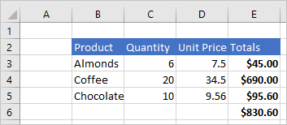

# <a name="scripting-fundamentals-for-office-scripts-in-excel-on-the-web-preview"></a><span data-ttu-id="c7913-103">Conceptos básicos de los scripts de Office en Excel en la Web (vista previa)</span><span class="sxs-lookup"><span data-stu-id="c7913-103">Scripting fundamentals for Office Scripts in Excel on the web (preview)</span></span>

<span data-ttu-id="c7913-104">En este artículo se presentan los aspectos técnicos de los scripts de Office.</span><span class="sxs-lookup"><span data-stu-id="c7913-104">This article will introduce you to the technical aspects of Office Scripts.</span></span> <span data-ttu-id="c7913-105">Obtendrá información sobre cómo funcionan conjuntamente los objetos de Excel y cómo se sincroniza el editor de código con un libro.</span><span class="sxs-lookup"><span data-stu-id="c7913-105">You'll learn how the Excel objects work together and how the Code Editor synchronizes with a workbook.</span></span>

[!INCLUDE [Preview note](../includes/preview-note.md)]

## <a name="main-function"></a><span data-ttu-id="c7913-106">`main` Función</span><span class="sxs-lookup"><span data-stu-id="c7913-106">`main` function</span></span>

<span data-ttu-id="c7913-107">Cada Script de Office debe contener una función `main` con el tipo de `ExcelScript.Workbook` como primer parámetro.</span><span class="sxs-lookup"><span data-stu-id="c7913-107">Each Office Script must contain a `main` function with the `ExcelScript.Workbook` type as its first parameter.</span></span> <span data-ttu-id="c7913-108">Cuando se ejecuta la función, la aplicación Excel invoca a esta función `main` al proporcionar el libro como primer parámetro.</span><span class="sxs-lookup"><span data-stu-id="c7913-108">When the function is executed, the Excel application invokes this `main` function by providing the workbook as its first parameter.</span></span> <span data-ttu-id="c7913-109">Por lo tanto, es importante no modificar la firma básica de la función `main` una vez que se haya grabado el script o se haya creado un nuevo script desde el editor de código.</span><span class="sxs-lookup"><span data-stu-id="c7913-109">Hence, it is important to not modify the basic signature of the `main` function once you have either recorded the script or created a new script from the code editor.</span></span>

```typescript
function main(workbook: ExcelScript.Workbook) {
  // Your code goes here
}
```

<span data-ttu-id="c7913-110">El código incluido en la función `main` se ejecuta cuando se ejecuta el script.</span><span class="sxs-lookup"><span data-stu-id="c7913-110">The code inside the `main` function runs when the script is run.</span></span> <span data-ttu-id="c7913-111">`main` puede llamar a otras funciones en el script, pero no se ejecutará el código que no esté contenido en una función.</span><span class="sxs-lookup"><span data-stu-id="c7913-111">`main` can call other functions in your script, but code that's not contained in a function will not run.</span></span>

> [!CAUTION]
> <span data-ttu-id="c7913-112">Si su función `main` es similar a `async function main(context: Excel.RequestContext)`, el script usa el modelo de API asincrónica antiguo.</span><span class="sxs-lookup"><span data-stu-id="c7913-112">If your `main` function looks like `async function main(context: Excel.RequestContext)`, your script is using the older async API model.</span></span> <span data-ttu-id="c7913-113">Para más información (incluido cómo convertir el script al modelo de API actual), consulte [Soporte de Scripts de Office antiguos que usan las API asincrónicas](excel-async-model.md).</span><span class="sxs-lookup"><span data-stu-id="c7913-113">For more information (including how to convert your script to the current API model), refer to [Support older Office Scripts that use the Async APIs](excel-async-model.md).</span></span>

## <a name="object-model"></a><span data-ttu-id="c7913-114">Modelo de objetos</span><span class="sxs-lookup"><span data-stu-id="c7913-114">Object model</span></span>

<span data-ttu-id="c7913-115">Para escribir un script, debe comprender cómo se encajan entre sí las API de Script de Office.</span><span class="sxs-lookup"><span data-stu-id="c7913-115">To write a script, you need to understand how the Office Script APIs fit together.</span></span> <span data-ttu-id="c7913-116">Los componentes de un libro tienen relaciones específicas entre sí.</span><span class="sxs-lookup"><span data-stu-id="c7913-116">The components of a workbook have specific relations to one another.</span></span> <span data-ttu-id="c7913-117">En muchos aspectos, estas relaciones coinciden con las de la Interfaz de Usuario de Excel.</span><span class="sxs-lookup"><span data-stu-id="c7913-117">In many ways, these relations match those of the Excel UI.</span></span>

- <span data-ttu-id="c7913-118">Un **Libro** contiene una o varias **Hojas de cálculo**.</span><span class="sxs-lookup"><span data-stu-id="c7913-118">A **Workbook** contains one or more **Worksheets**.</span></span>
- <span data-ttu-id="c7913-119">Una **Hoja de cálculo** proporciona acceso a las celdas mediante objetos de **Rango**.</span><span class="sxs-lookup"><span data-stu-id="c7913-119">A **Worksheet** gives access to cells through **Range** objects.</span></span>
- <span data-ttu-id="c7913-120">Un **Rango** representa un grupo de celdas adyacentes.</span><span class="sxs-lookup"><span data-stu-id="c7913-120">A **Range** represents a group of contiguous cells.</span></span>
- <span data-ttu-id="c7913-121">Los **Rangos** se usan para crear y colocar **Tablas**, **Gráficos**, **Formas** y otros objetos de visualización u organización de datos.</span><span class="sxs-lookup"><span data-stu-id="c7913-121">**Ranges** are used to create and place **Tables**, **Charts**, **Shapes**, and other data visualization or organization objects.</span></span>
- <span data-ttu-id="c7913-122">Una **Hoja de cálculo** contiene colecciones de aquellos objetos de datos presentes en la hoja individual.</span><span class="sxs-lookup"><span data-stu-id="c7913-122">A **Worksheet** contains collections of those data objects that are present in the individual sheet.</span></span>
- <span data-ttu-id="c7913-123">Los **Libros** contiene colecciones de algunos de esos objetos de datos (como **Tablas**) para todo el **Libro**.</span><span class="sxs-lookup"><span data-stu-id="c7913-123">**Workbooks** contain collections of some of those data objects (such as **Tables**) for the entire **Workbook**.</span></span>

### <a name="workbook"></a><span data-ttu-id="c7913-124">Libro de trabajo</span><span class="sxs-lookup"><span data-stu-id="c7913-124">Workbook</span></span>

<span data-ttu-id="c7913-125">Todas las secuencias de script proporcionan un objeto `workbook`de tipo`Workbook` por la función`main`.</span><span class="sxs-lookup"><span data-stu-id="c7913-125">Every script is provided a `workbook` object of type `Workbook` by the `main` function.</span></span> <span data-ttu-id="c7913-126">Esto representa el objeto de nivel superior con el cual su script interactúa con el libro de trabajo de Excel.</span><span class="sxs-lookup"><span data-stu-id="c7913-126">This represents the top level object through which your script interacts with the Excel workbook.</span></span>

<span data-ttu-id="c7913-127">El siguiente script obtiene la hoja de cálculo activa del libro y registra su nombre.</span><span class="sxs-lookup"><span data-stu-id="c7913-127">The following script gets the active worksheet from the workbook and logs its name.</span></span>

```typescript
function main(workbook: ExcelScript.Workbook) {
    // Get the active worksheet.
    let sheet = workbook.getActiveWorksheet();

    // Display the current worksheet's name.
    console.log(sheet.getName());
}
```

### <a name="ranges"></a><span data-ttu-id="c7913-128">Ranges</span><span class="sxs-lookup"><span data-stu-id="c7913-128">Ranges</span></span>

<span data-ttu-id="c7913-129">Un rango es un grupo de celdas adyacentes en el libro.</span><span class="sxs-lookup"><span data-stu-id="c7913-129">A range is a group of contiguous cells in the workbook.</span></span> <span data-ttu-id="c7913-130">Normalmente, los scripts usan la notación de estilo A1 (por ejemplo, **B3** para la única celda de la columna **B** y la fila **3** o **C2:F4** para las celdas de las columnas de **C** a **F** y las filas de **2** a **4**) para definir rangos.</span><span class="sxs-lookup"><span data-stu-id="c7913-130">Scripts typically use A1-style notation (e.g., **B3** for the single cell in column **B** and row **3** or **C2:F4** for the cells from columns **C** through **F** and rows **2** through **4**) to define ranges.</span></span>

<span data-ttu-id="c7913-131">Los rangos tienen tres propiedades fundamentales: valores, fórmulas y formato.</span><span class="sxs-lookup"><span data-stu-id="c7913-131">Ranges have three core properties: values, formulas, and format.</span></span> <span data-ttu-id="c7913-132">Estas propiedades obtienen o establecen los valores de celda, las fórmulas que se deben evaluar y el formato visual de las celdas.</span><span class="sxs-lookup"><span data-stu-id="c7913-132">These properties get or set the cell values, formulas to be evaluated, and the visual formatting of the cells.</span></span> <span data-ttu-id="c7913-133">Se obtiene acceso a ellos a través de `getValues`, `getFormulas`y `getFormat`.</span><span class="sxs-lookup"><span data-stu-id="c7913-133">They are accessed through `getValues`, `getFormulas`, and `getFormat`.</span></span> <span data-ttu-id="c7913-134">Se pueden cambiar los valores y las fórmulas con `setValues` y `setFormulas`, mientras que el formato es un objeto `RangeFormat` formado por varios objetos más pequeños que se configuran por separado.</span><span class="sxs-lookup"><span data-stu-id="c7913-134">Values and formulas can be changed with `setValues` and `setFormulas`, while the format is a `RangeFormat` object comprised of several smaller objects that are individually set.</span></span>

<span data-ttu-id="c7913-135">Los rangos usan matrices bidimensionales para administrar la información.</span><span class="sxs-lookup"><span data-stu-id="c7913-135">Ranges use two-dimensional arrays to manage information.</span></span> <span data-ttu-id="c7913-136">Para obtener más información sobre cómo administrar estas matrices en el marco de Scripts de Office, consulte la sección [que trabaja con rangos en el uso de objetos de JavaScript integrados en los scripts de Office](javascript-objects.md#working-with-ranges).</span><span class="sxs-lookup"><span data-stu-id="c7913-136">Read the [Working with ranges section of Using built-in JavaScript objects in Office Scripts](javascript-objects.md#working-with-ranges) for more information on handling those arrays in the Office Scripts framework.</span></span>

#### <a name="range-sample"></a><span data-ttu-id="c7913-137">Ejemplo de rango</span><span class="sxs-lookup"><span data-stu-id="c7913-137">Range sample</span></span>

<span data-ttu-id="c7913-138">En el siguiente ejemplo se muestra cómo crear registros de ventas.</span><span class="sxs-lookup"><span data-stu-id="c7913-138">The following sample shows how to create sales records.</span></span> <span data-ttu-id="c7913-139">Este script usa objetos `Range` para establecer los valores, fórmulas y formatos.</span><span class="sxs-lookup"><span data-stu-id="c7913-139">This script uses `Range` objects to set the values, formulas, and parts of the format.</span></span>

```TypeScript
function main(workbook: ExcelScript.Workbook) {
    // Get the active worksheet.
    let sheet = workbook.getActiveWorksheet();

    // Create the headers and format them to stand out.
    let headers = [["Product", "Quantity", "Unit Price", "Totals"]];
    let headerRange = sheet.getRange("B2:E2");
    headerRange.setValues(headers);
    headerRange.getFormat().getFill().setColor("#4472C4");
    headerRange.getFormat().getFont().setColor("white");

    // Create the product data rows.
    let productData = [
        ["Almonds", 6, 7.5],
        ["Coffee", 20, 34.5],
        ["Chocolate", 10, 9.56],
    ];
    let dataRange = sheet.getRange("B3:D5");
    dataRange.setValues(productData);

    // Create the formulas to total the amounts sold.
    let totalFormulas = [
        ["=C3 * D3"],
        ["=C4 * D4"],
        ["=C5 * D5"],
        ["=SUM(E3:E5)"],
    ];
    let totalRange = sheet.getRange("E3:E6");
    totalRange.setFormulas(totalFormulas);
    totalRange.getFormat().getFont().setBold(true);

    // Display the totals as US dollar amounts.
    totalRange.setNumberFormat("$0.00");
}
```

<span data-ttu-id="c7913-140">Al ejecutar este script se crean los siguientes datos en la hoja de cálculo actual:</span><span class="sxs-lookup"><span data-stu-id="c7913-140">Running this script creates the following data in the current worksheet:</span></span>



### <a name="charts-tables-and-other-data-objects"></a><span data-ttu-id="c7913-142">Gráficos, tablas y otros objetos de datos</span><span class="sxs-lookup"><span data-stu-id="c7913-142">Charts, tables, and other data objects</span></span>

<span data-ttu-id="c7913-143">Los scripts pueden crear y manipular las estructuras y visualizaciones de datos en Excel.</span><span class="sxs-lookup"><span data-stu-id="c7913-143">Scripts can create and manipulate the data structures and visualizations within Excel.</span></span> <span data-ttu-id="c7913-144">Las tablas y los gráficos son dos de los objetos más usados, pero las API son compatibles con tablas dinámicas, formas, imágenes, etc.</span><span class="sxs-lookup"><span data-stu-id="c7913-144">Tables and charts are two of the more commonly used objects, but the APIs support PivotTables, shapes, images, and more.</span></span> <span data-ttu-id="c7913-145">Se almacenan en colecciones, que se tratan más adelante en este artículo.</span><span class="sxs-lookup"><span data-stu-id="c7913-145">These are stored in collections, which will be discussed later in this article.</span></span>

#### <a name="creating-a-table"></a><span data-ttu-id="c7913-146">Crear una tabla</span><span class="sxs-lookup"><span data-stu-id="c7913-146">Creating a table</span></span>

<span data-ttu-id="c7913-147">Cree tablas con rangos con datos.</span><span class="sxs-lookup"><span data-stu-id="c7913-147">Create tables by using data-filled ranges.</span></span> <span data-ttu-id="c7913-148">El formato y los controles de tabla (como filtros) se aplican automáticamente al rango.</span><span class="sxs-lookup"><span data-stu-id="c7913-148">Formatting and table controls (such as filters) are automatically applied to the range.</span></span>

<span data-ttu-id="c7913-149">El siguiente script crea una tabla con los rangos del ejemplo anterior.</span><span class="sxs-lookup"><span data-stu-id="c7913-149">The following script creates a table using the ranges from the previous sample.</span></span>

```TypeScript
function main(workbook: ExcelScript.Workbook) {
    // Get the active worksheet.
    let sheet = workbook.getActiveWorksheet();

    // Add a table that has headers using the data from B2:E5.
    sheet.addTable("B2:E5", true);
}
```

<span data-ttu-id="c7913-150">Ejecutar este script en la hoja de cálculo con los datos anteriores crea la tabla siguiente:</span><span class="sxs-lookup"><span data-stu-id="c7913-150">Running this script on the worksheet with the previous data creates the following table:</span></span>


#### <a name="creating-a-chart"></a><span data-ttu-id="c7913-152">Crear un gráfico</span><span class="sxs-lookup"><span data-stu-id="c7913-152">Creating a chart</span></span>

<span data-ttu-id="c7913-153">Cree gráficos para visualizar los datos de un rango.</span><span class="sxs-lookup"><span data-stu-id="c7913-153">Create charts to visualize the data in a range.</span></span> <span data-ttu-id="c7913-154">Los scripts permiten decenas de tipos de gráficos, cada uno de los cuales se puede personalizar según sus necesidades.</span><span class="sxs-lookup"><span data-stu-id="c7913-154">Scripts allow for dozens of chart varieties, each of which can be customized to suit your needs.</span></span>

<span data-ttu-id="c7913-155">El siguiente script crea un gráfico de columnas simple para tres elementos y los coloca 100 píxeles por debajo de la parte superior de la hoja de cálculo.</span><span class="sxs-lookup"><span data-stu-id="c7913-155">The following script creates a simple column chart for three items and places it 100 pixels below the top of the worksheet.</span></span>

```TypeScript
function main(workbook: ExcelScript.Workbook) {
    // Get the active worksheet.
    let sheet = workbook.getActiveWorksheet();

    // Create a column chart using the data from B3:C5.
    let chart = sheet.addChart(
        ExcelScript.ChartType.columnStacked,
        sheet.getRange("B3:C5")
    );

    // Set the margin of the chart to be 100 pixels from the top of the screen.
    chart.setTop(100);
}
```

<span data-ttu-id="c7913-156">Ejecutar este script en la hoja de cálculo con la tabla anterior crea el gráfico siguiente:</span><span class="sxs-lookup"><span data-stu-id="c7913-156">Running this script on the worksheet with the previous table creates the following chart:</span></span>


### <a name="collections-and-other-object-relations"></a><span data-ttu-id="c7913-158">Colecciones y otras relaciones de objeto</span><span class="sxs-lookup"><span data-stu-id="c7913-158">Collections and other object relations</span></span>

<span data-ttu-id="c7913-159">Se puede acceder a cualquier objeto secundario a través de su objeto primario.</span><span class="sxs-lookup"><span data-stu-id="c7913-159">Any child object can be accessed through its parent object.</span></span> <span data-ttu-id="c7913-160">Por ejemplo, puede leer `Worksheets` del objeto `Workbook`.</span><span class="sxs-lookup"><span data-stu-id="c7913-160">For example, you can read `Worksheets` from the `Workbook` object.</span></span> <span data-ttu-id="c7913-161">Se producirá un método `get` relacionado en la clase principal (por ejemplo, `Workbook.getWorksheets()` o `Workbook.getWorksheet(name)`).</span><span class="sxs-lookup"><span data-stu-id="c7913-161">There will be a related `get` method on the parent class that (e.g., `Workbook.getWorksheets()` or `Workbook.getWorksheet(name)`).</span></span> <span data-ttu-id="c7913-162">Los métodos `get` que son singulares devuelven un único objeto y requieren un identificador o nombre para el objeto específico (como el nombre de una hoja de cálculo).</span><span class="sxs-lookup"><span data-stu-id="c7913-162">`get` methods that are singular return a single object and require an ID or name for the specific object (such as the name of a worksheet).</span></span> <span data-ttu-id="c7913-163">Los métodos `get`que están en plural devuelven la colección de objetos completa como una matriz.</span><span class="sxs-lookup"><span data-stu-id="c7913-163">`get` methods that are plural return the entire object collection as an array.</span></span> <span data-ttu-id="c7913-164">Si la colección está vacía, obtendrá una matriz vacía (`[]`).</span><span class="sxs-lookup"><span data-stu-id="c7913-164">If the collection is empty, you'll get an empty array (`[]`).</span></span>

<span data-ttu-id="c7913-165">Una vez que se ha recuperado la colección, puede usar operaciones de matriz normales como obtener su `length` o usar `for`, `for..of`,`while`bucles para la iteración o usar métodos de matriz TypeScript como `map`, `forEach` en ellas.</span><span class="sxs-lookup"><span data-stu-id="c7913-165">Once the collection is retrieved, you can use regular array operations such as getting its `length` or use `for`, `for..of`, `while` loops for iteration or use TypeScript array methods such as `map`, `forEach` on them.</span></span> <span data-ttu-id="c7913-166">También puede obtener acceso a objetos individuales de la colección con el valor del índice de matriz.</span><span class="sxs-lookup"><span data-stu-id="c7913-166">You can also access individual objects within the collection using the array index value.</span></span> <span data-ttu-id="c7913-167">Por ejemplo, `workbook.getTables()[0]` devuelve la primera tabla de la colección.</span><span class="sxs-lookup"><span data-stu-id="c7913-167">For example, `workbook.getTables()[0]` returns the first table in the collection.</span></span> <span data-ttu-id="c7913-168">Para obtener más información sobre la funcionalidad de estas matrices integradas en el marco de Scripts de Office, consulte la sección [que trabaja con rangos en el uso de objetos de JavaScript integrados en los scripts de Office ](javascript-objects.md#working-with-collections)</span><span class="sxs-lookup"><span data-stu-id="c7913-168">Read the [Working with collections section of Using built-in JavaScript objects in Office Scripts](javascript-objects.md#working-with-collections) to learn more about using built-in array functionality with the Office Scripts framework.</span></span>

<span data-ttu-id="c7913-169">El siguiente script obtiene todas las tablas del libro.</span><span class="sxs-lookup"><span data-stu-id="c7913-169">The following script gets all tables in the workbook.</span></span> <span data-ttu-id="c7913-170">Luego, asegura que se muestran los encabezados, que los botones de filtro están visibles y que el estilo de tabla está establecido en "TableStyleLight1".</span><span class="sxs-lookup"><span data-stu-id="c7913-170">It then ensures the headers are displays, the filter buttons are visible, and the table style is set to "TableStyleLight1".</span></span>

```typescript
function main(workbook: ExcelScript.Workbook) {
  /* Get table collection */
  const tables = workbook.getTables();
  /* Set table formatting properties */
  tables.forEach(table => {
    table.setShowHeaders(true);
    table.setShowFilterButton(true);
    table.setPredefinedTableStyle("TableStyleLight1");
  })
}
```

#### <a name="adding-excel-objects-with-a-script"></a><span data-ttu-id="c7913-171">Agregar objetos de Excel con un script</span><span class="sxs-lookup"><span data-stu-id="c7913-171">Adding Excel objects with a script</span></span>

<span data-ttu-id="c7913-172">Puede agregar mediante programación objetos de documento, como tablas o gráficos, llamando al método `add` correspondiente disponible en el objeto primario.</span><span class="sxs-lookup"><span data-stu-id="c7913-172">You can programmatically add document objects, such as tables or charts, by calling the corresponding `add` method available on the parent object.</span></span>

> [!NOTE]
> <span data-ttu-id="c7913-173">No agregue objetos manualmente a matrices de colección.</span><span class="sxs-lookup"><span data-stu-id="c7913-173">Do not manually add objects to collection arrays.</span></span> <span data-ttu-id="c7913-174">Usar los métodos `add` en los objetos primarios por ejemplo, agregue un `Table` a un `Worksheet` con el método `Worksheet.addTable`.</span><span class="sxs-lookup"><span data-stu-id="c7913-174">Use the `add` methods on the parent objects For example, add a `Table` to a `Worksheet` with the `Worksheet.addTable` method.</span></span>

<span data-ttu-id="c7913-175">El siguiente script crea una tabla en Excel en la primera hoja de cálculo del libro.</span><span class="sxs-lookup"><span data-stu-id="c7913-175">The following script creates a table in Excel on the first worksheet in the workbook.</span></span> <span data-ttu-id="c7913-176">Tenga en cuenta que el método `addTable` devuelve la tabla creada.</span><span class="sxs-lookup"><span data-stu-id="c7913-176">Note that the created table is returned by the `addTable` method.</span></span>

```typescript
function main(workbook: ExcelScript.Workbook) {
    // Get the first worksheet.
    let sheet = workbook.getWorksheets()[0];

    // Add a table that uses the data in C3:G10.
    let table = sheet.addTable(
      "C3:G10",
       true /* True because the table has headers. */
    );
}
```

## <a name="removing-excel-objects-with-a-script"></a><span data-ttu-id="c7913-177">Quitar objetos de Excel con un script</span><span class="sxs-lookup"><span data-stu-id="c7913-177">Removing Excel objects with a script</span></span>

<span data-ttu-id="c7913-178">Para eliminar un objeto, llame al método `delete`del objeto.</span><span class="sxs-lookup"><span data-stu-id="c7913-178">To delete an object, call the object's `delete` method.</span></span>

> [!NOTE]
> <span data-ttu-id="c7913-179">Al igual que con la adición de objetos, no elimine objetos de matrices de colecciones de forma manual.</span><span class="sxs-lookup"><span data-stu-id="c7913-179">As with adding objects, do not manually remove objects from collection arrays.</span></span> <span data-ttu-id="c7913-180">Use los métodos `delete` en los objetos de tipo de colección.</span><span class="sxs-lookup"><span data-stu-id="c7913-180">Use the `delete` methods on the collection-type objects.</span></span> <span data-ttu-id="c7913-181">Por ejemplo, quitar un `Table` de un `Worksheet` con `Table.delete`.</span><span class="sxs-lookup"><span data-stu-id="c7913-181">For example, remove a `Table` from a `Worksheet` using `Table.delete`.</span></span>

<span data-ttu-id="c7913-182">El siguiente script elimina la primera hoja de trabajo del libro de trabajo.</span><span class="sxs-lookup"><span data-stu-id="c7913-182">The following script removes the first worksheet in the workbook.</span></span>

```typescript
function main(workbook: ExcelScript.Workbook) {
    // Get first worksheet.
    let sheet = workbook.getWorksheets()[0];

    // Remove that worksheet from the workbook.
    sheet.delete();
}
```

### <a name="further-reading-on-the-object-model"></a><span data-ttu-id="c7913-183">Más información sobre el modelo de objetos</span><span class="sxs-lookup"><span data-stu-id="c7913-183">Further reading on the object model</span></span>

<span data-ttu-id="c7913-184">La [Documentación de referencia de las API de scripts de Office](/javascript/api/office-scripts/overview) es una lista completa de los objetos que se usan en los scripts de Office.</span><span class="sxs-lookup"><span data-stu-id="c7913-184">The [Office Scripts API reference documentation](/javascript/api/office-scripts/overview) is a comprehensive listing of the objects used in Office Scripts.</span></span> <span data-ttu-id="c7913-185">Allí, puede usar la tabla de contenido para navegar hasta cualquier clase de la que quiera obtener más información.</span><span class="sxs-lookup"><span data-stu-id="c7913-185">There, you can use the table of contents to navigate to any class you'd like to learn more about.</span></span> <span data-ttu-id="c7913-186">Las siguientes son algunas de las páginas habitualmente consultadas.</span><span class="sxs-lookup"><span data-stu-id="c7913-186">The following are several commonly viewed pages.</span></span>

- [<span data-ttu-id="c7913-187">Chart</span><span class="sxs-lookup"><span data-stu-id="c7913-187">Chart</span></span>](/javascript/api/office-scripts/excelscript/excelscript.chart)
- [<span data-ttu-id="c7913-188">Comment</span><span class="sxs-lookup"><span data-stu-id="c7913-188">Comment</span></span>](/javascript/api/office-scripts/excelscript/excelscript.comment)
- [<span data-ttu-id="c7913-189">PivotTable</span><span class="sxs-lookup"><span data-stu-id="c7913-189">PivotTable</span></span>](/javascript/api/office-scripts/excelscript/excelscript.pivottable)
- [<span data-ttu-id="c7913-190">Range</span><span class="sxs-lookup"><span data-stu-id="c7913-190">Range</span></span>](/javascript/api/office-scripts/excelscript/excelscript.range)
- [<span data-ttu-id="c7913-191">RangeFormat</span><span class="sxs-lookup"><span data-stu-id="c7913-191">RangeFormat</span></span>](/javascript/api/office-scripts/excelscript/excelscript.rangeformat)
- [<span data-ttu-id="c7913-192">Shape</span><span class="sxs-lookup"><span data-stu-id="c7913-192">Shape</span></span>](/javascript/api/office-scripts/excelscript/excelscript.shape)
- [<span data-ttu-id="c7913-193">Table</span><span class="sxs-lookup"><span data-stu-id="c7913-193">Table</span></span>](/javascript/api/office-scripts/excelscript/excelscript.table)
- [<span data-ttu-id="c7913-194">Workbook</span><span class="sxs-lookup"><span data-stu-id="c7913-194">Workbook</span></span>](/javascript/api/office-scripts/excelscript/excelscript.workbook)
- [<span data-ttu-id="c7913-195">Worksheet</span><span class="sxs-lookup"><span data-stu-id="c7913-195">Worksheet</span></span>](/javascript/api/office-scripts/excelscript/excelscript.worksheet)

## <a name="see-also"></a><span data-ttu-id="c7913-196">Consulta también</span><span class="sxs-lookup"><span data-stu-id="c7913-196">See also</span></span>

- [<span data-ttu-id="c7913-197">Grabar, editar y crear scripts de Office en Excel en la Web</span><span class="sxs-lookup"><span data-stu-id="c7913-197">Record, edit, and create Office Scripts in Excel on the web</span></span>](../tutorials/excel-tutorial.md)
- [<span data-ttu-id="c7913-198">Leer datos de libros con scripts de Office en Excel en la Web</span><span class="sxs-lookup"><span data-stu-id="c7913-198">Read workbook data with Office Scripts in Excel on the web</span></span>](../tutorials/excel-read-tutorial.md)
- [<span data-ttu-id="c7913-199">Referencia de API de scripts de Office</span><span class="sxs-lookup"><span data-stu-id="c7913-199">Office Scripts API reference</span></span>](/javascript/api/office-scripts/overview)
- [<span data-ttu-id="c7913-200">Usar objetos integrados de JavaScript en los scripts de Office</span><span class="sxs-lookup"><span data-stu-id="c7913-200">Using built-in JavaScript objects in Office Scripts</span></span>](javascript-objects.md)
