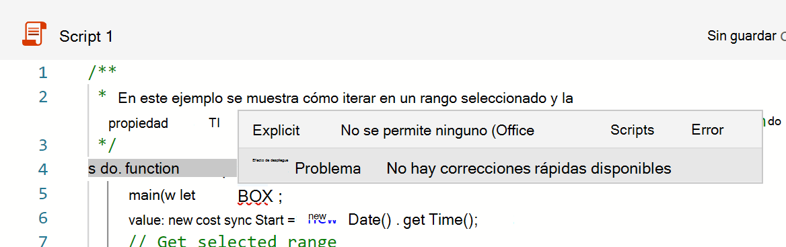

# Restricciones de TypeScript en scripts de OfficeTypeScript restrictions in Office Scripts

Los scripts de Office usan el lenguaje TypeScript.Office Scripts use the TypeScript language. En la mayoría de los casos, cualquier código TypeScript o JavaScript funcionará en un script de Office.For the most part, any TypeScript or JavaScript code will work in an Office Script. Sin embargo, hay algunas restricciones aplicadas por el Editor de código para garantizar que el script funciona de forma coherente y según lo previsto con el libro de Excel.However, there are a few restrictions enforced by the Code Editor to ensure your script works consistently and as intended with your Excel workbook.

## Ningún tipo "cualquiera" en scripts de OfficeNo 'any' type in Office Scripts

Escribir [tipos](https://www.typescriptlang.org/docs/handbook/typescript-in-5-minutes.html) es opcional en TypeScript, porque los tipos se pueden deducir.Writing [types](https://www.typescriptlang.org/docs/handbook/typescript-in-5-minutes.html) is optional in TypeScript, because the types can be inferred. Sin embargo, el script de Office requiere que una variable no pueda ser de [tipo alguno.](https://www.typescriptlang.org/docs/handbook/basic-types.html#any)However, Office Script requires that a variable can't be of [type any](https://www.typescriptlang.org/docs/handbook/basic-types.html#any). No se permiten explícitas `any` e implícitas en un script de Office.Both explicit and implicit `any` are not allowed in an Office Script. Estos casos se notifican como errores.These cases are reported as errors.

### Explicit `any`Explicit `any`

No puede declarar explícitamente una variable para que sea de tipo en scripts de `any` Office (es decir, `let someVariable: any;` ).You cannot explicitly declare a variable to be of type `any` in Office Scripts (that is, `let someVariable: any;`). El `any` tipo provoca problemas cuando Excel lo procesa.The `any` type causes issues when processed by Excel. Por ejemplo, `Range` un necesita saber que un valor es un , o `string` `number` `boolean` .For example, a `Range` needs to know that a value is a `string`, `number`, or `boolean`. Recibirá un error en tiempo de compilación (un error antes de ejecutar el script) si alguna variable se define explícitamente como el tipo `any` en el script.You will receive a compile-time error (an error prior to running the script) if any variable is explicitly defined as the `any` type in the script.

En la captura de pantalla `[5, 16] Explicit Any is not allowed` anterior, indica que la línea #5, la columna #16 el `any` tipo.In the above screenshot `[5, 16] Explicit Any is not allowed` indicates that line #5, column #16 defines `any` type. Esto le ayuda a localizar el error.This helps you locate the error.

Para evitar este problema, defina siempre el tipo de la variable.To get around this issue, always define the type of the variable. Si no está seguro del tipo de variable, puede usar un tipo [de unión.](https://www.typescriptlang.org/docs/handbook/unions-and-intersections.html)If you are uncertain about the type of a variable, you can use a [union type](https://www.typescriptlang.org/docs/handbook/unions-and-intersections.html). Esto puede ser útil para variables que tienen valores, que pueden ser de tipo , o (el tipo de valores es una `Range` `string` unión de los `number` `boolean` `Range` siguientes: `string | number | boolean` ).This can be useful for variables that hold `Range` values, which can be of type `string`, `number`, or `boolean` (the type for `Range` values is a union of those: `string | number | boolean`).

### Implícito `any`Implicit `any`

Los tipos de variables de TypeScript pueden ser [implícitamente](( https://www.typescriptlang.org/docs/handbook/type-inference.html) definidos.TypeScript variable types can be [implicitly]((https://www.typescriptlang.org/docs/handbook/type-inference.html) defined. Si el compilador de TypeScript no puede determinar el tipo de una variable (ya sea porque el tipo no está definido explícitamente o la inferencia de tipo no es posible), es un error implícito y recibirá un error en tiempo de `any` compilación.If the TypeScript compiler is unable to determine the type of a variable (either because type is not defined explicitly or type inference isn't possible), then it's an implicit `any` and you will receive a compilation-time error.

El caso más común en cualquier `any` implícito es en una declaración de variable, como `let value;` .The most common case on any implicit `any` is in a variable declaration, such as `let value;`. Hay dos formas de evitarlo:There are two ways to avoid this:

* Asignar la variable a un tipo de identificación implícita ( `let value = 5;` o `let value = workbook.getWorksheet();` ).Assign the variable to an implicitly identifiable type (`let value = 5;` or `let value = workbook.getWorksheet();`).
* Escriba explícitamente la variable ( `let value: number;` )Explicitly type the variable (`let value: number;`)

## No se heredan clases o interfaces de script de OfficeNo inheriting Office Script classes or interfaces

Las clases e interfaces que se crean en el script de Office no pueden [ampliar ni](https://www.typescriptlang.org/docs/handbook/classes.html#inheritance) implementar clases o interfaces de scripts de Office.Classes and interfaces that are created in your Office Script cannot [extend or implement](https://www.typescriptlang.org/docs/handbook/classes.html#inheritance) Office Scripts classes or interfaces. En otras palabras, nada en el `ExcelScript` espacio de nombres puede tener subclases o subinterfaces.In other words, nothing in the `ExcelScript` namespace can have subclasses or subinterfaces.

## Funciones de TypeScript incompatiblesIncompatible TypeScript functions

Las API de scripts de Office no se pueden usar en lo siguiente:Office Scripts APIs cannot be used in the following:

* [Funciones de generadorGenerator functions](https://developer.mozilla.org/docs/Web/JavaScript/Guide/Iterators_and_Generators#generator_functions)
* [Array.sortArray.sort](https://developer.mozilla.org/docs/Web/JavaScript/Reference/Global_Objects/Array/sort)

## `eval` no se admite`eval` is not supported

La función de [eval de](https://developer.mozilla.org/docs/Web/JavaScript/Reference/Global_Objects/eval) JavaScript no se admite por motivos de seguridad.The JavaScript [eval function](https://developer.mozilla.org/docs/Web/JavaScript/Reference/Global_Objects/eval) is not supported for security reasons.

## Identifers restringidosRestricted identifers

Las siguientes palabras no se pueden usar como identificadores en un script.The following words can't be used as identifiers in a script. Son términos reservados.They are reserved terms.

* `Excel`
* `ExcelScript`
* `console`

## Advertencias de rendimientoPerformance warnings

El [linter](https://wikipedia.org/wiki/Lint_(software)) del Editor de código proporciona advertencias si el script puede tener problemas de rendimiento.The Code Editor's [linter](https://wikipedia.org/wiki/Lint_(software)) gives warnings if the script might have performance issues. Los casos y cómo evitarlos se documentan en [Mejorar el rendimiento de los scripts de Office.](web-client-performance.md)The cases and how to work around them are documented in [Improve the performance of your Office Scripts](web-client-performance.md).

## Llamadas a API externasExternal API calls

Para [obtener más información, vea](external-calls.md) la compatibilidad con llamadas de API externas en scripts de Office.See [External API call support in Office Scripts](external-calls.md) for more information.

## Vea tambiénSee also

* [Conceptos básicos de los Scripts de Office en Excel en la webScripting fundamentals for Office Scripts in Excel on the web](scripting-fundamentals.md)
* [Mejorar el rendimiento de los scripts de OfficeImprove the performance of your Office Scripts](web-client-performance.md)
