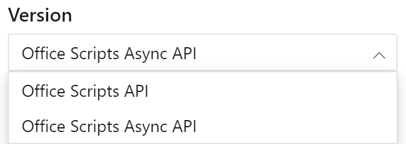

Use [este vínculo para ver la versión asincrónica de la documentación de referencia de la API](/javascript/api/office-scripts/excel?view=office-scripts-async). Puede alternar entre las API estándar y las versiones asincrónicas mediante el control de selección de versiones, encima de la tabla de contenido, en la documentación de referencia.

