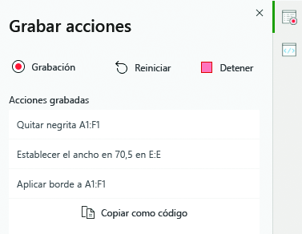

# Scripts de Office en Excel en la Web (vista previa)

Los scripts de Office en Excel en la Web le permiten automatizar las tareas cotidianas. Puede grabar las acciones de Excel con la Grabadora de acciones, lo que creará automáticamente un script. También puede crear y editar los scripts con el Editor de código. Puede compartir scripts en la organización para que los compañeros de trabajo también puedan automatizar sus flujos de trabajo.

En esta serie de documentos aprenderá a usar estas herramientas. Le presentaremos la Grabadora de acciones, para que pueda grabar las acciones que realiza en Excel de forma habitual. También le informaremos de cómo escribir o actualizar sus propios scripts con el Editor de código.

 

> [!VIDEO https://www.microsoft.com/videoplayer/embed/RE4qdFF]

[!INCLUDE [Preview note](../includes/preview-note.md)]

## Cuándo usar scripts de Office

Los scripts le permiten grabar una serie de acciones en Excel y repetirlas en diferentes libros y hojas de cálculo. Si nota que realiza las mismas acciones una y otra vez, un script de Office le permite reducir todo ese flujo de trabajo a un solo clic de botón.

Por ejemplo, imagine que comienza cada día de trabajo abriendo un archivo .csv desde un sitio de contabilidad en Excel. Acto seguido, tiene que invertir varios minutos en eliminar columnas innecesarias, aplicar formato a una tabla, agregar fórmulas y crear una tabla dinámica en una hoja de cálculo nueva. En vez de hacer estas tareas diariamente, puede hacerlas una vez y grabarlas con la Grabadora de acciones. Luego, ejecute el script y este se ocupará de transformar el archivo .csv automáticamente. No solo elimina el riesgo de olvidarse de algunos pasos, sino que también puede compartir su script con otras personas sin que tengan que entender todo el proceso. Los scripts de Office automatizan las tareas comunes para que usted y sus colegas sean más eficientes y productivos.

## Grabadora de acciones

La Grabadora de acciones graba las acciones que realiza en Excel y las traduce en un script. Cuando ejecute la Grabadora de acciones, esta capturará lo que usted haga en Excel, como editar las celdas, cambiar el formato y crear tablas. El script resultante se puede ejecutar en otros libros y hojas de cálculo para recrear las acciones grabadas.

## Editor de código

Todos los scripts registrados en la Grabadora de acciones se pueden editar con el Editor de código. Esto le permite modificar y personalizar el script para adecuarlo mejor a sus necesidades concretas. También puede agregar lógica y funciones que no son accesibles directamente desde la interfaz de usuario de Excel, como condicionales (si/si no) y bucles.

Una forma sencilla de descubrir de lo que son capaces los scripts de Office es grabar scripts en Excel en la Web y ver el código resultante. Una forma más detallada y estructurada de aprender es seguir nuestros [tutoriales](../tutorials/excel-tutorial.md).

## Compartir scripts

Los Scripts de Office se pueden compartir con otros usuarios de un libro de Excel. Al compartir un script con otros usuarios de un libro, el script se adjunta al libro. Los scripts se almacenan en su OneDrive y, cuando comparte uno, se crea un vínculo a él en el libro que ha abierto.

Puede obtener más información sobre scripts compartidos y no compartidos en el artículo [Compartir Scripts de Office en Excel para la web](https://support.microsoft.com/office/sharing-office-scripts-in-excel-for-the-web-226eddbc-3a44-4540-acfe-fccda3d1122b?storagetype=live&ui=en-US&rs=en-US&ad=US).

## Conectar Scripts de Office a Power Automate

[Power Automate](https://flow.microsoft.com/) es un servicio que le ayuda a crear flujos de trabajo automatizados entre varias aplicaciones y servicios. Es posible usar Scripts de Office en estos flujos de trabajo, lo que le proporciona el control de los scripts externos al libro. Puede ejecutar los scripts según una programación, activarlos como respuesta a mensajes de correo electrónico y mucho más. Visite el tutorial [Ejecutar Scripts de Office con Power Automate](../tutorials/excel-power-automate-manual.md) para conocer los conceptos básicos de la conexión de estos servicios de automatización.

## Siguientes pasos

Complete el [Tutorial de scripts de Office en Excel en la Web](../tutorials/excel-tutorial.md) para descubrir cómo crear sus primeros scripts de Office.

## Vea también

- [Conceptos básicos de los Scripts de Office en Excel en la web](../develop/scripting-fundamentals.md)
- [Referencia de API de scripts de Office](/javascript/api/office-scripts/overview)
- [Solución de problemas de scripts de Office](../testing/troubleshooting.md)
- [Configuración de scripts de Office en M365](https://support.office.com/article/office-scripts-settings-in-m365-19d3c51a-6ca2-40ab-978d-60fa49554dcf)
- [Introducción a los scripts de Office en Excel (en support.office.com)](https://support.office.com/article/introduction-to-office-scripts-in-excel-9fbe283d-adb8-4f13-a75b-a81c6baf163a)
- [Compartir Scripts de Office en Excel para la web](https://support.microsoft.com/office/sharing-office-scripts-in-excel-for-the-web-226eddbc-3a44-4540-acfe-fccda3d1122b?storagetype=live&ui=en-US&rs=en-US&ad=US)
