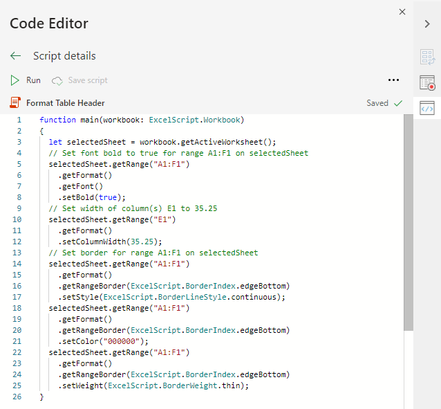

# Scripts de Office en Excel en la Web (vista previa)Office Scripts in Excel on the web (preview)

Los scripts de Office en Excel en la Web le permiten automatizar las tareas cotidianas.Office Scripts in Excel on the web let you automate your day-to-day tasks. Puede grabar las acciones de Excel con la Grabadora de acciones, lo que creará automáticamente un script.You can record your Excel actions with the Action Recorder, which creates a script. También puede crear y editar los scripts con el Editor de código.You can also create and edit scripts with the Code Editor. Puede compartir scripts en la organización para que los compañeros de trabajo también puedan automatizar sus flujos de trabajo.Your scripts can then be shared across your organization so your coworkers can also automate their workflows.

En esta serie de documentos aprenderá a usar estas herramientas.This series of documents teaches you how to use these tools. Le presentaremos la Grabadora de acciones, para que pueda grabar las acciones que realiza en Excel de forma habitual.You'll be introduced to the Action Recorder and see how to record your frequent Excel actions. También le informaremos de cómo escribir o actualizar sus propios scripts con el Editor de código.You'll also learn how to make or update your own scripts with the Code Editor.

 

> [!VIDEO https://www.microsoft.com/videoplayer/embed/RE4qdFF]

[!INCLUDE [Preview note](../includes/preview-note.md)]

## Cuándo usar scripts de OfficeWhen to use Office Scripts

Los scripts le permiten grabar una serie de acciones en Excel y repetirlas en diferentes libros y hojas de cálculo.Scripts allow you to record and replay your Excel actions on different workbooks and worksheets. Si ve que realiza las mismas acciones una y otra vez, puede convertir todo ese trabajo en un script de Office fácil de ejecutar.If you find yourself doing the same things over and over again, you can turn all that work into an easy-to-run Office Script. Ejecute el script con tan solo pulsar un botón en Excel o combínelo con Power Automate para agilizar todo el flujo de trabajo.Run your script with a button-press in Excel or combine it with Power Automate to streamline your entire workflow.

Por ejemplo, imagine que comienza cada día de trabajo abriendo un archivo .csv desde un sitio de contabilidad en Excel.As an example, say you start your work day by opening a .csv file from an accounting site in Excel. Acto seguido, tiene que invertir varios minutos en eliminar columnas innecesarias, aplicar formato a una tabla, agregar fórmulas y crear una tabla dinámica en una hoja de cálculo nueva.You then spend several minutes deleting unnecessary columns, formatting a table, adding formulas, and creating a PivotTable in a new worksheet. En vez de hacer estas tareas diariamente, puede hacerlas una vez y grabarlas con la Grabadora de acciones.Those actions you repeat daily can be recorded once with the Action Recorder. Luego, ejecute el script y este se ocupará de transformar el archivo .csv automáticamente.From then on, running the script will take care of your entire .csv conversion. No solo elimina el riesgo de olvidarse de algunos pasos, sino que también puede compartir su script con otras personas sin que tengan que entender todo el proceso.You'll not only remove the risk of forgetting steps, but be able to share your process with others without having to teach them anything. Los scripts de Office automatizan las tareas comunes para que usted y sus colegas sean más eficientes y productivos.Office Scripts automate your common tasks so you and your workplace can be more efficient and productive.

## Grabadora de accionesAction Recorder

La Grabadora de acciones graba las acciones que realiza en Excel y las guarda como un script.The Action Recorder records actions you take in Excel and saves them as a script. Cuando ejecute la Grabadora de acciones, esta capturará lo que usted haga en Excel, como editar las celdas, cambiar el formato y crear tablas.With the Action recorder running, you can capture the Excel actions as you edit cells, change formatting, and create tables. El script resultante se puede ejecutar en otros libros y hojas de cálculo para recrear las acciones grabadas.The resulting script can be run on other worksheets and workbooks to recreate your original actions.

## Editor de códigoCode Editor

Todos los scripts registrados en la Grabadora de acciones se pueden editar con el Editor de código.All scripts recorded with the Action Recorder can be edited through the Code Editor. Esto le permite modificar y personalizar el script para adecuarlo mejor a sus necesidades concretas.This lets you tweak and customize the script to better suit your exact needs. También puede agregar lógica y funciones que no son accesibles directamente desde la interfaz de usuario de Excel, como condicionales (si/si no) y bucles.You can also add logic and functionality that is not directly accessible through the Excel UI, such as conditional statements (if/else) and loops.

Una forma sencilla de descubrir de lo que son capaces los scripts de Office es grabar scripts en Excel en la Web y ver el código resultante.One easy way to start learning the capabilities of Office Scripts is to record scripts in Excel on the web and view the resulting code. Una forma más detallada y estructurada de aprender es seguir nuestros [tutoriales](../tutorials/excel-tutorial.md).Another option is to follow our [tutorials](../tutorials/excel-tutorial.md) to learn in a more guided and structured way.

## Compartir scriptsSharing scripts

Los Scripts de Office se pueden compartir con otros usuarios de un libro de Excel.Office Scripts can be shared with other users of an Excel workbook. Al compartir un script con otros usuarios de un libro, el script se adjunta al libro.When you share a script with others in a workbook, the script is attached to the workbook. Los scripts se almacenan en su OneDrive y, cuando comparte uno, se crea un vínculo a él en el libro que ha abierto.Your scripts are stored in your OneDrive, and when you share one, you create a link to it in the workbook you have open.

Puede obtener más información sobre scripts compartidos y no compartidos en el artículo [Compartir Scripts de Office en Excel para la web](https://support.microsoft.com/office/sharing-office-scripts-in-excel-for-the-web-226eddbc-3a44-4540-acfe-fccda3d1122b?storagetype=live&ui=en-US&rs=en-US&ad=US).More details about sharing and unsharing scripts can be in the article [Sharing Office Scripts in Excel for the Web](https://support.microsoft.com/office/sharing-office-scripts-in-excel-for-the-web-226eddbc-3a44-4540-acfe-fccda3d1122b?storagetype=live&ui=en-US&rs=en-US&ad=US).

## Conectar Scripts de Office a Power AutomateConnecting Office Scripts to Power Automate

[Power Automate](https://flow.microsoft.com/) es un servicio que le ayuda a crear flujos de trabajo automatizados entre varias aplicaciones y servicios.[Power Automate](https://flow.microsoft.com/) is a service that helps you create automated workflows between multiple apps and services. Es posible usar Scripts de Office en estos flujos de trabajo, lo que le proporciona el control de los scripts externos al libro.Office Scripts can be used in these workflows, giving you control of your scripts outside of the workbook. Puede ejecutar los scripts según una programación, activarlos como respuesta a mensajes de correo electrónico y mucho más.You can run your scripts on a schedule, trigger them in response to emails, and much more. Visite el tutorial [Ejecutar Scripts de Office con Power Automate](../tutorials/excel-power-automate-manual.md) para conocer los conceptos básicos de la conexión de estos servicios de automatización.Visit the [Run Office Scripts in Excel on the web with Power Automate](../tutorials/excel-power-automate-manual.md) tutorial to learn the basics of connecting these automation services.

## Siguientes pasosNext steps

Complete el [Tutorial de scripts de Office en Excel en la Web](../tutorials/excel-tutorial.md) para descubrir cómo crear sus primeros scripts de Office.Complete the [Office Scripts in Excel on the web tutorial](../tutorials/excel-tutorial.md) to learn how to create your first Office Scripts.

## Vea tambiénSee also

- [Conceptos básicos de los Scripts de Office en Excel en la webScripting fundamentals for Office Scripts in Excel on the web](../develop/scripting-fundamentals.md)
- [Referencia de API de scripts de OfficeOffice Scripts API reference](/javascript/api/office-scripts/overview)
- [Solución de problemas de scripts de OfficeTroubleshooting Office Scripts](../testing/troubleshooting.md)
- [Configuración de scripts de Office en M365Office Scripts settings in M365](https://support.office.com/article/office-scripts-settings-in-m365-19d3c51a-6ca2-40ab-978d-60fa49554dcf)
- [Introducción a los scripts de Office en Excel (en support.office.com)Introduction to Office Scripts in Excel (on support.office.com)](https://support.office.com/article/introduction-to-office-scripts-in-excel-9fbe283d-adb8-4f13-a75b-a81c6baf163a)
- [Compartir Scripts de Office en Excel para la webSharing Office Scripts in Excel for the Web](https://support.microsoft.com/office/sharing-office-scripts-in-excel-for-the-web-226eddbc-3a44-4540-acfe-fccda3d1122b?storagetype=live&ui=en-US&rs=en-US&ad=US)
