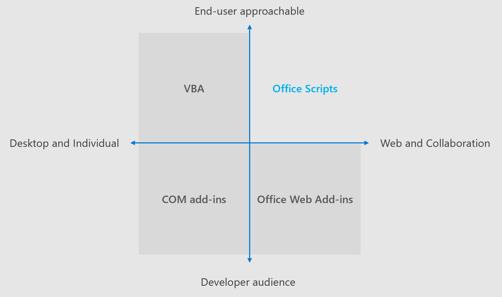

# Diferencias entre scripts de Office y complementos de OfficeDifferences between Office Scripts and Office Add-ins

Los complementos de Office y los scripts de Office tienen mucho en común.Office Add-ins and Office Scripts have a lot in common. Ambos ofrecen el control automatizado de un libro de Excel `Excel` a través del espacio de nombres de la API de JavaScript de Office.They both offer automated control of an Excel workbook through the `Excel` namespace of the Office JavaScript API. Sin embargo, las secuencias de comandos de Office están más limitadas en su ámbito.However, Office Scripts are more limited in their scope.

Los scripts de Office se ejecutan hasta el final con una pulsación de botón manual o como un paso de la [automatización de energía](https://flow.microsoft.com/), mientras que los complementos de Office se conservan mientras los paneles de tareas están abiertos.Office Scripts run to completion with a manual button press or as a step in [Power Automate](https://flow.microsoft.com/), whereas Office Add-ins persist while their task panes are open. Esto significa que los complementos pueden mantener el estado durante una sesión, mientras que los scripts de Office no mantienen un estado interno entre ejecuciones.This means the add-ins can maintain state during a session, whereas Office Scripts do not maintain an internal state between runs. Si observa que su extensión de Excel debe superar las capacidades de la plataforma de scripting, visite la documentación de los complementos de [Office](/office/dev/add-ins) para obtener más información sobre los complementos de Office.If you find that your Excel extension needs to exceed the scripting platform's capabilities, visit the [Office Add-ins documentation](/office/dev/add-ins) to learn more about Office Add-ins.

En el resto de este artículo se describen las principales diferencias entre los complementos de Office y los scripts de Office.The rest of this article describes on the main differences between Office Add-ins and Office Scripts.

## Compatibilidad con plataformasPlatform Support

Los complementos de Office son para varias plataformas.Office Add-ins are cross-platform. Funcionan en plataformas de escritorio de Windows, Mac, iOS y Web y proporcionan la misma experiencia en cada uno de ellos.They work across Windows desktop, Mac, iOS, and web platforms and provide the same experience on each. Cualquier excepción a esto se indica en la documentación de la API individual.Any exception to this is noted in the documentation of the individual API.

Los scripts de Office solo están actualmente admitidos por para Excel en la Web.Office Scripts are currently only supported by for Excel on the web. Todas las operaciones de grabación, edición y ejecución se realizan en la plataforma Web.All recording, editing, and running is done on the web platform.

## APIAPIs

Los scripts de Office admiten la mayoría de las API de JavaScript de Excel, lo que significa que hay mucha funcionalidad superpuesta entre las dos plataformas.Office Scripts support most of the Excel JavaScript APIs, which means there's  a lot of functionality overlap between the two platforms. Hay dos excepciones: Events y Common API.There are two exceptions: events and Common APIs.

### EventosEvents

Los scripts de Office no admiten [eventos](/office/dev/add-ins/excel/excel-add-ins-events).Office Scripts do not support [events](/office/dev/add-ins/excel/excel-add-ins-events). Cada secuencia de comandos ejecuta el código en `main` un solo método y, a continuación, finaliza.Every script runs the code in a single `main` method, then ends. No se reactiva cuando se desencadenan eventos y, por lo tanto, no pueden registrar los eventos.It does not reactivate when events are triggered, and thus, cannot register events.

### API comunesCommon APIs

Los scripts de Office no pueden usar [API comunes](/javascript/api/office).Office Scripts cannot use [Common APIs](/javascript/api/office). Si necesita la autenticación, ventanas de cuadro de diálogo u otras características que solo se admiten en las API comunes, es probable que deba crear un complemento de Office en lugar de un script de Office.If you need authentication, dialog windows, or other features that are only supported by Common APIs, you'll likely need to create an Office Add-in instead of an Office Script.

## Consulte tambiénSee also

- [Scripts de Office en Excel en la WebOffice Scripts in Excel on the web](../overview/excel.md)
- [Diferencias entre scripts de Office y macros de VBADifferences between Office Scripts and VBA macros](vba-differences.md)
- [Solución de problemas de scripts de OfficeTroubleshooting Office Scripts](../testing/troubleshooting.md)
- [Crear un complemento de panel de tareas de ExcelBuild an Excel task pane add-in](/office/dev/add-ins/quickstarts/excel-quickstart-jquery)
