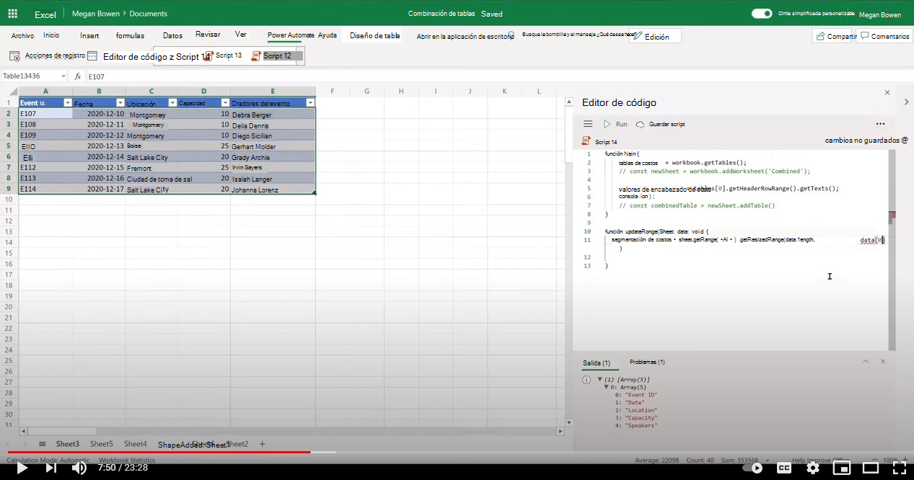

# <a name="combine-data-from-multiple-excel-tables-into-a-single-table"></a>Combinar datos de varias tablas de Excel en una sola tabla

En este ejemplo se combinan los datos de varias tablas de Excel en una sola tabla que incluye todas las filas. Se supone que todas las tablas que se usan tienen la misma estructura.

Hay dos variaciones de este script:

1. El [primer script](#sample-code-combine-data-from-multiple-excel-tables-into-a-single-table) combina todas las tablas del archivo de Excel.
1. El [segundo script obtiene](#sample-code-combine-data-from-multiple-excel-tables-in-select-worksheets-into-a-single-table) selectivamente tablas dentro de un conjunto de hojas de cálculo.

## <a name="sample-code-combine-data-from-multiple-excel-tables-into-a-single-table"></a>Código de ejemplo: combinar datos de varias tablas de Excel en una sola tabla

Descargue el archivo de <a href="tables-copy.xlsx">tables-copy.xlsx</a> y ústelo con el siguiente script para probarlo usted mismo.

```TypeScript
function main(workbook: ExcelScript.Workbook) {
    workbook.getWorksheet('Combined')?.delete();
    const newSheet = workbook.addWorksheet('Combined');
    
    const tables = workbook.getTables();    
    const headerValues = tables[0].getHeaderRowRange().getTexts();
    console.log(headerValues);
    const targetRange = updateRange(newSheet, headerValues);
    const combinedTable = newSheet.addTable(targetRange.getAddress(), true);
    for (let table of tables) {      
      let dataValues = table.getRangeBetweenHeaderAndTotal().getTexts();
      let rowCount = table.getRowCount();
      if (rowCount > 0) {
        combinedTable.addRows(-1, dataValues);
      }
    }
}

function updateRange(sheet: ExcelScript.Worksheet, data: string[][]): ExcelScript.Range {
  const targetRange = sheet.getRange('A1').getResizedRange(data.length-1, data[0].length-1);
  targetRange.setValues(data);
  return targetRange;
}
```

## <a name="sample-code-combine-data-from-multiple-excel-tables-in-select-worksheets-into-a-single-table"></a>Código de ejemplo: combinar datos de varias tablas de Excel en hojas de cálculo selectas en una sola tabla

Descargue el archivo de <a href="tables-select-copy.xlsx">tables-select-copy.xlsx</a> y ústelo con el siguiente script para probarlo usted mismo.

```TypeScript
function main(workbook: ExcelScript.Workbook) {
    const sheetNames = ['Sheet1', 'Sheet2', 'Sheet3'];
    
    workbook.getWorksheet('Combined')?.delete();
    const newSheet = workbook.addWorksheet('Combined');
    let targetTableCreated = false;
    let combinedTable;
    sheetNames.forEach((sheet) => {
      const tables = workbook.getWorksheet(sheet).getTables();
      if (!targetTableCreated) {
        const headerValues = tables[0].getHeaderRowRange().getTexts();
        const targetRange = updateRange(newSheet, headerValues);
        combinedTable = newSheet.addTable(targetRange.getAddress(), true);
        targetTableCreated = true;
      }      
      for (let table of tables) {
        let dataValues = table.getRangeBetweenHeaderAndTotal().getTexts();
        let rowCount = table.getRowCount();
        if (rowCount > 0) {
        combinedTable.addRows(-1, dataValues);
        }
      }
    })
}

function updateRange(sheet: ExcelScript.Worksheet, data: string[][]): ExcelScript.Range {
  const targetRange = sheet.getRange('A1').getResizedRange(data.length-1, data[0].length-1);
  targetRange.setValues(data);
  return targetRange;
}
```

## <a name="training-video-combine-data-from-multiple-excel-tables-into-a-single-table"></a>Vídeo de aprendizaje: Combinar datos de varias tablas de Excel en una sola tabla

[](https://youtu.be/di-8JukK3Lc "Vídeo paso a paso sobre cómo combinar datos de varias tablas de Excel en una sola tabla")
