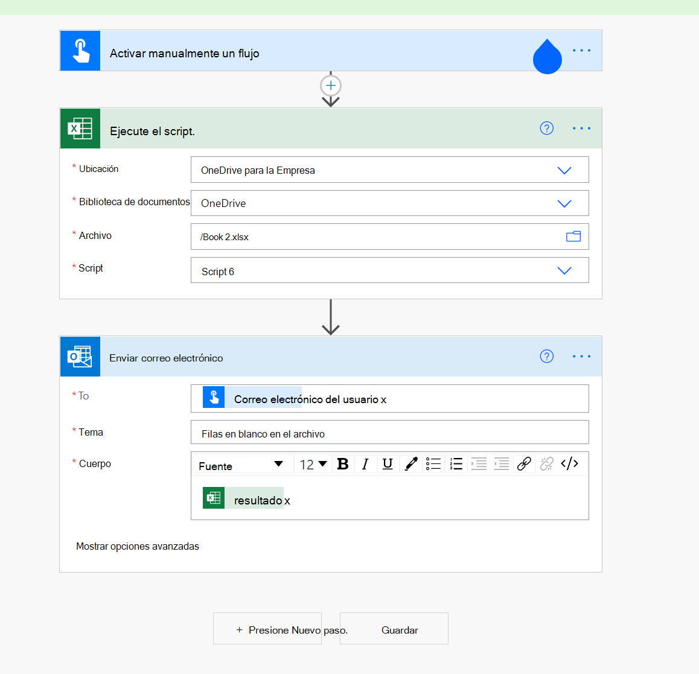

# <a name="count-blank-rows-on-sheets"></a>Contar filas en blanco en hojas

Este proyecto incluye dos scripts:

* [Contar filas en blanco en una hoja determinada:](#sample-code-count-blank-rows-on-a-given-sheet)recorre el intervalo usado en una hoja de cálculo determinada y devuelve un recuento de filas en blanco.
* [Contar filas en blanco en todas las hojas:](#sample-code-count-blank-rows-on-all-sheets)recorre el intervalo usado en todas las hojas de cálculo _y_ devuelve un recuento de filas en blanco.

> [!NOTE]
> Para nuestro script, una fila en blanco es cualquier fila donde no hay datos. La fila puede tener formato.

_Esta hoja devuelve el recuento de 4 filas en blanco_


_Esta hoja devuelve el recuento de 0 filas en blanco (todas las filas tienen algunos datos)_


## <a name="sample-code-count-blank-rows-on-a-given-sheet"></a>Código de ejemplo: contar filas en blanco en una hoja determinada

```TypeScript
function main(workbook: ExcelScript.Workbook): number
{
  const sheet = workbook.getWorksheet('Sheet1'); 
  // Getting the active worksheet is not suitable for a script used by Power Automate.
  // const sheet = workbook.getActiveWorksheet();
  
  const range = sheet.getUsedRange(true); // Get value only.
  if (!range) {
    console.log(`No data on this sheet. `);
    return;
  }
  console.log(`Used range for the worksheet: ${range.getAddress()}`);
  const values = range.getValues();
  let emptyRows = 0;
  for (let row of values) {
    let len = 0; 
    for (let cell of row) {
      len = len + cell.toString().length;
    }
    if (len === 0) { 
      emptyRows++;
    }
  }
  console.log(`Total empty row: ` + emptyRows);
  return emptyRows;
}
```

## <a name="sample-code-count-blank-rows-on-all-sheets"></a>Código de ejemplo: contar filas en blanco en todas las hojas

```TypeScript
function main(workbook: ExcelScript.Workbook): number
{
  const sheets = workbook.getWorksheets();
  let emptyRows = 0;
  for (let sheet of sheets) { 
    const range = sheet.getUsedRange(true); // Get value only.
    if (!range) {
      console.log(`No data on this sheet. `);
      continue;
    }
    console.log(`Used range for the worksheet ${sheet.getName()}: ${range.getAddress()}`);
    const values = range.getValues();

    for (let row of values) {
      let len = 0;
      for (let cell of row) {
        len = len + cell.toString().length;
      }
      if (len === 0) {
        emptyRows++;
      }
    }
  }
  console.log(`Total empty row: ` + emptyRows);
  return emptyRows;
}
```

## <a name="use-with-power-automate"></a>Usar con Power Automate


