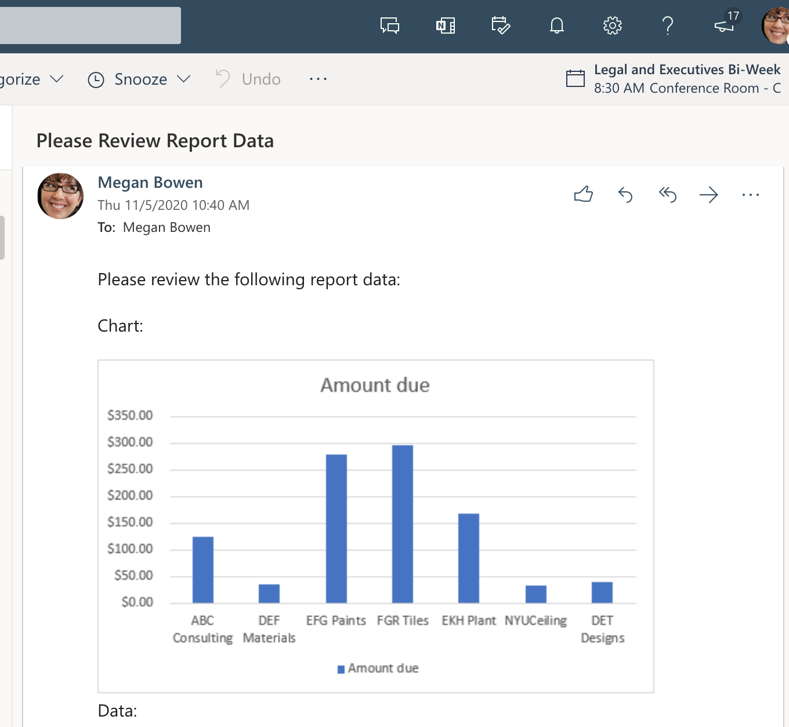

# <a name="use-office-scripts-and-power-automate-to-email-images-of-a-chart-and-table"></a>Usar Scripts de Office y Power Automate para enviar por correo electrónico imágenes de un gráfico y una tabla

En este ejemplo se usan scripts de Office y Power Automate para crear un gráfico. A continuación, envía un correo electrónico a las imágenes del gráfico y su tabla base.

## <a name="example-scenario"></a>Escenario de ejemplo

* Calcule para obtener los resultados más recientes.
* Crear gráfico.
* Obtener imágenes de gráfico y tabla.
* Envíe un correo electrónico a las imágenes con Power Automate.

_Datos de entrada_


_Gráfico de salida_


_Correo electrónico que se recibió a través del flujo de Power Automate_



## <a name="solution"></a>Solución

Esta solución tiene dos partes:

1. [Un script de Office para calcular y extraer gráfico y tabla de Excel](#sample-code-calculate-and-extract-excel-chart-and-table)
1. Flujo de Power Automate para invocar el script y enviar por correo electrónico los resultados. Para obtener un ejemplo sobre cómo hacerlo, consulte [Create an automated workflow with Power Automate](../../tutorials/excel-power-automate-returns.md#create-an-automated-workflow-with-power-automate).

## <a name="sample-code-calculate-and-extract-excel-chart-and-table"></a>Código de ejemplo: calcular y extraer gráfico y tabla de Excel

El siguiente script calcula y extrae un gráfico y una tabla de Excel.

Descargue el archivo de <a href="email-chart-table.xlsx">email-chart-table.xlsx</a> y ústelo con este script para probarlo usted mismo.

```TypeScript
function main(workbook: ExcelScript.Workbook): ReportImages {

  workbook.getApplication().calculate(ExcelScript.CalculationType.full);
  
  let sheet1 = workbook.getWorksheet("Sheet1");
  const table = workbook.getWorksheet('InvoiceAmounts').getTables()[0];
  const rows = table.getRange().getTexts();

  const selectColumns = rows.map((row) => {
    return [row[2], row[5]];
  });
  table.setShowTotals(true);
  selectColumns.splice(selectColumns.length-1, 1);
  console.log(selectColumns);

  workbook.getWorksheet('ChartSheet')?.delete();
  const chartSheet = workbook.addWorksheet('ChartSheet');
  const targetRange = updateRange(chartSheet, selectColumns);

  // Insert chart on sheet 'Sheet1'.
  let chart_2 = chartSheet.addChart(ExcelScript.ChartType.columnClustered, targetRange);
  chart_2.setPosition('D1');
  const chartImage = chart_2.getImage();
  const tableImage = table.getRange().getImage();
  return {
    chartImage,
    tableImage
  }
}

function updateRange(sheet: ExcelScript.Worksheet, data: string[][]): ExcelScript.Range {
  const targetRange = sheet.getRange('A1').getResizedRange(data.length-1, data[0].length-1);
  targetRange.setValues(data);
  return targetRange;
}

interface ReportImages {
  chartImage: string
  tableImage: string
}
```

## <a name="training-video-extract-and-email-images-of-chart-and-table"></a>Vídeo de aprendizaje: extraer y enviar por correo electrónico imágenes de gráfico y tabla

[](https://youtu.be/152GJyqc-Kw "Vídeo paso a paso sobre cómo extraer y enviar por correo electrónico imágenes de gráfico y tabla")
