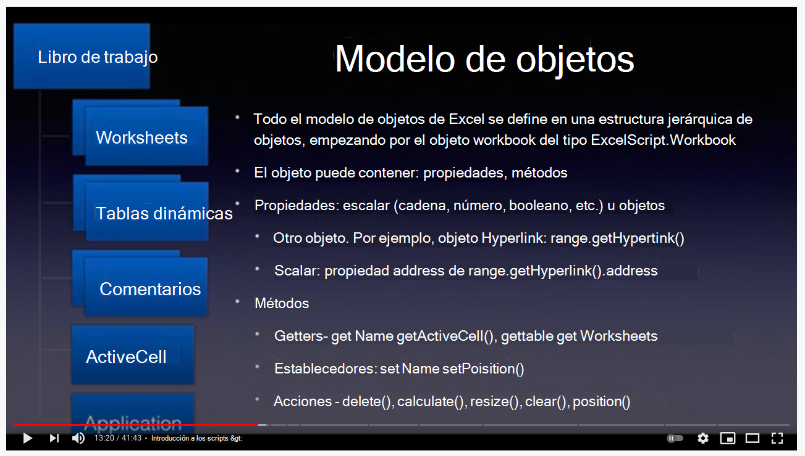
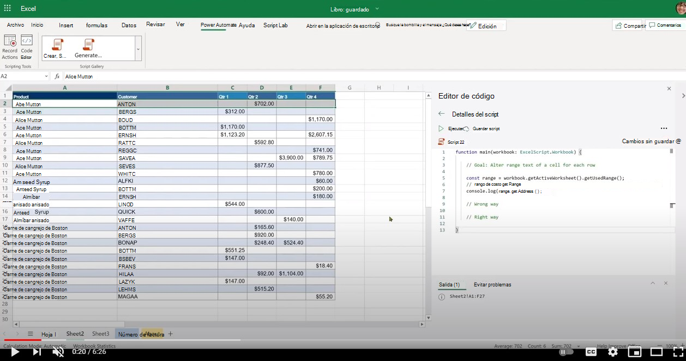

# <a name="getting-started"></a>Introducción

En esta sección se proporcionan detalles sobre los conceptos básicos de los scripts de Office, incluidos el acceso, el entorno, los conceptos básicos del script y algunos patrones de script básicos.

## <a name="environment-setup"></a>Configuración del entorno

Obtenga información sobre los conceptos básicos del editor de acceso, entorno y script.

[](https://youtu.be/vvCtxsjPxo8 "Conceptos básicos de la aplicación scripts de Office")

### <a name="access"></a>Access

Scripts de Office requiere la configuración de administración disponible para el administrador de Microsoft 365 en **Configuración**  >  **de la organización Configuración Scripts**  >  **de Office**. De forma predeterminada, está activada para todos los usuarios. Hay dos configuraciones sub, que el administrador puede activar y desactivar.

* Capacidad para compartir scripts dentro de la organización
* Capacidad de usar scripts en Power Automate

Puede saber si tiene acceso a scripts de Office abriendo un archivo en Excel en la web (explorador) y viendo si la pestaña **Automatizar** aparece en la cinta de Opciones de Excel o no.
Si aún no puede ver la pestaña **Automatizar,** compruebe [esta sección de solución de problemas](../../testing/troubleshooting.md#automate-tab-not-appearing-or-office-scripts-unavailable).

### <a name="availability"></a>Disponibilidad

Los scripts de Office solo están disponibles en Excel en la web para licencias de Enterprise E3+ (no se admiten cuentas de consumidor y E1). Los scripts de Office aún no se admiten en Excel en Windows y Mac.

### <a name="scripts-and-editor"></a>Scripts y editor

El editor de código se basa directamente en Excel en la web (versión en línea). Si has usado editores como Visual Studio Code o Sublime, esta experiencia de edición será bastante similar.
La mayoría de las teclas de acceso directo que Visual Studio editor de código también usan trabajo en la experiencia de edición de scripts de Office. Consulte los siguientes volantes de teclas de método abreviado.

* [macOS](https://code.visualstudio.com/shortcuts/keyboard-shortcuts-macos.pdf)
* [Windows](https://code.visualstudio.com/shortcuts/keyboard-shortcuts-windows.pdf)

#### <a name="key-things-to-note"></a>Aspectos clave a tener en cuenta

* Los scripts de Office solo están disponibles para los archivos almacenados en OneDrive para la Empresa, los sitios de SharePoint y los sitios de grupo.
* El editor no muestra la extensión del script. En realidad, se trata de archivos TypeScript, pero se almacenan con una extensión personalizada denominada `.osts` .
* Los scripts se almacenan en su propia carpeta de OneDrive para la Empresa `My Files/Documents/OfficeScripts` . No necesitará administrar esta carpeta. Por su parte, puede omitir este aspecto a medida que el editor administra la experiencia de visualización y edición.
* Los scripts no se almacenan como parte de los archivos de Excel. Se almacenan por separado.
* Puede compartir el script con un archivo de Excel que, en efecto, significa que está vinculando el script con el archivo, no adjuntarlo. Quien tenga acceso al archivo de Excel también podrá **ver,** **ejecutar** o hacer **una copia** del script. Esta es una diferencia clave en comparación con las macros de VBA.
* A menos que comparta los scripts, nadie más podrá acceder a él, ya que reside en su propia biblioteca.
* Los scripts no se pueden vincular desde un disco local ni desde ubicaciones de nube personalizadas. Los scripts de Office solo reconocen y ejecutan un script que se encuentra en una ubicación predefinida (la carpeta de OneDrive mencionada anteriormente) o scripts compartidos.
* Durante la edición, los archivos se guardan temporalmente en el explorador, pero tendrás que guardar el script antes de cerrar la ventana de Excel para guardarlo en la ubicación de OneDrive. No olvide guardar el archivo después de editarlo.

## <a name="gentle-introduction-to-scripting"></a>Introducción suave a scripting

Los scripts de Office son scripts independientes escritos en el lenguaje TypeScript que contienen instrucciones para realizar cierta automatización en el libro de Excel seleccionado. Todas las instrucciones de automatización están independientes dentro de un script y los scripts no pueden invocar ni llamar a otros scripts. Todos los scripts se almacenan en archivos independientes y se almacenan en la carpeta de OneDrive del usuario. Puede grabar un nuevo script, editar un script grabado o escribir un script nuevo completo desde cero, todo dentro de una interfaz de editor integrada. La mejor parte de los scripts de Office es que no necesitan ninguna configuración adicional de los usuarios. No hay bibliotecas externas, páginas web o elementos de interfaz de usuario, configuración, etc. Todos los scripts de Office controlan toda la configuración del entorno y permiten un acceso fácil y rápido a la automatización a través de una interfaz de API sencilla.

Algunos de los conceptos básicos útiles para comprender cómo editar y navegar por scripts son:

* Sintaxis básica del lenguaje TypeScript
* Descripción de `main` la función y los argumentos
* Objetos y jerarquía, métodos, propiedades
* Colección (matriz): navegación y operaciones
* Definiciones de tipo
* Entorno: registrar/editar, ejecutar, examinar resultados, compartir

En este vídeo y en la sección se explican algunos de estos conceptos en detalle.

[](https://youtu.be/8Zsrc1uaiiU "Conceptos básicos de scripts")

### <a name="language-typescript"></a>Idioma: TypeScript

[Los scripts](../../index.md) de Office se escriben con el lenguaje [TypeScript](https://www.typescriptlang.org/), que es un lenguaje de código abierto que se basa en JavaScript (uno de los más usados del mundo) agregando definiciones de tipos estáticos. Como dice el sitio web, proporcione una forma de describir la forma de un objeto, proporcionando mejor documentación y permitiendo que TypeScript valide que el código funciona `Types` correctamente.

La sintaxis del lenguaje en sí se escribe con [JavaScript](https://developer.mozilla.org/docs/Web/JavaScript) con escrituras adicionales definidas en el script mediante convenciones de TypeScript. En su mayoría, puede pensar en scripts de Office como escritos en JavaScript. Es esencial que comprenda los conceptos básicos del lenguaje JavaScript para comenzar el recorrido de scripts de Office; aunque no es necesario ser competente para comenzar el recorrido de automatización. Con la grabadora de acciones de Scripts de Office, puede comprender las instrucciones de script porque se incluyen comentarios de código y puede seguir y realizar pequeñas modificaciones.

Las API de Scripts de Office, que permiten que el script interactúe con Excel, están diseñadas para usuarios finales que pueden no tener mucho fondo de codificación. Las API se pueden invocar sincrónicamente y no es necesario conocer temas avanzados como promesas o devoluciones de llamada. El diseño de la API de scripts de Office proporciona:

* Modelo de objetos simple con métodos, getters/setters.
* Colecciones de objetos de fácil acceso como matrices regulares.
* Opciones sencillas de control de errores.
* Rendimiento optimizado para escenarios selectos que ayudan a los usuarios a centrarse en el escenario disponible.

### <a name="main-function-the-scripts-starting-point"></a>`main` function: el punto inicial del script

La ejecución de scripts de Office comienza en la `main` función. Un script es un único archivo que contiene una o varias funciones junto con declaraciones de tipos, interfaces, variables, etc. Para seguir con el script, comience con la función, ya que Excel siempre invoca primero `main` la función al ejecutar cualquier `main` script. La función siempre tendrá al menos un argumento (o parámetro) denominado , que es solo un nombre de variable que identifica el libro actual con el que `main` `workbook` se ejecuta el script. Puede definir argumentos adicionales para su uso con la ejecución de Power Automate (sin conexión).

* `function main(workbook: ExcelScript.Workbook)`

Un script se puede organizar en funciones más pequeñas para ayudar con la reusabilidad del código, la claridad, etc. Otras funciones pueden estar dentro o fuera de la función principal, pero siempre en el mismo archivo. Un script es independiente y solo puede usar funciones definidas en el mismo archivo. Los scripts no pueden invocar ni llamar a otro script de Office.

Por lo tanto, en resumen:

* La `main` función es el punto de entrada de cualquier script. Cuando se ejecuta la función, la aplicación de Excel invoca esta función principal proporcionando el libro como su primer parámetro.
* Es importante mantener el primer argumento y `workbook` su declaración de tipo tal como aparece. Puede agregar nuevos argumentos a la función (consulte la siguiente sección) pero mantenga `main` el primer argumento tal y como está.

:::image type="content" source="../../images/getting-started-main-introduction.png" alt-text="La función principal es el punto de entrada del script":::

#### <a name="send-or-receive-data-from-other-apps"></a>Enviar o recibir datos de otras aplicaciones

Puede conectar Excel a otras partes de su organización ejecutando scripts en [Power Automate](https://flow.microsoft.com). Obtenga más información sobre [cómo ejecutar scripts de Office en flujos de Power Automate.](../../develop/power-automate-integration.md)

La forma de recibir o enviar datos desde y a Excel es a través de la `main` función. Piense en ella como la puerta de enlace de información que permite describir y usar los datos entrantes y salientes en el script. Puede recibir datos de fuera del script mediante el tipo de datos y devolver cualquier dato reconocido por TypeScript, como , , o cualquier objeto en forma de interfaces que defina en el `string` `string` `number` `boolean` script.

:::image type="content" source="../../images/getting-started-data-in-out.png" alt-text="Entradas y salidas de un script":::

#### <a name="use-functions-to-organize-and-reuse-code"></a>Usar funciones para organizar y reutilizar código

Puede usar funciones para organizar y reutilizar código dentro del script.

:::image type="content" source="../../images/getting-started-use-functions.png" alt-text="Uso de funciones en un script":::

### <a name="objects-hierarchy-methods-properties-collections"></a>Objetos, jerarquía, métodos, propiedades, colecciones

Todo el modelo de objetos de Excel se define en una estructura jerárquica de objetos, empezando por el objeto de libro de tipo `ExcelScript.Workbook` . Un objeto puede contener métodos, propiedades y otros objetos dentro de él. Los objetos se vinculan entre sí mediante los métodos. El método de un objeto puede devolver otro objeto o colección de objetos. El uso de la característica de IntelliSense (finalización de código) del editor de código es una excelente manera de explorar la jerarquía de objetos. También puede usar el sitio de documentación [de referencia oficial](/javascript/api/office-scripts/overview) para seguir las relaciones entre objetos.

Un [objeto](https://developer.mozilla.org/docs/Web/JavaScript/Reference/Global_Objects/Object) es una colección de propiedades y una propiedad es una asociación entre un nombre (o clave) y un valor. El valor de una propiedad puede ser una función, en cuyo caso la propiedad se conoce como un método. En el caso del modelo de objetos scripts de Office, un objeto representa una cosa en el archivo de Excel con la que interactúan los usuarios, como un gráfico, un hipervínculo, una tabla dinámica, etc. También puede representar el comportamiento de un objeto, como los atributos de protección de una hoja de cálculo.

El tema de los objetos y propiedades de TypeScript frente a los métodos es bastante profundo. Para empezar con el script y ser productivo, puede recordar algunas cosas básicas:

* Se tiene acceso a ambos objetos y propiedades mediante notación (punto), con el objeto en el lado izquierdo de la propiedad o método `.` `.` en el lado derecho. Ejemplos: `hyperlink.address` , `range.getAddress()` .
* Las propiedades son escalares en la naturaleza (cadenas, booleanos, números). Por ejemplo, el nombre de un libro, la posición de una hoja de cálculo, el valor de si la tabla tiene un pie de página o no.
* Los métodos se "invocan" o se "ejecutan" con los paréntesis de apertura y cierre. Ejemplo: `table.delete()`. A veces, un argumento se pasa a una función incluyéndolos entre paréntesis de apertura y cierre: `range.setValue('Hello')` . Puede pasar muchos argumentos a una función (como se define en su contrato/firma) y separarlos mediante `,` .  Por ejemplo: `worksheet.addTable('A1:D6', true)`. Puede pasar argumentos de cualquier tipo según lo requiera el método, como cadenas, números, booleanos o incluso otros objetos, por ejemplo, , donde es un objeto creado en otra parte del `worksheet.addTable(targetRange, true)` `targetRange` script.
* Los métodos pueden devolver algo como una propiedad escalar (nombre, dirección, etc.) u otro objeto (intervalo, gráfico) o no devolver nada en absoluto (como el caso con `delete` métodos). Recibirá lo que devuelve el método declarando una variable o asignando a una variable existente. Puede ver que en el lado izquierdo de la instrucción, como `const table = worksheet.addTable('A1:D6', true)` .
* En su mayoría, el modelo de objetos scripts de Office consta de objetos con métodos que vinculan varias partes del modelo de objetos de Excel. Muy rara vez se encontrará con propiedades que sean de valores escalares u objetos.
* En scripts de Office, un método de modelo de objetos de Excel debe contener paréntesis de apertura y cierre. No se permite el uso de métodos sin ellos (como asignar un método a una variable).

Veamos algunos métodos en el `workbook` objeto.

```TypeScript
function main(workbook: ExcelScript.Workbook) {
    // Return a boolean (true or false) setting of whether the workbook is set to auto-save or not. 
    const autoSave = workbook.getAutoSave(); 
    // Get workbook name.
    const name = workbook.getName();
    // Get active cell range object.
    const cell = workbook.getActiveCell();
    // Get table named SALES.
    const cell = workbook.getTable('SALES');
    // Get all slicer objects.
    const slicers = workbook.getSlicers();
}
```

En este ejemplo:

* Los métodos del `workbook` objeto, como `getAutoSave()` y `getName()` devuelven una propiedad escalar (cadena, número, booleano).
* Métodos como `getActiveCell()` devolver otro objeto.
* El método acepta un argumento (nombre de tabla en este caso) y `getTable()` devuelve una tabla específica en el libro.
* El `getSlicers()` método devuelve una matriz (a la que se hace referencia en muchos lugares como una colección) de todos los objetos de segmentación de datos del libro.

Observará que todos estos métodos tienen un prefijo, que es solo una convención usada en el modelo de objetos scripts de Office para transmitir que el método `get` devuelve algo. También se les conoce comúnmente como "getters".

Hay otros dos tipos de métodos que veremos en el siguiente ejemplo:

```TypeScript
function main(workbook: ExcelScript.Workbook) {
    // Get a worksheet named 'Sheet1.
    const sheet = workbook.getWorksheet('Sheet1'); 
    // Set name to SALES.
    sheet.setName('SALES');
    // Position the worksheet at the beginning.
    sheet.setPosition(0);
}
```

En este ejemplo:

* El `setName()` método establece un nuevo nombre en la hoja de cálculo. `setPosition()` establece la posición en la primera celda.
* Estos métodos modifican el archivo de Excel estableciendo una propiedad o comportamiento del libro. Estos métodos se denominan "setters".
* Normalmente, los "setters" tienen un "getter" complementario, por ejemplo, y , ambos `worksheet.getPosition` `worksheet.setPosition` son métodos.

#### <a name="undefined-and-null-primitive-types"></a>`undefined` y `null` tipos primitivos

Los siguientes son dos tipos de datos primitivos que debe tener en cuenta:

1. El valor [`null`](https://developer.mozilla.org/docs/Web/JavaScript/Reference/Global_Objects/null) representa la ausencia intencionada de cualquier valor de objeto. Es uno de los valores primitivos de JavaScript y se usa para indicar que una variable no tiene ningún valor.
1. Una variable a la que no se ha asignado un valor es de tipo [`undefined`](https://developer.mozilla.org/docs/Web/JavaScript/Reference/Global_Objects/undefined) . Un método o instrucción también puede devolver si la variable que se está `undefined` evaluando no tiene un valor asignado.

Estos dos tipos se recortan como parte del tratamiento de errores y pueden causar bastante dolor de cabeza si no se manejan correctamente. Afortunadamente, TypeScript/JavaScript ofrece una forma de comprobar si una variable es de tipo `undefined` o `null` . Hablaremos sobre algunas de esas comprobaciones en secciones posteriores, incluido el control de errores.

#### <a name="method-chaining"></a>Encadenamiento de métodos

Puede usar la notación de puntos para conectar los objetos que se devuelven desde un método para acortar el código. A veces, esta técnica facilita la lectura y administración del código. Sin embargo, hay pocas cosas que tener en cuenta. Veamos los ejemplos siguientes.

El siguiente código obtiene la celda activa y la siguiente celda y, a continuación, establece el valor. Este es un buen candidato para usar el encadenamiento, ya que este código se realizará correctamente todo el tiempo.

```TypeScript
function main(workbook: ExcelScript.Workbook) {
    workbook.getActiveCell().getOffsetRange(0,1).setValue('Next cell');
}
```

Sin embargo, el siguiente código (que obtiene una tabla denominada **SALES** y activa su estilo de columna con bandas) tiene un problema.

```TypeScript
function main(workbook: ExcelScript.Workbook) {
  workbook.getTable('SALES').setShowBandedColumns(true);
}
```

¿Qué ocurre **si la tabla SALES** no existe? El script producirá un error (se muestra a continuación) porque devuelve (que es un tipo de JavaScript que indica que no hay ninguna tabla `getTable('SALES')` `undefined` como **SALES**). Llamar al `setShowBandedColumns` método on no tiene sentido, es decir, y, por lo tanto, el `undefined` script termina en un `undefined.setShowBandedColumns(true)` error.

```text
Line 2: Cannot read property 'setShowBandedColumns' of undefined
```

Puede usar [](https://developer.mozilla.org/docs/Web/JavaScript/Reference/Operators/Optional_chaining) el operador de encadenamiento opcional que proporciona una forma de simplificar el acceso a valores a través de objetos conectados cuando sea posible que una referencia o método sea o (que es la forma de JavaScript de indicar un objeto o resultado sin asignación o inexistente) para controlar esta `undefined` `null` condición.

```TypeScript
function main(workbook: ExcelScript.Workbook) {
    // This line will not fail as the setShowBandedColumns method is executed only if the SALES table is present.
    workbook.getTable('SALES')?.setShowBandedColumns(true); 
}
```

Si desea controlar las condiciones de objeto inexistentes o el tipo que devuelve un método, es mejor asignar el valor devuelto del método y controlarlo `undefined` por separado.

```TypeScript
function main(workbook: ExcelScript.Workbook) {
    const salesTable = workbook.getTable('SALES');
    if (salesTable) {
        salesTable.setShowBandedColumns(true);
    } else { 
        // Handle this condition.
    }
}
```

#### <a name="get-object-reference"></a>Obtener referencia de objeto

El `workbook` objeto se le entrega en la `main` función. Puede empezar a usar el `workbook` objeto y acceder a sus métodos directamente.

```TypeScript
function main(workbook: ExcelScript.Workbook) {
    // Get workbook name.
    const name = workbook.getName();
    // Display name to console.
    console.log(name);
}
```

Para usar todos los demás objetos dentro del libro, comience con el objeto y vaya hacia abajo en la jerarquía hasta que llegue al `workbook` objeto que está buscando. Puede obtener la referencia de objeto mediante la captura del objeto mediante su método o recuperando `get` la colección de objetos como se muestra a continuación:

```TypeScript
function main(workbook: ExcelScript.Workbook) {
    // Get the active worksheet.
    const sheet = workbook.getActiveWorksheet();
    // Fetch using an ID or key.
    const sheet = workbook.getWorksheet('SomeSheetName');
    // Invoke methods on the object.
    sheet.setPosition(0); 
    
    // Get collection of methods.
    const tables = sheet.getTables();
    console.log('Total tables in this sheet: ' + tables.length);
}
```

#### <a name="check-if-an-object-exists-then-delete-and-add"></a>Comprobar si existe un objeto, eliminar y agregar

Para crear un objeto, por ejemplo, con un nombre predefinido, siempre es mejor quitar un objeto similar que pueda existir y, a continuación, agregarlo. Puede hacerlo con el siguiente patrón.

```TypeScript
function main(workbook: ExcelScript.Workbook) {
  // Name of the worksheet to be added. 
  let name = "Index";
  // Check if the worksheet already exists. If not, add the worksheet.
  let sheet = workbook.getWorksheet('Index');
  if (sheet) {
    console.log(`Worksheet by the name ${name} already exists. Deleting it.`);
    // Call the delete method on the object to remove it. 
    sheet.delete();
  } 
    // Add a blank worksheet. 
  console.log(`Adding the worksheet named  ${name}.`)
  const indexSheet = workbook.addWorksheet("Index");
}

```

Como alternativa, para eliminar un objeto que puede existir o no, use el siguiente patrón.

```TypeScript
    // The ? preceding delete() will ensure that the API is only invoked if the object exists. 
    workbook.getWorksheet('Index')?.delete(); 
```

#### <a name="note-about-adding-an-object"></a>Nota sobre cómo agregar un objeto

Para crear, insertar o agregar un objeto como una segmentación de datos, una tabla dinámica, una hoja de cálculo, etc., use el método **add_Object_** correspondiente. Este método está disponible en su objeto primario. Por ejemplo, el `addChart()` método está disponible en el `worksheet` objeto. El **add_Object_** devuelve el objeto que crea. Reciba el valor devuelto y úselo más adelante en el script.

```TypeScript
function main(workbook: ExcelScript.Workbook) {
  // Add object and get a reference to it. 
  const indexSheet = workbook.addWorksheet("Index");
  // Use it elsewhere in the script 
  console.log(indexSheet.getPosition());
}

```

Como alternativa, para eliminar un objeto que puede existir o no, use este patrón:

```TypeScript
    workbook.getWorksheet('Index')?.delete(); // The ? preceding delete() will ensure that the API is only invoked if the object exists. 
```

#### <a name="collections"></a>Colecciones

Las colecciones son objetos como tablas, gráficos, columnas, etc. que se pueden recuperar como una matriz e iterar para su procesamiento. Puede recuperar una colección con el método correspondiente y procesar los datos en un bucle mediante una de las muchas técnicas de recorrido de matriz `get` de TypeScript, como:

* [`for` o `while`](https://developer.mozilla.org/docs/Web/JavaScript/Guide/Loops_and_iteration)
* [`for..of`](https://developer.mozilla.org/docs/Web/JavaScript/Reference/Statements/for...of)
* [`forEach`](https://developer.mozilla.org/docs/Web/JavaScript/Reference/Global_Objects/Array/forEach)

* [Conceptos básicos de idioma de las matrices](https://developer.mozilla.org//docs/Learn/JavaScript/First_steps/Arrays)

Este script muestra cómo usar colecciones admitidas en las API de Scripts de Office. Colore cada ficha de hoja de cálculo del archivo con un color aleatorio.

```TypeScript
function main(workbook: ExcelScript.Workbook) {

  // Get all sheets as a collection.
  const sheets = workbook.getWorksheets();
  const names = sheets.map ((sheet) => sheet.getName());
  console.log(names);
  console.log(`Total worksheets inside of this workbook: ${sheets.length}`);
  // Get information from specific sheets within the collection.
  console.log(`First sheet name is: ${names[0]}`);
  if (sheets.length > 1) {
    console.log(`Last sheet's Id is: ${sheets[sheets.length -1].getId()}`);
  }
  // Color each worksheet with random color.
  for (const sheet of sheets) {
    sheet.setTabColor(`#${Math.random().toString(16).substr(-6)}`);
  }
}
```

## <a name="type-declarations"></a>Declaraciones de tipo

Las declaraciones de tipo ayudan a los usuarios a comprender el tipo de variable con la que están tratando. Ayuda con la finalización automática de métodos y ayuda en las comprobaciones de calidad del tiempo de desarrollo.

Puede encontrar declaraciones de tipo en el script en varios lugares, como la declaración de función, la declaración de variables, IntelliSense definiciones, etc.

Ejemplos:

* `function main(workbook: ExcelScript.Workbook)`
* `let myRange: ExcelScript.Range;`
* `function getMaxAmount(range: ExcelScript.Range): number`

Puede identificar los tipos fácilmente en el editor de código, ya que normalmente aparece de forma distinta en un color diferente. Normalmente, `:` dos puntos precede a la declaración de tipo.  

Los tipos de escritura pueden ser opcionales en TypeScript porque la inferencia de tipos le permite obtener mucha potencia sin escribir código adicional. En su mayoría, el lenguaje TypeScript es bueno para deducir los tipos de variables. Sin embargo, en algunos casos, los scripts de Office requieren que las declaraciones de tipo se definan explícitamente si el idioma no puede identificar claramente el tipo. Además, no se permite explícita `any` o implícita en el script de Office. Más información más adelante.

### <a name="excelscript-types"></a>`ExcelScript` tipos

En Scripts de Office, usará los siguientes tipos de tipos.

* Tipos de idioma nativo como `number` , , , , , `string` `object` `boolean` `null` etc.
* Tipos de API de Excel. Empiezan por `ExcelScript` . Por ejemplo, `ExcelScript.Range` , `ExcelScript.Table` , etc.
* Cualquier interfaz personalizada que haya definido en el script mediante `interface` instrucciones.

Vea los ejemplos de cada uno de estos grupos a continuación.

**_Tipos de idioma nativo_**

En el ejemplo siguiente, observe los lugares `string` donde , y se han `number` `boolean` usado. Estos son tipos de **lenguaje TypeScript** nativos.

```TypeScript
function main(workbook: ExcelScript.Workbook)
{
  const table = workbook.getActiveWorksheet().getTables()[0];
  const sales = table.getColumnByName('Sales').getRange().getValues();
  console.log(sales);
  // Add 100 to each value.
  const revisedSales = salesAs1DArray.map(data => data as number + 100);
  // Add a column.
  table.addColumn(-1, revisedSales);  
}
/**
 * Extract a column from 2D array and return result.
 */
function extractColumn(data: (string | number | boolean)[][], index: number): (string | number | boolean)[] {

  const column = data.map((row) => {
    return row[index];
  })
  return column;
}
/**
 * Convert a flat array into a 2D array that can be used as range column.
 */
function convertColumnTo2D(data: (string | number | boolean)[]): (string | number | boolean)[][] {

  const columnAs2D = data.map((row) => {
    return [row];
  })
  return columnAs2D;
}
```

**_Tipos de ExcelScript_**

En el ejemplo siguiente, una función auxiliar toma dos argumentos. La primera es la `sheet` variable que es de tipo `ExcelScript.Worksheet` type.

```TypeScript
function main(workbook: ExcelScript.Workbook) {
    const sheet = workbook.getWorksheet('Sheet5');
    const data = ['2016', 'Bikes', 'Seats', '1500', .05];
    addRow(sheet, data);
    return;
}

function addRow(sheet: ExcelScript.Worksheet, data: (string | number | boolean)[]): void {

    const usedRange = sheet.getUsedRange();
    let startCell: ExcelScript.Range;
    // If the sheet is empty, then use A1 as starting cell for update.
    if (usedRange) { 
      startCell = usedRange.getLastRow().getCell(0, 0).getOffsetRange(1, 0);
    } else {
      startCell = sheet.getRange('A1');
    }
    console.log(startCell.getAddress());
    const targetRange = startCell.getResizedRange(0, data.length - 1);      
    targetRange.setValues([data]);
    return;
}
```

**_Tipos personalizados_**

La interfaz personalizada `ReportImages` se usa para devolver imágenes a otra acción de flujo. La declaración de función incluye instrucciones para decir a TypeScript que se devuelve un `main` `: ReportImages` objeto de ese tipo.

```TypeScript
function main(workbook: ExcelScript.Workbook): ReportImages {
  let chart = workbook.getWorksheet("Sheet1").getCharts()[0];
  const table = workbook.getWorksheet('InvoiceAmounts').getTables()[0];
  
  const chartImage = chart.getImage();
  const tableImage = table.getRange().getImage();
  return {
    chartImage,
    tableImage
  }
}

interface ReportImages {
  chartImage: string
  tableImage: string
}
```

### <a name="type-assertion-overriding-the-type"></a>Aserción de tipo (invalidación del tipo)

Como indica la documentación [de](https://www.typescriptlang.org/docs/handbook/basic-types.html#type-assertions) TypeScript, "A veces, terminas en una situación en la que sabrás más sobre un valor que TypeScript. Normalmente, esto ocurrirá cuando sepa que el tipo de alguna entidad podría ser más específico que su tipo actual. Las aserciones de tipo son una forma de decir al compilador "confía en mí, sé lo que estoy haciendo". Una aserción de tipo es como un tipo que se convierte en otros idiomas, pero no realiza ninguna comprobación o reestructuración especial de los datos. No tiene ningún impacto en tiempo de ejecución y el compilador lo usa exclusivamente".

Puede afirmar el tipo con la palabra `as` clave o con corchetes angulares, como se muestra en el código siguiente.

```TypeScript
function main(workbook: ExcelScript.Workbook) {
  let data = workbook.getActiveCell().getValue();
  // Since the add10 function only accepts number, assert data's type as number, otherwise the script cannot be run.
  const answer1 = add10(data as number);
  const answer2 = add10(<number> data);
}

function add10(data: number) { 
  return data + 10;
}
```

#### <a name="any-type-in-the-script"></a>Tipo 'any' en el script

El [sitio web de TypeScript indica:](https://www.typescriptlang.org/docs/handbook/basic-types.html#any)

  En algunas situaciones, no toda la información de tipo está disponible o su declaración requiere una cantidad de esfuerzo inapropiada. Estos pueden ocurrir para los valores del código que se ha escrito sin TypeScript o una biblioteca de terceros. En estos casos, es posible que deseemos no participar en la comprobación de tipo. Para ello, etiquetamos estos valores con el `any` tipo:

  ```TypeScript
  declare function getValue(key: string): any;
  // OK, return value of 'getValue' is not checked
  const str: string = getValue("myString");
  ```

**Explicit `any` is NOT allowed**

```TypeScript
// This is not allowed
let someVariable: any; 
```

El `any` tipo presenta desafíos a la forma en que Scripts de Office procesa las API de Excel. Provoca problemas cuando las variables se envían a las API de Excel para su procesamiento. Conocer el tipo de variables usadas en el script es esencial para el procesamiento del script y, por lo tanto, se prohíbe la definición explícita de cualquier variable `any` con tipo. Recibirá un error en tiempo de compilación (error antes de ejecutar el script) si hay alguna variable con `any` el tipo declarado en el script. También verá un error en el editor.

:::image type="content" source="../../images/getting-started-eanyi.png" alt-text="Error explícito &quot;cualquiera&quot;":::

:::image type="content" source="../../images/getting-started-expany.png" alt-text="Error explícito &quot;cualquiera&quot; que se muestra en Salida":::

En el código mostrado en la imagen anterior, indica que la `[5, 16] Explicit Any is not allowed` línea 5 columna 16 declara el `any` tipo. Esto le ayuda a buscar la línea de código que contiene el error.

Para evitar este problema, declare siempre el tipo de la variable.

Si no está seguro del tipo de variable, un truco interesante en TypeScript le permite definir [tipos de unión](https://www.typescriptlang.org/docs/handbook/unions-and-intersections.html). Esto se puede usar para que las variables puedan contener valores de intervalo, que pueden ser de muchos tipos.

```TypeScript
// Define value as a union type rather than 'any' type.
let value: (string | number | boolean);
value = someValue_from_another_source;
//...
someRange.setValue(value);
```

### <a name="type-inference"></a>Inferencia de tipo

En TypeScript, hay varios lugares en los que se usa la [inferencia](https://www.typescriptlang.org/docs/handbook/type-inference.html) de tipos para proporcionar información de tipo cuando no hay ninguna anotación de tipo explícita. Por ejemplo, el tipo de la variable x se deduce como un número en el código siguiente.

```TypeScript
let x = 3;
//  ^ = let x: number
```

Este tipo de inferencia tiene lugar al inicializar variables y miembros, establecer valores predeterminados de parámetro y determinar tipos de retorno de función.

### <a name="no-implicit-any-rule"></a>no-implicit-any rule

Un script requiere los tipos de variables que se usan para declararse explícita o implícitamente. Si el compilador de TypeScript no puede determinar el tipo de una variable (ya sea porque el tipo no se declara explícitamente o la inferencia de tipo no es posible), recibirá un error de tiempo de compilación (error antes de ejecutar el script). También verá un error en el editor.

:::image type="content" source="../../images/getting-started-iany.png" alt-text="Error implícito &quot;cualquiera&quot; que se muestra en el editor.":::

Los scripts siguientes tienen errores de tiempo de compilación porque las variables se declaran sin tipos y TypeScript no puede determinar el tipo en el momento de la declaración.

```TypeScript
function main(workbook: ExcelScript.Workbook) {
    // The variable 'value' gets 'any' type
    // because no type is declared.
    let value; 
    // Even when a number type is assigned,
    // the type of 'value' remains any.
    value = 10; 
    // The following statement fails because
    // Office Scripts can't send an argument
    // of type 'any' to Excel for processing.
    workbook.getActiveCell().setValue(value);
    return;
}
```

```TypeScript
function main(workbook: ExcelScript.Workbook) {
    // The variable 'cell' gets 'any' type
    // because no type is defined.
    let cell; 
    cell = workbook.getActiveCell().getValue();
    // Office Scripts can't assign Range type object
    // to a variable of 'any' type.
    console.log(cell.getValue());
    return;
}
```

Para evitar este error, use los siguientes patrones en su lugar. En cada caso, la variable y su tipo se declaran al mismo tiempo.

```TypeScript
function main(workbook: ExcelScript.Workbook) {
    const value: number = 10; 
    workbook.getActiveCell().setValue(value);
    return;
}
```

```TypeScript
function main(workbook: ExcelScript.Workbook) {
    const cell: ExcelScript.Range = workbook.getActiveCell().getValue();
    console.log(cell.getValue()); 
    return;
}
```

## <a name="error-handling"></a>Control de errores

El error scripts de Office se puede clasificar en una de las siguientes categorías.

1. Advertencia en tiempo de compilación que se muestra en el editor
1. Error en tiempo de compilación que aparece cuando se ejecuta pero se produce antes de que comience la ejecución
1. Error en tiempo de ejecución

Las advertencias del editor se pueden identificar con los subrayados rojos ondulados del editor:

:::image type="content" source="../../images/getting-started-eanyi.png" alt-text="Advertencia en tiempo de compilación que se muestra en el editor":::

En ocasiones, también puede ver subrayados de advertencia naranja y mensajes informativos grises. Deben examinarse estrechamente aunque no van a causar errores.

No es posible distinguir entre errores en tiempo de compilación y en tiempo de ejecución, ya que ambos mensajes de error tienen un aspecto idéntico. Ambos se producen cuando se ejecuta realmente el script. En las imágenes siguientes se muestran ejemplos de un error en tiempo de compilación y un error en tiempo de ejecución.

:::image type="content" source="../../images/getting-started-expany.png" alt-text="Ejemplo de error en tiempo de compilación":::

:::image type="content" source="../../images/getting-started-error-basic.png" alt-text="Ejemplo de error en tiempo de ejecución":::

En ambos casos, verá el número de línea donde se produjo el error. A continuación, puede examinar el código, corregir el problema y volver a ejecutarlo.

Los siguientes son algunos procedimientos recomendados para evitar errores en tiempo de ejecución.

### <a name="check-for-object-existence-before-deletion"></a>Comprobar la existencia de objetos antes de la eliminación

Como alternativa, para eliminar un objeto que puede existir o no, use este patrón:

```TypeScript
// The ? ensures that the delete() API is only invoked if the object exists.
workbook.getWorksheet('Index')?.delete();

// Alternative:
const indexSheet = workbook.getWorksheet('Index');
if (indexSheet) {
    indexSheet.delete();
}
```

### <a name="do-pre-checks-at-the-beginning-of-the-script"></a>Realizar comprobaciones previas al principio del script

Como práctica recomendada, asegúrese siempre de que todas las entradas estén presentes en el archivo de Excel antes de ejecutar el script. Es posible que haya hecho ciertos supuestos acerca de los objetos que están presentes en el libro. Si esos objetos no existen, es posible que el script encuentre un error al leer el objeto o sus datos. En lugar de iniciar el procesamiento y los errores en el medio después de que parte de las actualizaciones o procesamiento ya haya finalizado, es mejor realizar todas las comprobaciones previas al inicio del script.

Por ejemplo, el siguiente script requiere que se presenten dos tablas denominadas Table1 y Table2. Por lo tanto, el script comprueba su presencia y termina con la instrucción y un `return` mensaje adecuado si no están presentes.

```TypeScript
function main(workbook: ExcelScript.Workbook) {

  // Tables that should be in the workbook for the script to work:
  const TargetTableName = 'Table1';
  const SourceTableName = 'Table2';

  // Get the table objects.
  let targetTable = workbook.getTable(TargetTableName);
  let sourceTable = workbook.getTable(SourceTableName);

  if (!targetTable || !sourceTable) {
    console.log(`Required tables missing - Check that both source (${TargetTableName}) and target (${SourceTableName}) tables are present before running the script.`);
    return;
  }

  // Continue....
}
```

Si la comprobación para garantizar la presencia de datos de entrada se está produciendo en una función independiente, es importante finalizar el script emitiendo la `return` instrucción de la `main` función.

En el ejemplo siguiente, la `main` función llama a la función para realizar las `inputPresent` comprobaciones previas. `inputPresent` devuelve un valor booleano ( o ) que indica `true` si todas las entradas necesarias están `false` presentes o no. A continuación, es responsabilidad de la función emitir la instrucción (es decir, desde dentro de la función) para `main` `return` finalizar el script `main` inmediatamente.

```TypeScript
function main(workbook: ExcelScript.Workbook) {

  // Get the table objects.
  if (!inputPresent(workbook)) {
    return;
  }

  // Continue....
}

function inputPresent( workbook: ExcelScript.Workbook): boolean {

  // Tables that should be in the workbook for the script to work:
  const TargetTableName = 'Table1';
  const SourceTableName = 'Table2';

  // Get the table objects.
  let targetTable = workbook.getTable(TargetTableName);
  let sourceTable = workbook.getTable(SourceTableName);

  if (!targetTable || !sourceTable) {
    console.log(`Required tables missing - Check that both source (${TargetTableName}) and target (${SourceTableName}) tables are present before running the script.`);
    return false;
  }
  return true;
}
```

### <a name="when-to-abort-throw-the-script"></a>Cuándo anular ( `throw` ) el script  

En su mayoría, no es necesario anular ( `throw` ) desde el script. Esto se debe a que el script normalmente informa al usuario de que el script no se pudo ejecutar debido a un problema. En la mayoría de los casos, basta con finalizar el script con un mensaje de error y una `return` instrucción de la `main` función.

Sin embargo, si el script se ejecuta como parte de Power Automate, es posible que desee anular el flujo si no se cumplen determinadas condiciones. Por lo tanto, es importante no realizar un error, sino emitir una instrucción para anular el script para que no se ejecuten las instrucciones de `return` `throw` código posteriores.

```TypeScript
function main(workbook: ExcelScript.Workbook) {

  // Tables that should be in the workbook for the script to work:
  const TargetTableName = 'Table1';
  const SourceTableName = 'Table2';

  // Get the table objects.
  let targetTable = workbook.getTable(TargetTableName);
  let sourceTable = workbook.getTable(SourceTableName);

  if (!targetTable || !sourceTable) {
    // Abort script.
    throw `Required tables missing - Check that both source (${TargetTableName}) and target (${SourceTableName}) tables are present before running the script.`;
  }
  
```

Como se mencionó en la sección siguiente, otro escenario es cuando tiene varias funciones implicadas (llamadas `main` que llaman, etc.) lo que dificulta la `functionX` `functionY` propagación del error. Aborting/throwing from the nested function with a message may be easier than returning an error all the way up to `main` and returning from with an error `main` message.

### <a name="when-to-use-trycatch-throw-exception"></a>Cuándo usar try.. catch (excepción de lanzamiento)

La técnica es una forma de detectar si se produjo un error en una llamada [`try..catch`](https://developer.mozilla.org/docs/Web/JavaScript/Reference/Statements/try...catch) API y controlar ese error en el script. Puede ser importante comprobar el valor devuelto de una API para comprobar que se completó correctamente.

Tenga en cuenta el siguiente fragmento de código de ejemplo.

```TypeScript
function main(workbook: ExcelScript.Workbook) {

  // Somewhere in the script, perform a large data update.
  range.setValues(someLargeValues);

}
```

La `setValues()` llamada puede producir un error y provocar el error de script. Es posible que desee controlar esta condición en el código y quizás personalizar el mensaje de error o dividir la actualización en unidades más pequeñas, etc. En ese caso, es importante saber que la API ha devuelto un error e interpretar o controlar ese error.

```TypeScript
try {
    range.setValues(someLargeValues);
} catch (error) {
    console.log(`The script failed to update the values at location ____. Please inspect and run again.`);
    console.log(error);
    return; // End script (assuming this is in main function).
}

// OR...

try {
    range.setValues(someLargeValues);
} catch (error) {
    console.log(`The script failed to update the values at location ____. Trying a different approach`);
    handleUpdatesInSmallerChunks(someLargeValues);
}

// Continue...
}
```

Otro escenario es cuando la función principal llama a otra función, que a su vez llama a otra función (y así sucesivamente). Y la llamada a la API que le interesa se produce en la función inferior. Propagar el error hasta el final `main` puede que no sea factible o conveniente. En ese caso, es más conveniente lanzar un error en la función inferior.

```TypeScript

function main(workbook: ExcelScript.Workbook) {
    ...
    updateRangeInChunks(sheet.getRange("B1"), data);
    ...
}

function updateRangeInChunks(
    ...
    updateNextChunk(startCell, values, rowsPerChunk, totalRowsUpdated);
    ...
}

function updateTargetRange(
      targetCell: ExcelScript.Range,
      values: (string | boolean | number)[][]
    ) {
    const targetRange = targetCell.getResizedRange(values.length - 1, values[0].length - 1);
    console.log(`Updating the range: ${targetRange.getAddress()}`);
    try {
      targetRange.setValues(values);
    } catch (e) {
      throw `Error while updating the whole range: ${JSON.stringify(e)}`;
    }
    return;
}
```

*Advertencia:* El `try..catch` uso dentro de un bucle ralentizará el script. Evite usar esto dentro o alrededor de bucles.

## <a name="range-basics"></a>Conceptos básicos sobre rangos

Consulte [Range Basics](range-basics.md) antes de ir más lejos en su viaje.

## <a name="basic-performance-considerations"></a>Consideraciones básicas de rendimiento

### <a name="avoid-slow-operations-in-the-loop"></a>Evitar operaciones lentas en el bucle

Ciertas operaciones cuando se realizan dentro o alrededor de las instrucciones de bucle, como , , , , etc. pueden provocar `for` `for..of` un rendimiento `map` `forEach` lento. Evite las siguientes categorías de API.

* `get*` API

Lea todos los datos que necesite fuera del bucle en lugar de leerlo dentro del bucle. A veces, es difícil evitar leer dentro de bucles; en tal caso, asegúrese de que los recuentos de bucles no son demasiado grandes o de administrarlos en lotes para evitar tener que recorrer una estructura de datos grande.

**Nota:** Si el rango o los datos con los que está trabajando es bastante grande (por ejemplo, >celdas de 100K), es posible que necesite usar técnicas avanzadas como dividir las lecturas y escrituras en varios fragmentos. El siguiente vídeo es realmente para una configuración de datos de tamaño pequeño y mediano. Para un conjunto de datos de gran tamaño, consulte [escenario de escritura de datos avanzado.](write-large-dataset.md)

[](https://youtu.be/lsR_GvVW3Pg "Vídeo que muestra la sugerencia de optimización de lectura y escritura")

* `console.log` instrucción (vea el ejemplo siguiente)

```TypeScript
// Color each cell with random color.
for (let row = 0; row < rows; row++) {
    for (let col = 0; col < cols; col++) {
        range
            .getCell(row, col)
            .getFormat()
            .getFill()
            .setColor(`#${Math.random().toString(16).substr(-6)}`);
        /* Avoid such console.log inside loop */
        // console.log("Updating" + range.getCell(row, col).getAddress());
    }
}
```

* `try {} catch ()` instrucción

Evite bucles de control `for` de excepciones. Bucles tanto interiores como externos.

## <a name="note-to-vba-developers"></a>Nota para desarrolladores de VBA

El lenguaje TypeScript difiere de VBA tanto sintácticamente como en convenciones de nomenclatura.

Consulte los siguientes fragmentos de código equivalentes.

```vba
Worksheets("Sheet1").Range("A1:G37").Clear
```

```TypeScript
workbook.getWorksheet('Sheet1').getRange('A1:G37').clear(ExcelScript.ClearApplyTo.all);
```

Algunas cosas que se pueden llamar acerca de TypeScript:

* Es posible que observe que todos los métodos necesitan tener paréntesis de apertura y cierre para ejecutarse. Los argumentos se pasan de forma idéntica, pero es posible que algunos argumentos sean necesarios para la ejecución (es decir, obligatorios frente a opcionales).
* La convención de nomenclatura sigue a camelCase en lugar de a la convención de PascalCase.
* Los métodos suelen `get` tener `set` o prefijos que indican si está leyendo o escribiendo miembros de objeto.
* Los bloques de código se definen e identifican mediante llaves de cierre abierto: `{` `}` . Los bloques son necesarios `if` para condiciones, `while` instrucciones, `for` bucles, definiciones de función, etc.
* Las funciones pueden llamar a otras funciones e incluso puede definir funciones dentro de una función.

En general, TypeScript es un idioma diferente y hay pocas similitudes entre ellos. Sin embargo, la PROPIA API de scripts de Office usa una terminología y una jerarquía de modelos de datos (modelo de objetos) similares a las API de VBA y eso le ayudará a navegar.
