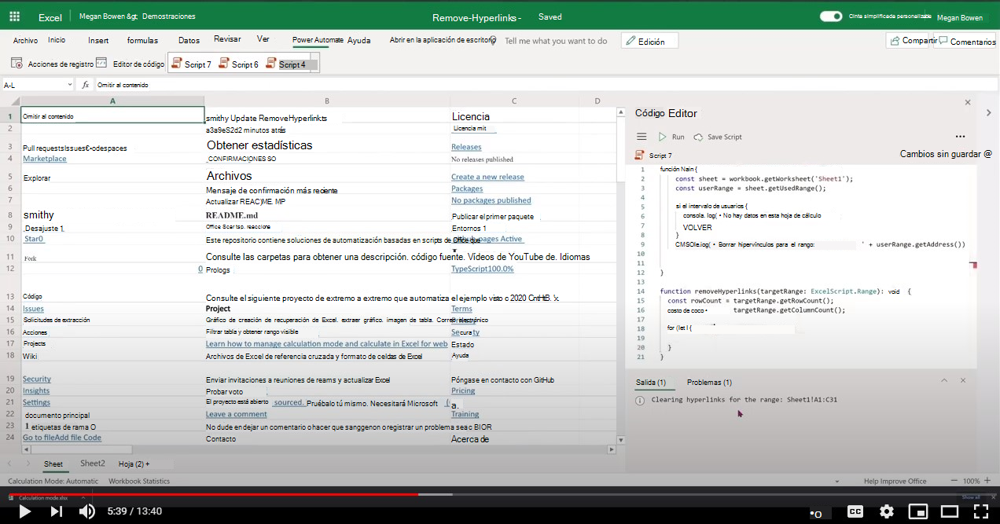

# <a name="remove-hyperlinks-from-each-cell-in-an-excel-worksheet"></a><span data-ttu-id="d4bb8-103">Quitar hipervínculos de cada celda de una hoja de cálculo de Excel</span><span class="sxs-lookup"><span data-stu-id="d4bb8-103">Remove hyperlinks from each cell in an Excel worksheet</span></span>

 <span data-ttu-id="d4bb8-104">En este ejemplo se borran todos los hipervínculos de la hoja de cálculo actual.</span><span class="sxs-lookup"><span data-stu-id="d4bb8-104">This sample clears all of the hyperlinks from the current worksheet.</span></span> <span data-ttu-id="d4bb8-105">Recorre la hoja de cálculo y, si hay algún hipervínculo asociado a la celda, borra el hipervínculo pero conserva el valor de la celda tal como está.</span><span class="sxs-lookup"><span data-stu-id="d4bb8-105">It traverses the worksheet and if there is any hyperlink associated with the cell, it clears the hyperlink yet retains the cell value as is.</span></span> <span data-ttu-id="d4bb8-106">También registra el tiempo necesario para completar el recorrido.</span><span class="sxs-lookup"><span data-stu-id="d4bb8-106">Also logs the time it takes to complete traversal.</span></span>

> [!NOTE]
> <span data-ttu-id="d4bb8-107">Esto solo funciona si el recuento de celdas < 10k.</span><span class="sxs-lookup"><span data-stu-id="d4bb8-107">This only works if the cell count is < 10k.</span></span>

## <a name="sample-code-remove-hyperlinks"></a><span data-ttu-id="d4bb8-108">Código de ejemplo: Quitar hipervínculos</span><span class="sxs-lookup"><span data-stu-id="d4bb8-108">Sample code: Remove hyperlinks</span></span>

<span data-ttu-id="d4bb8-109">Descarga el archivo <a href="remove-hyperlinks.xlsx">remove-hyperlinks.xlsx</a> usado en este ejemplo y pruébalo tú mismo.</span><span class="sxs-lookup"><span data-stu-id="d4bb8-109">Download the file <a href="remove-hyperlinks.xlsx">remove-hyperlinks.xlsx</a> used in this sample and try it out yourself!</span></span>

```TypeScript
function main(workbook: ExcelScript.Workbook, sheetName: string = 'Sheet1') {

  // Get the active worksheet. 
  let sheet = workbook.getWorksheet(sheetName);
  const targetRange = sheet.getUsedRange(true);
  if (!targetRange) {
    console.log(`There is no data in the worksheet. `)
    return;
  }
  console.log(`Target Range to clear hyperlinks from: ${targetRange.getAddress()}`);

  const rowCount = targetRange.getRowCount();
  const colCount = targetRange.getColumnCount();
  const totalCells = rowCount * colCount;
  if (totalCells > 10000) {
    console.log("Too many cells to operate with. Consider editing script to use selected range and then remove hyperlinks in batches. " + targetRange.getAddress());
    return;
  }
  // Call the helper function to remove the hyperlinks. 
  removeHyperLink(targetRange);
  return;
}

/**
 * Removes hyperlink for each cell in the target range. Logs the time it takes to complete traversal.
 * @param targetRange Target range to clear the hyperlinks from.
 */
function removeHyperLink(targetRange: ExcelScript.Range): void {
  const rowCount = targetRange.getRowCount();
  const colCount = targetRange.getColumnCount();
  console.log(`Searching for hyperlinks in ${targetRange.getAddress()} which contains ${(rowCount * colCount)} cells`);
  let clearedCount = 0;
  let cellsVisited = 0;

  let groupStart = new Date().getTime();
  for (let i = 0; i < rowCount; i++) {
    for (let j = 0; j < colCount; j++) {
      cellsVisited++;
      if (cellsVisited % 50 === 0) {
        let groupEnd = new Date().getTime();
        console.log(`Completed ${cellsVisited} cells out of ${rowCount * colCount}. This group took: ${(groupEnd - groupStart) / 1000} seconds to complete.`);
        groupStart = new Date().getTime();
      }
      const cell = targetRange.getCell(i, j);
      const hyperlink = cell.getHyperlink();
      if (hyperlink) {
        cell.clear(ExcelScript.ClearApplyTo.hyperlinks);
        cell.getFormat().getFont().setUnderline(ExcelScript.RangeUnderlineStyle.none);
        cell.getFormat().getFont().setColor('Black');
        clearedCount++;
      }
    }
  }
  console.log(`Done. Inspected ${cellsVisited} cells. Cleared hyperlinks in: ${clearedCount} cells`);
  return;
}
```

## <a name="training-video-remove-hyperlinks-from-each-cell-in-an-excel-worksheet"></a><span data-ttu-id="d4bb8-110">Vídeo de aprendizaje: quitar hipervínculos de cada celda de una hoja de cálculo de Excel</span><span class="sxs-lookup"><span data-stu-id="d4bb8-110">Training video: Remove hyperlinks from each cell in an Excel worksheet</span></span>

<span data-ttu-id="d4bb8-111">[](https://youtu.be/v20fdinxpHU "Vídeo paso a paso sobre cómo quitar hipervínculos de cada celda de una hoja de cálculo de Excel")</span><span class="sxs-lookup"><span data-stu-id="d4bb8-111">[](https://youtu.be/v20fdinxpHU "Step-by-step video on how to remove hyperlinks from each cell in an Excel worksheet")</span></span>
