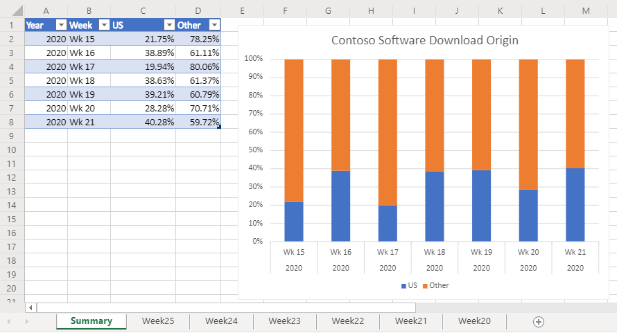

# <a name="office-scripts-sample-scenario-analyze-web-downloads"></a>Escenario de ejemplo de scripts de Office: analizar descargas Web

En este escenario, usted tiene la tarea de analizar los informes de descarga desde el sitio web de su empresa. El objetivo de este análisis es determinar si el tráfico web procede de Estados Unidos o de otros lugares del mundo.

Los compañeros cargan los datos sin procesar en el libro. El conjunto de datos de cada semana tiene su propia hoja de cálculo. También hay una hoja de cálculo de **Resumen** con una tabla y un gráfico que muestra tendencias semanales sobre la semana.

Desarrollará un script que analiza los datos de descarga semanal de la hoja de cálculo activa. Analizará la dirección IP asociada con cada descarga y determinará si llegó o no con nosotros. La respuesta se insertará en la hoja de cálculo como un valor booleano ("TRUE" o "FALSE") y se aplicará el formato condicional a esas celdas. Los resultados de la ubicación de la dirección IP se totalizarán en la hoja de cálculo y se copiarán en la tabla de resumen.

## <a name="scripting-skills-covered"></a>Habilidades de scripting cubiertas

- Análisis de texto
- Subfunciones en scripts
- Formato condicional
- Tablas

## <a name="demo-video"></a>Vídeo de demostración

Este ejemplo se ha demodo como parte de la llamada de la comunidad de desarrolladores de complementos de Office para febrero de 2020.

> [!VIDEO https://www.youtube.com/embed/vPEqbb7t6-Y?start=154]

> [!NOTE]
> El código que se muestra en este vídeo usa un modelo de API anterior (las [API asincrónicas de scripts de Office](../../develop/excel-async-model.md)). El ejemplo presentado en esta página se ha actualizado, pero el código es un poco diferente de la grabación. Los cambios no afectan el comportamiento del script o del otro contenido de la demostración del moderador.

## <a name="setup-instructions"></a>Instrucciones de instalación

1. Descargue <a href="analyze-web-downloads.xlsx">analyze-web-downloads.xlsx</a> a su OneDrive.

2. Abra el libro con Excel para la Web.

3. En la ficha **automatizar** , abra el **Editor de código**.

4. En el panel de tareas **Editor de código** , presione **nueva secuencia** de comandos y pegue el siguiente script en el editor.

    ```TypeScript
    function main(workbook: ExcelScript.Workbook) {
      /* Get the Summary worksheet and table.
       * End the script early if either object is not in the workbook.
       */
      let summaryWorksheet = workbook.getWorksheet("Summary");
      if (!summaryWorksheet) {
        console.log("The script expects a worksheet named \"Summary\". Please download the correct template and try again.");
        return;
      }
      let summaryTable = summaryWorksheet.getTable("Table1");
      if (!summaryTable) {
        console.log("The script expects a summary table named \"Table1\". Please download the correct template and try again.");
        return;
      }

      // Get the current worksheet.
      let currentWorksheet = workbook.getActiveWorksheet();
      if (currentWorksheet.getName().toLocaleLowerCase().indexOf("week") !== 0) {
        console.log("Please switch worksheet to one of the weekly data sheets and try again.")
        return;
      }

      // Get the values of the active range of the active worksheet.
      let logRange = currentWorksheet.getUsedRange();

      if (logRange.getColumnCount() !== 8) {
        console.log(`Verify that you are on the correct worksheet. Either the week's data has been already processed or the content is incorrect. The following columns are expected: ${[
          "Time Stamp", "IP Address", "kilobytes", "user agent code", "milliseconds", "Request", "Results", "Referrer"
        ]}`);
        return;
      }
      // Get the range that will contain TRUE/FALSE if the IP address is from the United States (US).
      let isUSColumn = logRange
        .getLastColumn()
        .getOffsetRange(0, 1);

      // Get the values of all the US IP addresses.
      let ipRange = workbook.getWorksheet("USIPAddresses").getUsedRange();
      let ipRangeValues = ipRange.getValues();
      let logRangeValues = logRange.getValues();
      // Remove the first row.
      let topRow = logRangeValues.shift();
      console.log(`Analyzing ${logRangeValues.length} entries.`);

      // Create a new array to contain the boolean representing if this is a US IP address.
      let newCol = [];

      // Go through each row in worksheet and add Boolean.
      for (let i = 0; i < logRangeValues.length; i++) {
        let curRowIP = logRangeValues[i][1];
        if (findIP(ipRangeValues, ipAddressToInteger(curRowIP)) > 0) {
          newCol.push([true]);
        } else {
          newCol.push([false]);
        }
      }

      // Remove the empty column header and add proper heading.
      newCol = [["Is US IP"], ...newCol];

      // Write the result to the spreadsheet.
      console.log(`Adding column to indicate whether IP belongs to US region or not at address: ${isUSColumn.getAddress()}`);
      console.log(newCol.length);
      console.log(newCol);
      isUSColumn.setValues(newCol);

      // Call the local function to add summary data to the worksheet.
      addSummaryData();

      // Call the local function to apply conditional formatting.
      applyConditionalFormatting(isUSColumn);

      // Autofit columns.
      currentWorksheet.getUsedRange().getFormat().autofitColumns();

      // Get the calculated summary data.
      let summaryRangeValues = currentWorksheet.getRange("J2:M2").getValues();

      // Add the corresponding row to the summary table.
      summaryTable.addRow(null, summaryRangeValues[0]);
      console.log("Complete.");
      return;

      /**
       * A function to add summary data on the worksheet.
       */
      function addSummaryData() {
        // Add a summary row and table.
        let summaryHeader = [["Year", "Week", "US", "Other"]];
        let countTrueFormula =
          "=COUNTIF(" + isUSColumn.getAddress() + ', "=TRUE")/' + (newCol.length - 1);
        let countFalseFormula =
          "=COUNTIF(" + isUSColumn.getAddress() + ', "=FALSE")/' + (newCol.length - 1);

        let summaryContent = [
          [
            '=TEXT(A2,"YYYY")',
            '=TEXTJOIN(" ", FALSE, "Wk", WEEKNUM(A2))',
            countTrueFormula,
            countFalseFormula
          ]
        ];
        let summaryHeaderRow = currentWorksheet
          .getRange("J1:M1");
        let summaryContentRow = currentWorksheet
          .getRange("J2:M2");
        console.log("2");

        summaryHeaderRow.setValues(summaryHeader);
        console.log("3");

        summaryContentRow.setValues(summaryContent);
        console.log("4");

        let formats = [[".000", ".000"]];
        summaryContentRow
          .getOffsetRange(0, 2)
          .getResizedRange(0, -2).setNumberFormats(formats);
      }
    }
    /**
     * Apply conditional formatting based on TRUE/FALSE values of the Is US IP column.
     */
    function applyConditionalFormatting(isUSColumn: ExcelScript.Range) {
      // Add conditional formatting to the new column.
      let conditionalFormatTrue = isUSColumn.addConditionalFormat(
        ExcelScript.ConditionalFormatType.cellValue
      );
      let conditionalFormatFalse = isUSColumn.addConditionalFormat(
        ExcelScript.ConditionalFormatType.cellValue
      );
      // Set TRUE to light blue and FALSE to light orange.
      conditionalFormatTrue.getCellValue().getFormat().getFill().setColor("#8FA8DB");
      conditionalFormatTrue.getCellValue().setRule({
        formula1: "=TRUE",
        operator: ExcelScript.ConditionalCellValueOperator.equalTo
      });
      conditionalFormatFalse.getCellValue().getFormat().getFill().setColor("#F8CCAD");
      conditionalFormatFalse.getCellValue().setRule({
        formula1: "=FALSE",
        operator: ExcelScript.ConditionalCellValueOperator.equalTo
      });
    }
    /**
     * Translate an IP address into an integer.
     * @param ipAddress: IP address to verify.
     */
    function ipAddressToInteger(ipAddress: string): number {
      // Split the IP address into octets.
      let octets = ipAddress.split(".");

      // Create a number for each octet and do the math to create the integer value of the IP address.
      let fullNum =
        // Define an arbitrary number for the last octet.
        111 +
        parseInt(octets[2]) * 256 +
        parseInt(octets[1]) * 65536 +
        parseInt(octets[0]) * 16777216;
      return fullNum;
    }
    /**
     * Return the row number where the ip address is found.
     * @param ipLookupTable IP look-up table.
     * @param n IP address to number value.  
     */
    function findIP(ipLookupTable: number[][], n: number): number {
      for (let i = 0; i < ipLookupTable.length; i++) {
        if (ipLookupTable[i][0] <= n && ipLookupTable[i][1] >= n) {
          return i;
        }
      }
      return -1;
    }
    ```

5. Cambie el nombre del script para **analizar las descargas Web** y guardarlas.

## <a name="running-the-script"></a>Ejecución del script

Navegue a cualquiera de las hojas de cálculo de la **semana \* \*** y ejecute el script **analizar descargas Web** . El script aplicará el formato condicional y el etiquetado de ubicación en la hoja actual. También se actualizará la hoja de cálculo de **Resumen** .

### <a name="before-running-the-script"></a>Antes de ejecutar el script


### <a name="after-running-the-script"></a>Después de ejecutar el script



