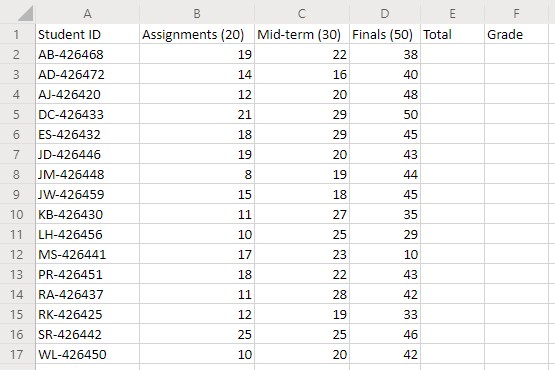

# <a name="office-scripts-sample-scenario-grade-calculator"></a>Escenario de ejemplo de scripts de Office: Calculadora de calificaciones

En este escenario, usted es un instructor que rellene las calificaciones de fin de período de cada estudiante. Ha estado especificando los resultados de sus asignaciones y pruebas a medida que avanza. Ahora, es el momento de determinar los Fates de los alumnos.

Desarrollará un script que totaliza las calificaciones para cada categoría de punto. A continuación, asignará una letra de calificación a cada estudiante en función del total. Para ayudar a garantizar la precisión, agregará un par de comprobaciones para ver si alguna puntuación individual es demasiado baja o alta. Si la puntuación de un estudiante es menor que cero o mayor que el valor de punto posible, el script marcará la celda con un relleno rojo y no hará un total de los puntos del estudiante. Esto será una indicación clara de los registros que debe comprobar dos veces. También agregará formato básico a las calificaciones para que pueda ver rápidamente la parte superior e inferior de la clase.

## <a name="scripting-skills-covered"></a>Habilidades de scripting cubiertas

- Formato de celda
- Comprobación de errores
- Expresiones regulares
- Formato condicional

## <a name="setup-instructions"></a>Instrucciones de instalación

1. Descargue <a href="grade-calculator.xlsx">grade-calculator.xlsx</a> a su OneDrive.

2. Abra el libro con Excel para la Web.

3. En la ficha **automatizar** , abra el **Editor de código**.

4. En el panel de tareas **Editor de código** , presione **nueva secuencia** de comandos y pegue el siguiente script en el editor.

    ```TypeScript
    function main(workbook: ExcelScript.Workbook) {
      // Get the worksheet and validate the data.
      let studentsRange = workbook.getActiveWorksheet().getUsedRange();
      if (studentsRange.getColumnCount() !== 6) {
        throw new Error(`The required columns are not present. Expected column headers: "Student ID | Assignment score | Mid-term | Final | Total | Grade"`);
      }

      let studentData = studentsRange.getValues();

      // Clear the total and grade columns.
      studentsRange.getColumn(4).getCell(1, 0).getAbsoluteResizedRange(studentData.length - 1, 2).clear();

      // Clear all conditional formatting.
      workbook.getActiveWorksheet().getUsedRange().clearAllConditionalFormats();

      // Use regular expressions to read the max score from the assignment, mid-term, and final scores columns.
      let maxScores: string[] = [];
      const assignmentMaxMatches = studentData[0][1].match(/\d+/);
      const midtermMaxMatches = studentData[0][2].match(/\d+/);
      const finalMaxMatches = studentData[0][3].match(/\d+/);

      // Check the matches happened before proceeding.
      if (!(assignmentMaxMatches && midtermMaxMatches && finalMaxMatches)) {
        throw new Error(`The scores are not present in the column headers. Expected format: "Assignments (n)|Mid-term (n)|Final (n)"`);
      }

      // Use the first (and only) match from the regular expressions as the max scores.
      maxScores = [assignmentMaxMatches[0], midtermMaxMatches[0], finalMaxMatches[0]];

      // Set conditional formatting for each of the assignment, mid-term, and final scores columns.
      maxScores.forEach((score, i) => {
        let range = studentsRange.getColumn(i + 1).getCell(0, 0).getRowsBelow(studentData.length - 1);
        setCellValueConditionalFormatting(
          score,
          range,
          "#9C0006",
          "#FFC7CE",
          ExcelScript.ConditionalCellValueOperator.greaterThan
        )
      });

      // Store the current range information to avoid calling the workbook in the loop.
      let studentsRangeFormulas = studentsRange.getColumn(4).getFormulasR1C1();
      let studentsRangeValues = studentsRange.getColumn(5).getValues();

      /* Iterate over each of the student rows and compute the total score and letter grade.
      * Note that iterator starts at index 1 to skip first (header) row.
      */
      for (let i = 1; i < studentData.length; i++) {
        // If any of the scores are invalid, skip processing it.
        if (studentData[i][1] > maxScores[0] ||
          studentData[i][2] > maxScores[1] ||
          studentData[i][3] > maxScores[2]) {
          continue;
        }
        const total = studentData[i][1] + studentData[i][2] + studentData[i][3];
        let grade: string;
        switch (true) {
          case total < 60:
            grade = "F";
            break;
          case total < 70:
            grade = "D";
            break;
          case total < 80:
            grade = "C";
            break;
          case total < 90:
            grade = "B";
            break;
          default:
            grade = "A";
            break;
        }

        // Set total score formula.
        studentsRangeFormulas[i][0] = '=RC[-2]+RC[-1]';
        // Set grade cell.
        studentsRangeValues[i][0] = grade;
      }

      // Set the formulas and values outside the loop.
      studentsRange.getColumn(4).setFormulasR1C1(studentsRangeFormulas);
      studentsRange.getColumn(5).setValues(studentsRangeValues);

      // Put a conditional formatting on the grade column.
      let totalRange = studentsRange.getColumn(5).getCell(0, 0).getRowsBelow(studentData.length - 1);
      setCellValueConditionalFormatting(
        "A",
        totalRange,
        "#001600",
        "#C6EFCE",
        ExcelScript.ConditionalCellValueOperator.equalTo
      );
      ["D", "F"].forEach((grade) => {
        setCellValueConditionalFormatting(
          grade,
          totalRange,
          "#9C0006",
          "#FFC7CE",
          ExcelScript.ConditionalCellValueOperator.equalTo
        );
      })
      // Center the grade column.
      studentsRange.getColumn(5).getFormat().setHorizontalAlignment(ExcelScript.HorizontalAlignment.center);
    }

    /**
     * Helper function to apply conditional formatting.
     * @param value Cell value to use in conditional formatting formula1.
     * @param range Target range.
     * @param fontColor Font color to use.
     * @param fillColor Fill color to use.
     * @param operator Operator to use in conditional formatting.
     */
    function setCellValueConditionalFormatting(
      value: string,
      range: ExcelScript.Range,
      fontColor: string,
      fillColor: string,
      operator: ExcelScript.ConditionalCellValueOperator) {
      // Determine the formula1 based on the type of value parameter.
      let formula1: string;
      if (isNaN(Number(value))) {
        // For cell value equalTo rule, use this format: formula1: "=\"A\"",
        formula1 = `=\"${value}\"`;
      } else {
        // For number input (greater-than or less-than rules), just append '='.
        formula1 = `=${value}`;
      }

      // Apply conditional formatting.
      let conditionalFormatting : ExcelScript.ConditionalFormat;
      conditionalFormatting = range.addConditionalFormat(ExcelScript.ConditionalFormatType.cellValue);
      conditionalFormatting.getCellValue().getFormat().getFont().setColor(fontColor);
      conditionalFormatting.getCellValue().getFormat().getFill().setColor(fillColor);
      conditionalFormatting.getCellValue().setRule({formula1, operator});
    }
    ```

5. Cambie el nombre del script a **Evaluation Calculator** y guárdelo.

## <a name="running-the-script"></a>Ejecución del script

Ejecutar el script de la **calculadora de calificación** en la única hoja de cálculo. El script totalizará las calificaciones y asignará a cada alumno una carta de calificación. Si alguna de las calificaciones tiene más puntos de los que merece la asignación o la prueba, la calificación infractora se marcará como roja y no se calculará el total.

### <a name="before-running-the-script"></a>Antes de ejecutar el script



### <a name="after-running-the-script"></a>Después de ejecutar el script


