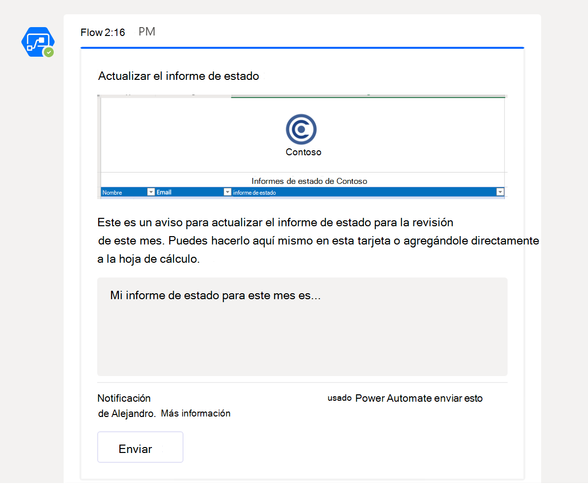
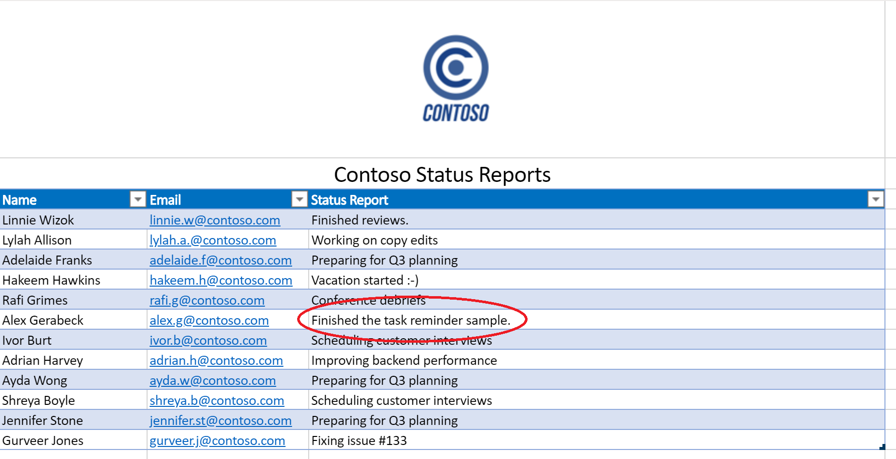

# <a name="office-scripts-sample-scenario-automated-task-reminders"></a>Escenario de ejemplo scripts de Office: avisos de tareas automatizadas

En este escenario, está administrando un proyecto. Use una hoja de cálculo de Excel para realizar un seguimiento del estado de los empleados cada mes. A menudo debes recordar a los usuarios que rellenen su estado, por lo que has decidido automatizar ese proceso de aviso.

Crearás un flujo de Power Automate para enviar mensajes a personas con campos de estado que faltan y aplicar sus respuestas a la hoja de cálculo. Para ello, desarrollará un par de scripts para controlar el trabajo con el libro. El primer script obtiene una lista de personas con estados en blanco y el segundo script agrega una cadena de estado a la fila derecha. También usarás las tarjetas adaptables de [Teams](/microsoftteams/platform/task-modules-and-cards/what-are-cards) para que los empleados escriban su estado directamente desde la notificación.

## <a name="scripting-skills-covered"></a>Habilidades de scripting cubiertas

- Crear flujos en Power Automate
- Pasar datos a scripts
- Devolver datos de scripts
- Tarjetas adaptables de Teams
- Tablas

## <a name="prerequisites"></a>Requisitos previos

En este escenario se [usan Power Automate](https://flow.microsoft.com) y Microsoft [Teams.](https://www.microsoft.com/microsoft-365/microsoft-teams/group-chat-software) Necesitará ambos asociados con la cuenta que use para desarrollar scripts de Office. Para obtener acceso gratuito a una suscripción de Microsoft Developer para obtener información sobre estas aplicaciones y trabajar con ellas, considere la posibilidad de unirse al Programa de desarrolladores de [Microsoft 365](https://developer.microsoft.com/microsoft-365/dev-program).

## <a name="setup-instructions"></a>Instrucciones de configuración

1. Descarga <a href="task-reminders.xlsx">task-reminders.xlsx</a> a tu OneDrive.

2. Abra el libro en Excel en la web.

3. En la **pestaña Automatizar,** abra **Todos los scripts**.

4. En primer lugar, necesitamos un script para obtener todos los empleados con informes de estado que faltan en la hoja de cálculo. En el **panel de tareas Editor** de código, presione Nuevo **script** y pegue el siguiente script en el editor.

    ```TypeScript
    /**
     * This script looks for missing status reports in a project management table.
     *
     * @returns An array of Employee objects (containing their names and emails).
     */
    function main(workbook: ExcelScript.Workbook): Employee[] {
      // Get the first worksheet and the first table on that worksheet.
      let sheet = workbook.getFirstWorksheet()
      let table = sheet.getTables()[0];

      // Give the column indices names matching their expected content.
      const NAME_INDEX = 0;
      const EMAIL_INDEX = 1;
      const STATUS_REPORT_INDEX = 2;

      // Get the data for the whole table.
      let bodyRangeValues = table.getRangeBetweenHeaderAndTotal().getValues();

      // Create the array of Employee objects to return.
      let people: Employee[] = [];

      // Loop through the table and check each row for completion.
      for (let i = 0; i < bodyRangeValues.length; i++) {
        let row = bodyRangeValues[i];
        if (row[STATUS_REPORT_INDEX] === "") {
          // Save the email to return.
          people.push({ name: row[NAME_INDEX].toString(), email: row[EMAIL_INDEX].toString() });
        }
      }

      // Log the array to verify we're getting the right rows.
      console.log(people);

      // Return the array of Employees.
      return people;
    }

    /**
     * An interface representing an employee.
     * An array of Employees will be returned from the script
     * for the Power Automate flow.
     */
    interface Employee {
      name: string;
      email: string;
    }
    ```

5. Guarde el script con el nombre **Get People**.

6. A continuación, necesitamos un segundo script para procesar las tarjetas de informe de estado y colocar la nueva información en la hoja de cálculo. En el **panel de tareas Editor** de código, presione Nuevo **script** y pegue el siguiente script en el editor.

    ```TypeScript
    /**
     * This script applies the results of a Teams Adaptive Card about
     * a status update to a project management table.
     *
     * @param senderEmail - The email address of the employee updating their status.
     * @param statusReportResponse - The employee's status report.
     */
    function main(workbook: ExcelScript.Workbook,
      senderEmail: string,
      statusReportResponse: string) {

      // Get the first worksheet and the first table in that worksheet.
      let sheet = workbook.getFirstWorksheet();
      let table = sheet.getTables()[0];

      // Give the column indices names matching their expected content.
      const NAME_INDEX = 0;
      const EMAIL_INDEX = 1;
      const STATUS_REPORT_INDEX = 2;

      // Get the range and data for the whole table.
      let bodyRange = table.getRangeBetweenHeaderAndTotal();
      let tableRowCount = bodyRange.getRowCount();
      let bodyRangeValues = bodyRange.getValues();

      // Create a flag to denote success.
      let statusAdded = false;

      // Loop through the table and check each row for a matching email address.
      for (let i = 0; i < tableRowCount && !statusAdded; i++) {
        let row = bodyRangeValues[i];

        // Check if the row's email address matches.
        if (row[EMAIL_INDEX] === senderEmail) {
          // Add the Teams Adaptive Card response to the table.
          bodyRange.getCell(i, STATUS_REPORT_INDEX).setValues([
            [statusReportResponse]
          ]);
          statusAdded = true;
        }
      }

      // If successful, log the status update.
      if (statusAdded) {
        console.log(
          `Successfully added status report for ${senderEmail} containing: ${statusReportResponse}`
        );
      }
    }
    ```

7. Guarde el script con el nombre **Guardar estado**.

8. Ahora, debemos crear el flujo. Abra [Power Automate](https://flow.microsoft.com/).

    > [!TIP]
    > Si no has creado un flujo antes, consulta nuestro tutorial Empezar a usar scripts con [Power Automate](../../tutorials/excel-power-automate-manual.md) para aprender los conceptos básicos.

9. Crear un nuevo **flujo instantáneo**.

10. Elija **Desencadenar manualmente un flujo de** las opciones y presione **Crear**.

11. El flujo debe llamar al script **Obtener personas** para obtener todos los empleados con campos de estado vacíos. Presione **Nuevo paso** y seleccione Excel Online **(Empresa).** En **Acciones**, seleccione **Ejecutar script (versión preliminar)**. Proporcione las siguientes entradas para el paso de flujo:

    - **Ubicación**: OneDrive para la Empresa
    - **Biblioteca de documentos**: OneDrive
    - **Archivo**: task-reminders.xlsx *(elegido a través del explorador de archivos)*
    - **Script**: Obtener personas

    

12. A continuación, el flujo debe procesar cada empleado de la matriz devuelta por el script. Presione **Nuevo paso** y seleccione Publicar una tarjeta adaptable a un usuario de Teams y esperar una **respuesta**.

13. Para el **campo Destinatario,** agregue **correo electrónico** desde el contenido dinámico (la selección tendrá el logotipo de Excel). Agregar **correo** electrónico hace que el paso de flujo esté rodeado por un **aplicar a cada** bloque. Esto significa que Power Automate iterará la matriz.

14. El envío de una tarjeta adaptable requiere que el JSON de la tarjeta se proporciona como **message**. Puede usar el Diseñador de [tarjetas adaptables](https://adaptivecards.io/designer/) para crear tarjetas personalizadas. Para este ejemplo, use el siguiente JSON.  

    ```json
    {
      "$schema": "http://adaptivecards.io/schemas/adaptive-card.json",
      "type": "AdaptiveCard",
      "version": "1.0",
      "body": [
        {
          "type": "TextBlock",
          "size": "Medium",
          "weight": "Bolder",
          "text": "Update your Status Report"
        },
        {
          "type": "Image",
          "altText": "",
          "url": "https://i.imgur.com/f5RcuF3.png"
        },
        {
          "type": "TextBlock",
          "text": "This is a reminder to update your status report for this month's review. You can do so right here in this card, or by adding it directly to the spreadsheet.",
          "wrap": true
        },
        {
          "type": "Input.Text",
          "placeholder": "My status report for this month is...",
          "id": "response",
          "isMultiline": true
        }
      ],
      "actions": [
        {
          "type": "Action.Submit",
          "title": "Submit",
          "id": "submit"
        }
      ]
    }
    ```

15. Rellene los campos restantes de la siguiente manera:

    - **Mensaje de actualización:** gracias por enviar el informe de estado. La respuesta se ha agregado correctamente a la hoja de cálculo.
    - **Debe actualizar la tarjeta**: Sí

16. En el **bloque Aplicar** a cada bloque, después de publicar una tarjeta adaptable a un usuario de Teams y esperar **una** respuesta, presione Agregar **una acción**. Seleccione **Excel Online (Empresa).** En **Acciones**, seleccione **Ejecutar script (versión preliminar)**. Proporcione las siguientes entradas para el paso de flujo:

    - **Ubicación**: OneDrive para la Empresa
    - **Biblioteca de documentos**: OneDrive
    - **Archivo**: task-reminders.xlsx *(elegido a través del explorador de archivos)*
    - **Script**: Guardar estado
    - **senderEmail:** correo *electrónico (contenido dinámico de Excel)*
    - **statusReportResponse**: response *(contenido dinámico de Teams)*

    

17. Guarde el flujo.

## <a name="running-the-flow"></a>Ejecución del flujo

Para probar el flujo, asegúrese de que cualquier fila de tabla con estado en blanco use una dirección de correo electrónico vinculada a una cuenta de Teams (probablemente debería usar su propia dirección de correo electrónico durante las pruebas).

Puede seleccionar Probar **en** el diseñador de flujos o ejecutar el flujo desde la **página Mis flujos.** Después de iniciar el flujo y aceptar el uso de las conexiones necesarias, debes recibir una tarjeta adaptable de Power Automate a través de Teams. Una vez rellenado el campo de estado en la tarjeta, el flujo continuará y actualizará la hoja de cálculo con el estado que proporcione.

### <a name="before-running-the-flow"></a>Antes de ejecutar el flujo


### <a name="receiving-the-adaptive-card"></a>Recepción de la tarjeta adaptable



### <a name="after-running-the-flow"></a>Después de ejecutar el flujo


