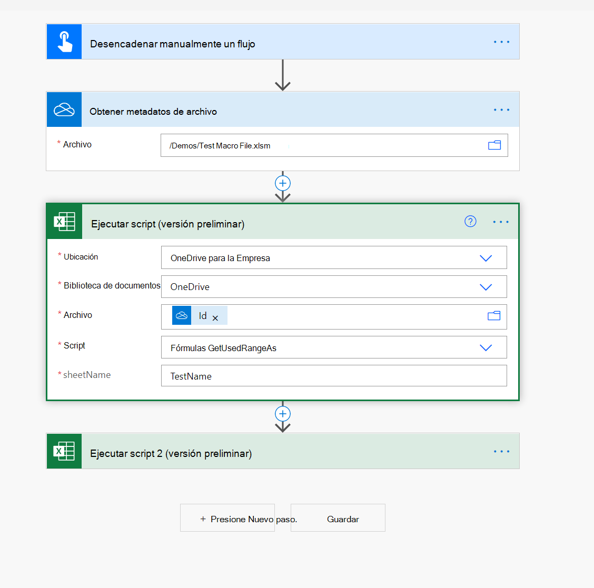

# Cómo usar archivos de macro en flujos de Power Automate

[Los flujos de Power Automate](https://flow.microsoft.com/) proporcionan [conectores de Excel](https://flow.microsoft.com/connectors/shared_excelonlinebusiness/excel-online-business/) para ayudar a conectar archivos de Excel con el resto de los datos y aplicaciones de la organización, como Teams, Outlook y SharePoint.

Sin embargo, los archivos de macro no se pueden seleccionar en el desplegable de archivos (vea un ejemplo en la siguiente captura de pantalla).

Una forma de evitar este problema es incluir la acción "Obtener metadatos de archivo" (OneDrive o SharePoint) y usar la propiedad ID en la acción "Ejecutar script", como se muestra en la siguiente captura de pantalla.

> [!NOTE]
> Es posible que algunos XLSM (especialmente los que tienen controles ActiveX/Formulario) no funcionen en el conector en línea de Excel. Asegúrese de probar antes de implementar la solución.

