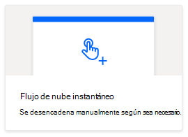
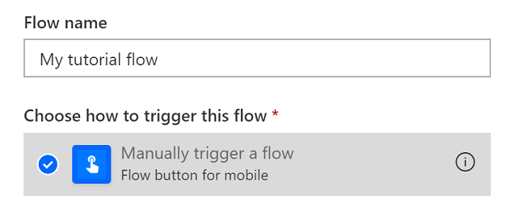
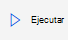

# <a name="start-using-scripts-with-power-automate-preview"></a>Empezar a usar scripts con Power automatization (versión preliminar)

Este tutorial le enseña a ejecutar un script de Office para Excel en la web a través de la automatización de la [energía](https://flow.microsoft.com).

## <a name="prerequisites"></a>Requisitos previos

[!INCLUDE [Tutorial prerequisites](../includes/tutorial-prerequisites.md)]

> [!IMPORTANT]
> En este tutorial se supone que ha completado el tutorial de [registro, edición y creación de scripts de Office en Excel en la web](excel-tutorial.md) .

## <a name="prepare-the-workbook"></a>Preparar el libro

La automatización de energía no puede usar referencias relativas como `Workbook.getActiveWorksheet` para tener acceso a componentes de libros. Por lo tanto, se necesita un libro y una hoja de cálculo con nombres coherentes a los que la automatización pueda hacer referencia.

1. Cree un nuevo libro denominado mi **libro**.

2. En el libro mi **libro** , cree una hoja de cálculo denominada **TutorialWorksheet**.

## <a name="create-an-office-script"></a>Crear un script de Office

1. Vaya a la ficha **automatizar** y seleccione **Editor de código**.

2. Seleccione **nuevo script**.

3. Reemplace el script predeterminado por el siguiente script. Este script agrega la fecha y la hora actuales a las dos primeras celdas de la hoja de cálculo **TutorialWorksheet** .

    ```TypeScript
    function main(workbook: ExcelScript.Workbook) {
      // Get the "TutorialWorksheet" worksheet from the workbook.
      let worksheet = workbook.getWorksheet("TutorialWorksheet");

      // Get the cells at A1 and B1.
      let dateRange = worksheet.getRange("A1");
      let timeRange = worksheet.getRange("B1");

      // Get the current date and time using the JavaScript Date object.
      let date = new Date(Date.now());

      // Add the date string to A1.
      dateRange.setValue(date.toLocaleDateString());

      // Add the time string to B1.
      timeRange.setValue(date.toLocaleTimeString());
    }
    ```

4. Cambie el nombre del script para **establecer la fecha y la hora**. Presione el nombre del script para cambiarlo.

5. Guarde el script presionando **Guardar script**.

## <a name="create-an-automated-workflow-with-power-automate"></a>Crear un flujo de trabajo automatizado con Power automaticing

1. Inicie sesión en el [sitio de vista previa de Automate Power](https://flow.microsoft.com).

2. En el menú que se muestra en la parte izquierda de la pantalla, presione **crear**. Esto le ofrece la lista de formas de crear nuevos flujos de trabajo.

    

3. En la sección **empezar desde en blanco** , seleccione **flujo instantáneo**. Esto crea un flujo de trabajo activado manualmente.

    

4. En la ventana de diálogo que aparece, escriba un nombre para el flujo en el cuadro de texto **nombre de flujo** , seleccione **desencadenar manualmente un flujo** de la lista de opciones en **Elija cómo activar el flujo**y presione **crear**.

    

5. Presione **nuevo paso**.

6. Seleccione la pestaña **estándar** y, a continuación, seleccione **Excel online (empresa)**.

    

7. En **acciones**, seleccione **Ejecutar script (vista previa)**.

    

8. Especifique las siguientes opciones para el conector de **ejecución de script** :

    - **Ubicación**: OneDrive para la empresa
    - **Biblioteca de documentos**: OneDrive
    - **Archivo**: MyWorkbook.xlsx
    - **Script**: establecer fecha y hora

    

9. Haga clic en **Guardar**.

El flujo ya está listo para ejecutarse a través de la automatización de la energía. Puede probarla con el botón **Test** del editor de flujos o seguir los pasos restantes del tutorial para ejecutar el flujo desde la colección de flujos.

## <a name="run-the-script-through-power-automate"></a>Ejecutar el script mediante la automatización de la energía

1. En la Página principal de Power automatizar, seleccione **Mis flujos**.

    

2. Seleccione **mi flujo de tutorial** en la lista de flujos que se muestra en la ficha **Mis flujos** . Muestra los detalles del flujo que se creó anteriormente.

3. Presione **Ejecutar**.

    

4. Aparecerá un panel de tareas para ejecutar el flujo. Si se le pide que **inicie sesión** en Excel online, hágalo presionando **continuar**.

5. Presione el **flujo de ejecución**. Esto ejecuta el flujo, que ejecuta el script de Office relacionado.

6. Haga clic en **listo**. Debería ver la sección **ejecuciones** en consecuencia.

7. Actualice la página para ver los resultados de la automatización de la energía. Si se realizó correctamente, vaya al libro para ver las celdas actualizadas. Si se produce un error, Compruebe la configuración del flujo y ejecútela una segunda vez.

    

## <a name="next-steps"></a>Siguientes pasos

Complete el tutorial [ejecutar automáticamente scripts con flujos automatizado de energía automatizada](excel-power-automate-trigger.md) . Enseña a pasar datos de un servicio de flujo de trabajo a su script de Office.
