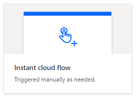
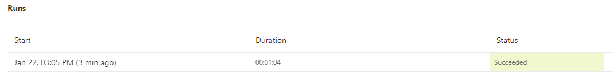

# <a name="start-using-scripts-with-power-automate-preview"></a><span data-ttu-id="edd09-103">Empezar a usar scripts con Power automatization (versión preliminar)</span><span class="sxs-lookup"><span data-stu-id="edd09-103">Start using scripts with Power Automate (preview)</span></span>

<span data-ttu-id="edd09-104">Este tutorial le enseña a ejecutar un script de Office para Excel en la web a través de la automatización de la [energía](https://flow.microsoft.com).</span><span class="sxs-lookup"><span data-stu-id="edd09-104">This tutorial teaches you how to run an Office Script for Excel on the web through [Power Automate](https://flow.microsoft.com).</span></span>

## <a name="prerequisites"></a><span data-ttu-id="edd09-105">Requisitos previos</span><span class="sxs-lookup"><span data-stu-id="edd09-105">Prerequisites</span></span>

[!INCLUDE [Tutorial prerequisites](../includes/tutorial-prerequisites.md)]

> [!IMPORTANT]
> <span data-ttu-id="edd09-106">En este tutorial se supone que ha completado el tutorial de [registro, edición y creación de scripts de Office en Excel en la web](excel-tutorial.md) .</span><span class="sxs-lookup"><span data-stu-id="edd09-106">This tutorial assumes you have completed the [Record, edit, and create Office Scripts in Excel on the web](excel-tutorial.md) tutorial.</span></span>

## <a name="prepare-the-workbook"></a><span data-ttu-id="edd09-107">Preparar el libro</span><span class="sxs-lookup"><span data-stu-id="edd09-107">Prepare the workbook</span></span>

<span data-ttu-id="edd09-108">La automatización de energía no puede usar referencias relativas como `Workbook.getActiveWorksheet` para tener acceso a componentes de libros.</span><span class="sxs-lookup"><span data-stu-id="edd09-108">Power Automate can't use relative references like `Workbook.getActiveWorksheet` to access workbook components.</span></span> <span data-ttu-id="edd09-109">Por lo tanto, se necesita un libro y una hoja de cálculo con nombres coherentes a los que la automatización pueda hacer referencia.</span><span class="sxs-lookup"><span data-stu-id="edd09-109">So, we need a workbook and worksheet with consistent names that Power Automate can reference.</span></span>

1. <span data-ttu-id="edd09-110">Cree un nuevo libro denominado mi **libro**.</span><span class="sxs-lookup"><span data-stu-id="edd09-110">Create a new workbook named **MyWorkbook**.</span></span>

2. <span data-ttu-id="edd09-111">En el libro mi **libro** , cree una hoja de cálculo denominada **TutorialWorksheet**.</span><span class="sxs-lookup"><span data-stu-id="edd09-111">In the **MyWorkbook** workbook, create a worksheet called **TutorialWorksheet**.</span></span>

## <a name="create-an-office-script"></a><span data-ttu-id="edd09-112">Crear un script de Office</span><span class="sxs-lookup"><span data-stu-id="edd09-112">Create an Office Script</span></span>

1. <span data-ttu-id="edd09-113">Vaya a la ficha **automatizar** y seleccione **Editor de código**.</span><span class="sxs-lookup"><span data-stu-id="edd09-113">Go to the **Automate** tab and select **Code Editor**.</span></span>

2. <span data-ttu-id="edd09-114">Seleccione **nuevo script**.</span><span class="sxs-lookup"><span data-stu-id="edd09-114">Select **New Script**.</span></span>

3. <span data-ttu-id="edd09-115">Reemplace el script predeterminado por el siguiente script.</span><span class="sxs-lookup"><span data-stu-id="edd09-115">Replace the default script with the following script.</span></span> <span data-ttu-id="edd09-116">Este script agrega la fecha y la hora actuales a las dos primeras celdas de la hoja de cálculo **TutorialWorksheet** .</span><span class="sxs-lookup"><span data-stu-id="edd09-116">This script adds the current date and time to the first two cells of the **TutorialWorksheet** worksheet.</span></span>

    ```TypeScript
    function main(workbook: ExcelScript.Workbook) {
      // Get the "TutorialWorksheet" worksheet from the workbook.
      let worksheet = workbook.getWorksheet("TutorialWorksheet");

      // Get the cells at A1 and B1.
      let dateRange = worksheet.getRange("A1");
      let timeRange = worksheet.getRange("B1");

      // Get the current date and time using the JavaScript Date object.
      let date = new Date(Date.now());

      // Add the date string to A1.
      dateRange.setValue(date.toLocaleDateString());

      // Add the time string to B1.
      timeRange.setValue(date.toLocaleTimeString());
    }
    ```

4. <span data-ttu-id="edd09-117">Cambie el nombre del script para **establecer la fecha y la hora**.</span><span class="sxs-lookup"><span data-stu-id="edd09-117">Rename the script to **Set date and time**.</span></span> <span data-ttu-id="edd09-118">Presione el nombre del script para cambiarlo.</span><span class="sxs-lookup"><span data-stu-id="edd09-118">Press the script name to change it.</span></span>

5. <span data-ttu-id="edd09-119">Guarde el script presionando **Guardar script**.</span><span class="sxs-lookup"><span data-stu-id="edd09-119">Save the script by pressing **Save Script**.</span></span>

## <a name="create-an-automated-workflow-with-power-automate"></a><span data-ttu-id="edd09-120">Crear un flujo de trabajo automatizado con Power automaticing</span><span class="sxs-lookup"><span data-stu-id="edd09-120">Create an automated workflow with Power Automate</span></span>

1. <span data-ttu-id="edd09-121">Inicie sesión en el [sitio de vista previa de Automate Power](https://flow.microsoft.com).</span><span class="sxs-lookup"><span data-stu-id="edd09-121">Sign in to the [Power Automate preview site](https://flow.microsoft.com).</span></span>

2. <span data-ttu-id="edd09-122">En el menú que se muestra en la parte izquierda de la pantalla, presione **crear**.</span><span class="sxs-lookup"><span data-stu-id="edd09-122">In the menu that's displayed on the left side of the screen, press **Create**.</span></span> <span data-ttu-id="edd09-123">Esto le ofrece la lista de formas de crear nuevos flujos de trabajo.</span><span class="sxs-lookup"><span data-stu-id="edd09-123">This brings you to list of ways to create new workflows.</span></span>

    

3. <span data-ttu-id="edd09-125">En la sección **empezar desde en blanco** , seleccione **flujo instantáneo**.</span><span class="sxs-lookup"><span data-stu-id="edd09-125">In the **Start from blank** section, select **Instant flow**.</span></span> <span data-ttu-id="edd09-126">Esto crea un flujo de trabajo activado manualmente.</span><span class="sxs-lookup"><span data-stu-id="edd09-126">This creates a manually activated workflow.</span></span>

    

4. <span data-ttu-id="edd09-128">En la ventana de diálogo que aparece, escriba un nombre para el flujo en el cuadro de texto **nombre de flujo** , seleccione **desencadenar manualmente un flujo** de la lista de opciones en **Elija cómo activar el flujo**y presione **crear**.</span><span class="sxs-lookup"><span data-stu-id="edd09-128">In the dialog window that appears, enter a name for your flow in the **Flow name** text box, select **Manually trigger a flow** from the list of options under **Choose how to trigger the flow**, and press **Create**.</span></span>

    

5. <span data-ttu-id="edd09-130">Presione **nuevo paso**.</span><span class="sxs-lookup"><span data-stu-id="edd09-130">Press **New step**.</span></span>

6. <span data-ttu-id="edd09-131">Seleccione la pestaña **estándar** y, a continuación, seleccione **Excel online (empresa)**.</span><span class="sxs-lookup"><span data-stu-id="edd09-131">Select the **Standard** tab, then select **Excel Online (Business)**.</span></span>

    

7. <span data-ttu-id="edd09-133">En **acciones**, seleccione **Ejecutar script (vista previa)**.</span><span class="sxs-lookup"><span data-stu-id="edd09-133">Under **Actions**, select **Run script (preview)**.</span></span>

    

8. <span data-ttu-id="edd09-135">Especifique las siguientes opciones para el conector de **ejecución de script** :</span><span class="sxs-lookup"><span data-stu-id="edd09-135">Specify the following settings for the **Run script** connector:</span></span>

    - <span data-ttu-id="edd09-136">**Ubicación**: OneDrive para la empresa</span><span class="sxs-lookup"><span data-stu-id="edd09-136">**Location**: OneDrive for Business</span></span>
    - <span data-ttu-id="edd09-137">**Biblioteca de documentos**: OneDrive</span><span class="sxs-lookup"><span data-stu-id="edd09-137">**Document Library**: OneDrive</span></span>
    - <span data-ttu-id="edd09-138">**Archivo**: MyWorkbook.xlsx</span><span class="sxs-lookup"><span data-stu-id="edd09-138">**File**: MyWorkbook.xlsx</span></span>
    - <span data-ttu-id="edd09-139">**Script**: establecer fecha y hora</span><span class="sxs-lookup"><span data-stu-id="edd09-139">**Script**: Set date and time</span></span>

    

9. <span data-ttu-id="edd09-141">Haga clic en **Guardar**.</span><span class="sxs-lookup"><span data-stu-id="edd09-141">Press **Save**.</span></span>

<span data-ttu-id="edd09-142">El flujo ya está listo para ejecutarse a través de la automatización de la energía.</span><span class="sxs-lookup"><span data-stu-id="edd09-142">Your flow is now ready to be run through Power Automate.</span></span> <span data-ttu-id="edd09-143">Puede probarla con el botón **Test** del editor de flujos o seguir los pasos restantes del tutorial para ejecutar el flujo desde la colección de flujos.</span><span class="sxs-lookup"><span data-stu-id="edd09-143">You can test it using the **Test** button in the flow editor or follow the remaining tutorial steps to run the flow from your flow collection.</span></span>

## <a name="run-the-script-through-power-automate"></a><span data-ttu-id="edd09-144">Ejecutar el script mediante la automatización de la energía</span><span class="sxs-lookup"><span data-stu-id="edd09-144">Run the script through Power Automate</span></span>

1. <span data-ttu-id="edd09-145">En la Página principal de Power automatizar, seleccione **Mis flujos**.</span><span class="sxs-lookup"><span data-stu-id="edd09-145">From the main Power Automate page, select **My flows**.</span></span>

    

2. <span data-ttu-id="edd09-147">Seleccione **mi flujo de tutorial** en la lista de flujos que se muestra en la ficha **Mis flujos** . Muestra los detalles del flujo que se creó anteriormente.</span><span class="sxs-lookup"><span data-stu-id="edd09-147">Select **My tutorial flow** from the list of flows displayed in the **My flows** tab. This shows the details of the flow we previously created.</span></span>

3. <span data-ttu-id="edd09-148">Presione **Ejecutar**.</span><span class="sxs-lookup"><span data-stu-id="edd09-148">Press **Run**.</span></span>

    

4. <span data-ttu-id="edd09-150">Aparecerá un panel de tareas para ejecutar el flujo.</span><span class="sxs-lookup"><span data-stu-id="edd09-150">A task pane will appear for running the flow.</span></span> <span data-ttu-id="edd09-151">Si se le pide que **inicie sesión** en Excel online, hágalo presionando **continuar**.</span><span class="sxs-lookup"><span data-stu-id="edd09-151">If you are asked to **Sign in** to Excel Online, do so by pressing **Continue**.</span></span>

5. <span data-ttu-id="edd09-152">Presione el **flujo de ejecución**.</span><span class="sxs-lookup"><span data-stu-id="edd09-152">Press **Run flow**.</span></span> <span data-ttu-id="edd09-153">Esto ejecuta el flujo, que ejecuta el script de Office relacionado.</span><span class="sxs-lookup"><span data-stu-id="edd09-153">This runs the flow, which runs the related Office Script.</span></span>

6. <span data-ttu-id="edd09-154">Haga clic en **listo**.</span><span class="sxs-lookup"><span data-stu-id="edd09-154">Press **Done**.</span></span> <span data-ttu-id="edd09-155">Debería ver la sección **ejecuciones** en consecuencia.</span><span class="sxs-lookup"><span data-stu-id="edd09-155">You should see the **Runs** section update accordingly.</span></span>

7. <span data-ttu-id="edd09-156">Actualice la página para ver los resultados de la automatización de la energía.</span><span class="sxs-lookup"><span data-stu-id="edd09-156">Refresh the page to see the results of the Power Automate.</span></span> <span data-ttu-id="edd09-157">Si se realizó correctamente, vaya al libro para ver las celdas actualizadas.</span><span class="sxs-lookup"><span data-stu-id="edd09-157">If it succeeded, go to the workbook to see the updated cells.</span></span> <span data-ttu-id="edd09-158">Si se produce un error, Compruebe la configuración del flujo y ejecútela una segunda vez.</span><span class="sxs-lookup"><span data-stu-id="edd09-158">If it failed, verify the flow's settings and run it a second time.</span></span>

    

## <a name="next-steps"></a><span data-ttu-id="edd09-160">Siguientes pasos</span><span class="sxs-lookup"><span data-stu-id="edd09-160">Next steps</span></span>

<span data-ttu-id="edd09-161">Complete el tutorial [ejecutar scripts automáticamente con Power automatization](excel-power-automate-trigger.md) .</span><span class="sxs-lookup"><span data-stu-id="edd09-161">Complete the [Automatically run scripts with Power Automate](excel-power-automate-trigger.md) tutorial.</span></span> <span data-ttu-id="edd09-162">Enseña a pasar datos de un servicio de flujo de trabajo a su script de Office.</span><span class="sxs-lookup"><span data-stu-id="edd09-162">It teaches you how to pass data from a workflow service to your Office Script.</span></span>
