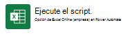

# <a name="return-data-from-a-script-to-an-automatically-run-power-automate-flow-preview"></a><span data-ttu-id="ae5fa-103">Devolver datos de un script a un flujo de Power Automate (vista previa)</span><span class="sxs-lookup"><span data-stu-id="ae5fa-103">Return data from a script to an automatically-run Power Automate flow (preview)</span></span>

<span data-ttu-id="ae5fa-104">Este tutorial le enseña cómo devolver información de un script de Office para Excel en la Web con un flujo de trabajo automatizado de [Power Automate](https://flow.microsoft.com).</span><span class="sxs-lookup"><span data-stu-id="ae5fa-104">This tutorial teaches you how to return information from an Office Script for Excel on the web as part of an automated [Power Automate](https://flow.microsoft.com) workflow.</span></span> <span data-ttu-id="ae5fa-105">Creará un script que busca en una programación y funciona con un flujo para enviar correos electrónicos de recordatorio.</span><span class="sxs-lookup"><span data-stu-id="ae5fa-105">You'll make a script that looks through a schedule and works with a flow to send reminder emails.</span></span> <span data-ttu-id="ae5fa-106">Este flujo se ejecutará de forma periódica y proporcionará los recordatorios en su nombre.</span><span class="sxs-lookup"><span data-stu-id="ae5fa-106">This flow will run on a regular schedule, providing these reminders on your behalf.</span></span>

> [!TIP]
> <span data-ttu-id="ae5fa-107">Si no está familiarizado con los scripts de Office, le recomendamos que empiece con el tutorial de [Guardar, editar y crear scripts de Office en Excel en la Web](excel-tutorial.md).</span><span class="sxs-lookup"><span data-stu-id="ae5fa-107">If you are new to Office Scripts, we recommend starting with the [Record, edit, and create Office Scripts in Excel on the web](excel-tutorial.md) tutorial.</span></span>
>
> <span data-ttu-id="ae5fa-108">Si no está familiarizado con Power Automate, le recomendamos que empiece con los tutoriales de [Llamar a scripts desde un flujo de Power Automate manual](excel-power-automate-manual.md) y [Pasar datos a scripts en un flujo ejecutado automáticamente de Power Automate](excel-power-automate-trigger.md).</span><span class="sxs-lookup"><span data-stu-id="ae5fa-108">If you are new to Power Automate, we recommend starting with the [Call scripts from a manual Power Automate flow](excel-power-automate-manual.md) and [Pass data to scripts in an automatically-run Power Automate flow](excel-power-automate-trigger.md) tutorials.</span></span>
>
> <span data-ttu-id="ae5fa-109">[Scripts de Office usa TypeScript](../overview/code-editor-environment.md) y este tutorial está diseñado para las personas con conocimientos de nivel intermedio de JavaScript o TypeScript.</span><span class="sxs-lookup"><span data-stu-id="ae5fa-109">[Office Scripts use TypeScript](../overview/code-editor-environment.md) and this tutorial is intended for people with beginner to intermediate-level knowledge of JavaScript or TypeScript.</span></span> <span data-ttu-id="ae5fa-110">Si no está familiarizado con JavaScript, le recomendamos que comience con el [Tutorial de JavaScript de Mozilla](https://developer.mozilla.org/docs/Web/JavaScript/Guide/Introduction).</span><span class="sxs-lookup"><span data-stu-id="ae5fa-110">If you're new to JavaScript, we recommend starting with the [Mozilla JavaScript tutorial](https://developer.mozilla.org/docs/Web/JavaScript/Guide/Introduction).</span></span>

## <a name="prerequisites"></a><span data-ttu-id="ae5fa-111">Requisitos previos</span><span class="sxs-lookup"><span data-stu-id="ae5fa-111">Prerequisites</span></span>

[!INCLUDE [Tutorial prerequisites](../includes/power-automate-tutorial-prerequisites.md)]

## <a name="prepare-the-workbook"></a><span data-ttu-id="ae5fa-112">Preparar el libro</span><span class="sxs-lookup"><span data-stu-id="ae5fa-112">Prepare the workbook</span></span>

1. <span data-ttu-id="ae5fa-113">Descargue el libro <a href="on-call-rotation.xlsx">on-call-rotation.xlsx</a> en su OneDrive.</span><span class="sxs-lookup"><span data-stu-id="ae5fa-113">Download the workbook <a href="on-call-rotation.xlsx">on-call-rotation.xlsx</a> to your OneDrive.</span></span>

1. <span data-ttu-id="ae5fa-114">Abra **on-call-rotation.xlsx** en Excel en la Web.</span><span class="sxs-lookup"><span data-stu-id="ae5fa-114">Open **on-call-rotation.xlsx** in Excel on the web.</span></span>

1. <span data-ttu-id="ae5fa-115">Agregue una fila a la tabla con su nombre, dirección de correo electrónico y fechas de inicio y finalización que se solapen con la fecha actual.</span><span class="sxs-lookup"><span data-stu-id="ae5fa-115">Add a row to the table with your name, email address, and start and end dates that overlap with the current date.</span></span>

    > [!IMPORTANT]
    > <span data-ttu-id="ae5fa-116">El script que escribirá usa la primera entrada coincidente de la tabla, así que asegúrese de que su nombre se encuentre encima de cualquier fila con la semana actual.</span><span class="sxs-lookup"><span data-stu-id="ae5fa-116">The script you'll write uses the first matching entry in the table, so make sure your name is above any row with the current week.</span></span>

    

## <a name="create-an-office-script"></a><span data-ttu-id="ae5fa-118">Crear un script de Office</span><span class="sxs-lookup"><span data-stu-id="ae5fa-118">Create an Office Script</span></span>

1. <span data-ttu-id="ae5fa-119">Vaya a la pestaña **Automatizar** y seleccione **Todos los scripts**.</span><span class="sxs-lookup"><span data-stu-id="ae5fa-119">Go to the **Automate** tab and select **All Scripts**.</span></span>

1. <span data-ttu-id="ae5fa-120">Seleccione **Nuevo script**.</span><span class="sxs-lookup"><span data-stu-id="ae5fa-120">Select **New Script**.</span></span>

1. <span data-ttu-id="ae5fa-121">Asigne al script el nombre **Obtener persona de guardia**.</span><span class="sxs-lookup"><span data-stu-id="ae5fa-121">Name the script **Get On-Call Person**.</span></span>

1. <span data-ttu-id="ae5fa-122">Ahora debería tener un script vacío.</span><span class="sxs-lookup"><span data-stu-id="ae5fa-122">You should now have an empty script.</span></span> <span data-ttu-id="ae5fa-123">Queremos usar el script para obtener una dirección de correo electrónico de la hoja de cálculo.</span><span class="sxs-lookup"><span data-stu-id="ae5fa-123">We want to use the script to get an email address from the spreadsheet.</span></span> <span data-ttu-id="ae5fa-124">Cambie `main` para devolver una cadena, de la siguiente manera:</span><span class="sxs-lookup"><span data-stu-id="ae5fa-124">Change `main` to return a string, like this:</span></span>

    ```TypeScript
    function main(workbook: ExcelScript.Workbook) : string {
    }
    ```

1. <span data-ttu-id="ae5fa-125">Después, debemos obtener todos los datos de la tabla.</span><span class="sxs-lookup"><span data-stu-id="ae5fa-125">Next, we need to get all the data from the table.</span></span> <span data-ttu-id="ae5fa-126">Eso nos permite buscar en cada fila con el script.</span><span class="sxs-lookup"><span data-stu-id="ae5fa-126">That lets us look through each row with the script.</span></span> <span data-ttu-id="ae5fa-127">Agregue el código siguiente dentro de la función `main`.</span><span class="sxs-lookup"><span data-stu-id="ae5fa-127">Add the following code inside the `main` function.</span></span>

    ```TypeScript
    // Get the H1 worksheet.
    let worksheet = workbook.getWorksheet("H1");

    // Get the first (and only) table in the worksheet.
    let table = worksheet.getTables()[0];

    // Get the data from the table.
    let tableValues = table.getRangeBetweenHeaderAndTotal().getValues();
    ```

1. <span data-ttu-id="ae5fa-128">Las fechas de la tabla se almacenan con [el número de serie de la fecha de Excel](https://support.microsoft.com/office/date-systems-in-excel-e7fe7167-48a9-4b96-bb53-5612a800b487).</span><span class="sxs-lookup"><span data-stu-id="ae5fa-128">The dates in the table are stored using [Excel's date serial number](https://support.microsoft.com/office/date-systems-in-excel-e7fe7167-48a9-4b96-bb53-5612a800b487).</span></span> <span data-ttu-id="ae5fa-129">Es necesario convertir esas fechas en fechas de JavaScript para poder compararlas.</span><span class="sxs-lookup"><span data-stu-id="ae5fa-129">We need to convert those dates to JavaScript dates in order to compare them.</span></span> <span data-ttu-id="ae5fa-130">Agregaremos una función auxiliar al script.</span><span class="sxs-lookup"><span data-stu-id="ae5fa-130">We'll add a helper function to our script.</span></span> <span data-ttu-id="ae5fa-131">Agregue el código siguiente fuera de la función `main`:</span><span class="sxs-lookup"><span data-stu-id="ae5fa-131">Add the following code outside of the `main` function:</span></span>

    ```TypeScript
    // Convert the Excel date to a JavaScript Date object.
    function convertDate(excelDateValue: number) {
        let javaScriptDate = new Date(Math.round((excelDateValue - 25569) * 86400 * 1000));
        return javaScriptDate;
    }
    ```

1. <span data-ttu-id="ae5fa-132">Ahora, debemos saber cuál es el usuario de guardia en este momento.</span><span class="sxs-lookup"><span data-stu-id="ae5fa-132">Now, we need to figure out which person is on call right now.</span></span> <span data-ttu-id="ae5fa-133">La fila tendrá una fecha de inicio y una de finalización en torno a la fecha actual.</span><span class="sxs-lookup"><span data-stu-id="ae5fa-133">Their row will have a start and end date surrounding the current date.</span></span> <span data-ttu-id="ae5fa-134">Escribiremos el script para asumir que solo un usuario está de guardia cada vez.</span><span class="sxs-lookup"><span data-stu-id="ae5fa-134">We'll write the script to assume only one person is on call at a time.</span></span> <span data-ttu-id="ae5fa-135">Los scripts pueden devolver matrices para manejar varios valores, pero por ahora devolveremos la primera dirección de correo electrónico coincidente.</span><span class="sxs-lookup"><span data-stu-id="ae5fa-135">Scripts can return arrays to handle multiple values, but for now we'll return the first matching email address.</span></span> <span data-ttu-id="ae5fa-136">Agregue el siguiente código al final de la función `main`.</span><span class="sxs-lookup"><span data-stu-id="ae5fa-136">Add the following code to the end of the `main` function.</span></span>

    ```TypeScript
    // Look for the first row where today's date is between the row's start and end dates.
    let currentDate = new Date();
    for (let row = 0; row < tableValues.length; row++) {
        let startDate = convertDate(tableValues[row][2] as number);
        let endDate = convertDate(tableValues[row][3] as number);
        if (startDate <= currentDate && endDate >= currentDate) {
            // Return the first matching email address.
            return tableValues[row][1].toString();
        }
    }
    ```

1. <span data-ttu-id="ae5fa-137">El script final debería tener un aspecto similar al siguiente:</span><span class="sxs-lookup"><span data-stu-id="ae5fa-137">The final script should look like this:</span></span>

    ```TypeScript
    function main(workbook: ExcelScript.Workbook) : string {
        // Get the H1 worksheet.
        let worksheet = workbook.getWorksheet("H1");

        // Get the first (and only) table in the worksheet.
        let table = worksheet.getTables()[0];
    
        // Get the data from the table.
        let tableValues = table.getRangeBetweenHeaderAndTotal().getValues();
    
        // Look for the first row where today's date is between the row's start and end dates.
        let currentDate = new Date();
        for (let row = 0; row < tableValues.length; row++) {
            let startDate = convertDate(tableValues[row][2] as number);
            let endDate = convertDate(tableValues[row][3] as number);
            if (startDate <= currentDate && endDate >= currentDate) {
                // Return the first matching email address.
                return tableValues[row][1].toString();
            }
        }
    }

    // Convert the Excel date to a JavaScript Date object.
    function convertDate(excelDateValue: number) {
        let javaScriptDate = new Date(Math.round((excelDateValue - 25569) * 86400 * 1000));
        return javaScriptDate;
    }
    ```

## <a name="create-an-automated-workflow-with-power-automate"></a><span data-ttu-id="ae5fa-138">Crear un flujo de trabajo automatizado con Power Automate</span><span class="sxs-lookup"><span data-stu-id="ae5fa-138">Create an automated workflow with Power Automate</span></span>

1. <span data-ttu-id="ae5fa-139">Inicie sesión en el [sitio de Power Automate](https://flow.microsoft.com).</span><span class="sxs-lookup"><span data-stu-id="ae5fa-139">Sign in to the [Power Automate site](https://flow.microsoft.com).</span></span>

1. <span data-ttu-id="ae5fa-140">En el menú que se muestra en la parte izquierda de la pantalla, presione **Crear**.</span><span class="sxs-lookup"><span data-stu-id="ae5fa-140">In the menu that's displayed on the left side of the screen, press **Create**.</span></span> <span data-ttu-id="ae5fa-141">Se mostrará una lista de maneras de crear flujos de trabajo nuevos.</span><span class="sxs-lookup"><span data-stu-id="ae5fa-141">This brings you to list of ways to create new workflows.</span></span>

    

1. <span data-ttu-id="ae5fa-143">En la sección **Empezar desde cero**, seleccione **Flujo de nube programado**.</span><span class="sxs-lookup"><span data-stu-id="ae5fa-143">Under the **Start from blank** section, select **Scheduled cloud flow**.</span></span>

    

1. <span data-ttu-id="ae5fa-145">Ahora debemos establecer la programación para este flujo.</span><span class="sxs-lookup"><span data-stu-id="ae5fa-145">Now we need to set the schedule for this flow.</span></span> <span data-ttu-id="ae5fa-146">Nuestra hoja de cálculo tiene una nueva asignación de guardia que empieza todos los lunes en la primera mitad de 2021.</span><span class="sxs-lookup"><span data-stu-id="ae5fa-146">Our spreadsheet has a new on-call assignment starting every Monday in the first half of 2021.</span></span> <span data-ttu-id="ae5fa-147">Vamos a configurar el flujo para que se ejecute a primera hora los lunes por la mañana.</span><span class="sxs-lookup"><span data-stu-id="ae5fa-147">Let's set the flow to run first thing Monday mornings.</span></span> <span data-ttu-id="ae5fa-148">Use las opciones siguientes para configurar el flujo de ejecución el lunes de cada semana.</span><span class="sxs-lookup"><span data-stu-id="ae5fa-148">Use the following options to configure the flow to run on Monday each week.</span></span>

    - <span data-ttu-id="ae5fa-149">**Nombre de flujo**: notificar a la persona de guardia</span><span class="sxs-lookup"><span data-stu-id="ae5fa-149">**Flow name**: Notify On-Call Person</span></span>
    - <span data-ttu-id="ae5fa-150">**Inicio**: 4/1/21 a la 01:00</span><span class="sxs-lookup"><span data-stu-id="ae5fa-150">**Starting**: 1/4/21 at 1:00am</span></span>
    - <span data-ttu-id="ae5fa-151">**Repetir cada**: 1 semana</span><span class="sxs-lookup"><span data-stu-id="ae5fa-151">**Repeat every**: 1 Week</span></span>
    - <span data-ttu-id="ae5fa-152">**En estos días**: L</span><span class="sxs-lookup"><span data-stu-id="ae5fa-152">**On these days**: M</span></span>

    

1. <span data-ttu-id="ae5fa-154">Presione **Crear**.</span><span class="sxs-lookup"><span data-stu-id="ae5fa-154">Press **Create**.</span></span>

1. <span data-ttu-id="ae5fa-155">Presione **Nuevo paso**.</span><span class="sxs-lookup"><span data-stu-id="ae5fa-155">Press **New step**.</span></span>

1. <span data-ttu-id="ae5fa-156">Seleccione la pestaña **Estándar** y, a continuación, seleccione **Excel Online (empresa)**.</span><span class="sxs-lookup"><span data-stu-id="ae5fa-156">Select the **Standard** tab, then select **Excel Online (Business)**.</span></span>

    

1. <span data-ttu-id="ae5fa-158">En **Acciones**, seleccione **Ejecutar script (versión preliminar)**.</span><span class="sxs-lookup"><span data-stu-id="ae5fa-158">Under **Actions**, select **Run script (preview)**.</span></span>

    

1. <span data-ttu-id="ae5fa-160">Después, seleccione el libro y el script que va a usar en el paso del flujo.</span><span class="sxs-lookup"><span data-stu-id="ae5fa-160">Next, you'll select the workbook and script to use in the flow step.</span></span> <span data-ttu-id="ae5fa-161">Use el libro **on-call-rotation.xlsx** que creó en OneDrive.</span><span class="sxs-lookup"><span data-stu-id="ae5fa-161">Use the **on-call-rotation.xlsx** workbook you created in your OneDrive.</span></span> <span data-ttu-id="ae5fa-162">Especifique la siguiente configuración para el conector **Ejecutar script**:</span><span class="sxs-lookup"><span data-stu-id="ae5fa-162">Specify the following settings for the **Run script** connector:</span></span>

    - <span data-ttu-id="ae5fa-163">**Ubicación**: OneDrive para la Empresa</span><span class="sxs-lookup"><span data-stu-id="ae5fa-163">**Location**: OneDrive for Business</span></span>
    - <span data-ttu-id="ae5fa-164">**Biblioteca de documentos**: OneDrive</span><span class="sxs-lookup"><span data-stu-id="ae5fa-164">**Document Library**: OneDrive</span></span>
    - <span data-ttu-id="ae5fa-165">**Archivo**: on-call-rotation.xlsx *(seleccionado en el explorador de archivos)*</span><span class="sxs-lookup"><span data-stu-id="ae5fa-165">**File**: on-call-rotation.xlsx *(Chosen through the file browser)*</span></span>
    - <span data-ttu-id="ae5fa-166">**Script**: obtener persona de guardia</span><span class="sxs-lookup"><span data-stu-id="ae5fa-166">**Script**: Get On-Call Person</span></span>

    

1. <span data-ttu-id="ae5fa-168">Presione **Nuevo paso**.</span><span class="sxs-lookup"><span data-stu-id="ae5fa-168">Press **New step**.</span></span>

1. <span data-ttu-id="ae5fa-169">Finalizaremos el flujo enviando el correo electrónico de recordatorio.</span><span class="sxs-lookup"><span data-stu-id="ae5fa-169">We'll end the flow by sending the reminder email.</span></span> <span data-ttu-id="ae5fa-170">Seleccione **Enviar un correo electrónico (V2)** mediante la barra de búsqueda del conector.</span><span class="sxs-lookup"><span data-stu-id="ae5fa-170">Select **Send an email (V2)** by using the connector's search bar.</span></span> <span data-ttu-id="ae5fa-171">Use el control **Agregar contenido dinámico** para agregar la dirección de correo electrónico que devuelve el script.</span><span class="sxs-lookup"><span data-stu-id="ae5fa-171">Use the **Add dynamic content** control to add the email address returned by the script.</span></span> <span data-ttu-id="ae5fa-172">Se etiquetará como **resultado** con el icono de Excel situado al lado.</span><span class="sxs-lookup"><span data-stu-id="ae5fa-172">This will be labelled **result** with the Excel icon next to it.</span></span> <span data-ttu-id="ae5fa-173">Puede proporcionar el asunto y el texto de cuerpo que prefiera.</span><span class="sxs-lookup"><span data-stu-id="ae5fa-173">You can provide whatever subject and body text you'd like.</span></span>

    

    > [!NOTE]
    > <span data-ttu-id="ae5fa-175">Este tutorial usa Outlook.</span><span class="sxs-lookup"><span data-stu-id="ae5fa-175">This tutorial uses Outlook.</span></span> <span data-ttu-id="ae5fa-176">Puede usar el servicio de correo electrónico que prefiera, aunque algunas opciones pueden ser diferentes.</span><span class="sxs-lookup"><span data-stu-id="ae5fa-176">Feel free to use your preferred email service instead, though some options may be different.</span></span>

1. <span data-ttu-id="ae5fa-177">Presione **Guardar**.</span><span class="sxs-lookup"><span data-stu-id="ae5fa-177">Press **Save**.</span></span>

## <a name="test-the-script-in-power-automate"></a><span data-ttu-id="ae5fa-178">Probar el script en Power Automate</span><span class="sxs-lookup"><span data-stu-id="ae5fa-178">Test the script in Power Automate</span></span>

<span data-ttu-id="ae5fa-179">El flujo se ejecutará cada lunes por la mañana.</span><span class="sxs-lookup"><span data-stu-id="ae5fa-179">Your flow will run every Monday morning.</span></span> <span data-ttu-id="ae5fa-180">Para probar el script ahora, presione el botón **Probar** en la esquina superior derecha de la pantalla.</span><span class="sxs-lookup"><span data-stu-id="ae5fa-180">You can test the script now by pressing the **Test** button in the upper-right corner of the screen.</span></span> <span data-ttu-id="ae5fa-181">Seleccione **Manualmente** y presione **Ejecutar prueba** para ejecutar el flujo ahora y probar el comportamiento.</span><span class="sxs-lookup"><span data-stu-id="ae5fa-181">Select **Manually** and press **Run Test** to run the flow now and test the behavior.</span></span> <span data-ttu-id="ae5fa-182">Es posible que deba conceder permisos a Excel y Outlook para continuar.</span><span class="sxs-lookup"><span data-stu-id="ae5fa-182">You may need to grant permissions to Excel and Outlook to continue.</span></span>


> [!TIP]
> <span data-ttu-id="ae5fa-184">Si el flujo no puede enviar un correo electrónico, vuelva a comprobar en la hoja de cálculo que se muestra un correo electrónico válido para el intervalo de fechas actual en la parte superior de la tabla.</span><span class="sxs-lookup"><span data-stu-id="ae5fa-184">If your flow fails to send an email, double-check in the spreadsheet that a valid email is listed for the current date range at the top of the table.</span></span>

## <a name="next-steps"></a><span data-ttu-id="ae5fa-185">Pasos siguientes</span><span class="sxs-lookup"><span data-stu-id="ae5fa-185">Next steps</span></span>

<span data-ttu-id="ae5fa-186">Visite [Ejecutar scripts de Office con Power Automate](../develop/power-automate-integration.md) para más información sobre la conexión de Scripts de Office con Power Automate.</span><span class="sxs-lookup"><span data-stu-id="ae5fa-186">Visit [Run Office Scripts with Power Automate](../develop/power-automate-integration.md) to learn more about connecting Office Scripts with Power Automate.</span></span>

<span data-ttu-id="ae5fa-187">También puede consultar el [Escenario de muestra de recordatorios de tareas automatizados](../resources/scenarios/task-reminders.md) para aprender a combinar los Scripts de Office y Power Automate con las Tarjetas adaptables de Teams.</span><span class="sxs-lookup"><span data-stu-id="ae5fa-187">You can also check out the [Automated task reminders sample scenario](../resources/scenarios/task-reminders.md) to learn how to combine Office Scripts and Power Automate with Teams Adaptive Cards.</span></span>
