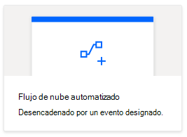
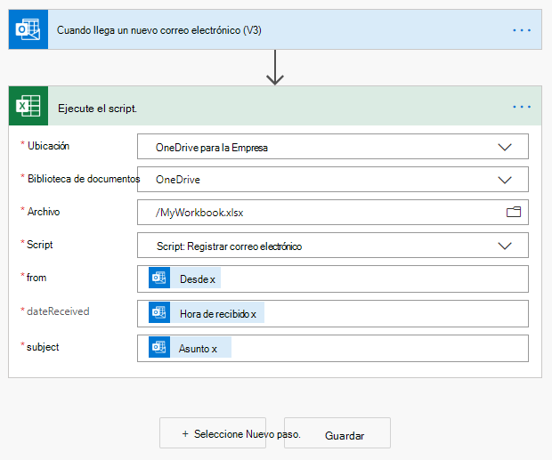
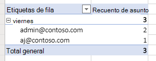

# <a name="automatically-run-scripts-with-automated-power-automate-flows-preview"></a>Ejecutar scripts automáticamente con flujos automatizar automatización (vista previa)

Este tutorial le enseña a usar un script de Office para Excel en la web con un flujo de trabajo automatizado de [Power](https://flow.microsoft.com) automatizada. El script se ejecutará automáticamente cada vez que reciba un correo electrónico, registrando información del correo electrónico en un libro de Excel.

## <a name="prerequisites"></a>Requisitos previos

[!INCLUDE [Tutorial prerequisites](../includes/tutorial-prerequisites.md)]

> [!IMPORTANT]
> En este tutorial, se supone que ha completado la [ejecución de scripts de Office en Excel en la web con el tutorial de Power automatization](excel-power-automate-manual.md) .

## <a name="prepare-the-workbook"></a>Preparar el libro

La automatización de energía no puede usar [referencias relativas](../develop/power-automate-integration.md#avoid-using-relative-references) como `Workbook.getActiveWorksheet` para tener acceso a componentes de libros. Por lo tanto, se necesita un libro y una hoja de cálculo con nombres coherentes para que la automatización de la energía sea de referencia.

1. Cree un nuevo libro denominado mi **libro**.

2. Vaya a la ficha **automatizar** y seleccione **Editor de código**.

3. Seleccione **nuevo script**.

4. Reemplace el código existente por el siguiente script y presione **Ejecutar**. Esto configurará el libro con nombres coherentes de hoja de cálculo, tabla y tabla dinámica.

    ```TypeScript
    function main(workbook: ExcelScript.Workbook) {
      // Add a new worksheet to store our email table
      let emailsSheet = workbook.addWorksheet("Emails");

      // Add data and create a table
      emailsSheet.getRange("A1:D1").setValues([
        ["Date", "Day of the week", "Email address", "Subject"]
      ]);
      let newTable = workbook.addTable(emailsSheet.getRange("A1:D2"), true);
      newTable.setName("EmailTable");

      // Add a new PivotTable to a new worksheet
      let pivotWorksheet = workbook.addWorksheet("SubjectPivot");
      let newPivotTable = workbook.addPivotTable("Pivot", "EmailTable", pivotWorksheet.getRange("A3:C20"));

      // Setup the pivot hierarchies
      newPivotTable.addRowHierarchy(newPivotTable.getHierarchy("Day of the week"));
      newPivotTable.addRowHierarchy(newPivotTable.getHierarchy("Email address"));
      newPivotTable.addDataHierarchy(newPivotTable.getHierarchy("Subject"));
    }
    ```

## <a name="create-an-office-script-for-your-automated-workflow"></a>Crear un script de Office para el flujo de trabajo automatizado

Vamos a crear un script que registre información de un correo electrónico. Queremos saber qué días de la semana recibimos más correo y cuántos remitentes únicos envían ese correo. Nuestro libro tiene una tabla con las columnas **fecha**, **día de la semana**, **dirección de correo electrónico**y **asunto** . La hoja de cálculo también tiene una tabla dinámica que se dinamiza en el **día de la semana** y en la **dirección de correo electrónico** (las jerarquías de filas). El número de **asuntos** únicos es la información agregada que se muestra (la jerarquía de datos). La tabla dinámica se actualizará después de actualizar la tabla de correo electrónico.

1. En el **Editor de código**, seleccione **nuevo script**.

2. El flujo que crearemos más adelante en el tutorial enviará nuestra información de scripts sobre cada correo electrónico que se reciba. El script debe aceptar esa entrada a través de los parámetros de la `main` función. Reemplace el script predeterminado por el siguiente script:

    ```TypeScript
    function main(
      workbook: ExcelScript.Workbook,
      from: string,
      dateReceived: string,
      subject: string) {

    }
    ```

3. El script necesita acceso a la tabla y a la tabla dinámica del libro. Agregue el siguiente código al cuerpo del script, después de la etiqueta `{` :

    ```TypeScript
    // Get the email table.
    let emailWorksheet = workbook.getWorksheet("Emails");
    let table = emailWorksheet.getTable("EmailTable");
  
    // Get the PivotTable.
    let pivotTableWorksheet = workbook.getWorksheet("SubjectPivot");
    let pivotTable = pivotTableWorksheet.getPivotTable("Pivot");
    ```

4. El `dateReceived` parámetro es de tipo `string` . Vamos a convertirla en un [ `Date` objeto](../develop/javascript-objects.md#date) para que podamos obtener fácilmente el día de la semana. Una vez hecho esto, será necesario asignar el valor numérico del día a una versión más legible. Agregue el código siguiente al final de la secuencia de comandos, antes de la etiqueta `}` :

    ```TypeScript
    // Parse the received date string.
    let date = new Date(dateReceived);

    // Convert number representing the day of the week into the name of the day.
    let dayText : string;
    switch (date.getDay()) {
      case 0:
        dayText = "Sunday";
        break;
      case 1:
        dayText = "Monday";
        break;
      case 2:
        dayText = "Tuesday";
        break;
      case 3:
        dayText = "Wednesday";
        break;
      case 4:
        dayText = "Thursday";
        break;
      case 5:
        dayText = "Friday";
        break;
      default:
        dayText = "Saturday";
        break;
    }
    ```

5. La `subject` cadena puede incluir la etiqueta de respuesta "re:". Vamos a quitarlo de la cadena para que los mensajes de correo electrónico del mismo subproceso tengan el mismo asunto para la tabla. Agregue el código siguiente al final de la secuencia de comandos, antes de la etiqueta `}` :

    ```TypeScript
    // Remove the reply tag from the email subject to group emails on the same thread.
    let subjectText = subject.replace("Re: ", "");
    subjectText = subjectText.replace("RE: ", "");
    ```

6. Ahora que se ha dado formato a los datos de correo electrónico a nuestra gusto, vamos a agregar una fila a la tabla email. Agregue el código siguiente al final de la secuencia de comandos, antes de la etiqueta `}` :

    ```TypeScript
    // Add the parsed text to the table.
    table.addRow(-1, [dateReceived, dayText, from, subjectText]);
    ```

7. Por último, asegúrese de que la tabla dinámica se actualiza. Agregue el código siguiente al final de la secuencia de comandos, antes de la etiqueta `}` :

    ```TypeScript
    // Refresh the PivotTable to include the new row.
    pivotTable.refresh();
    ```

8. Cambie el nombre de la secuencia de comandos **por correo electrónico** y presione **Guardar script**.

El script ya está listo para que el flujo de trabajo se Automatice con eficacia. Debe ser similar al siguiente script:

```TypeScript
function main(
  workbook: ExcelScript.Workbook,
  from: string,
  dateReceived: string,
  subject: string) {
  // Get the email table.
  let emailWorksheet = workbook.getWorksheet("Emails");
  let table = emailWorksheet.getTable("EmailTable");

  // Get the PivotTable.
  let pivotTableWorksheet = workbook.getWorksheet("Pivot");
  let pivotTable = pivotTableWorksheet.getPivotTable("SubjectPivot");

  // Parse the received date string.
  let date = new Date(dateReceived);

  // Convert number representing the day of the week into the name of the day.
  let dayText: string;
  switch (date.getDay()) {
    case 0:
      dayText = "Sunday";
      break;
    case 1:
      dayText = "Monday";
      break;
    case 2:
      dayText = "Tuesday";
      break;
    case 3:
      dayText = "Wednesday";
      break;
    case 4:
      dayText = "Thursday";
      break;
    case 5:
      dayText = "Friday";
      break;
    default:
      dayText = "Saturday";
      break;
  }

  // Remove the reply tag from the email subject to group emails on the same thread.
  let subjectText = subject.replace("Re: ", "");
  subjectText = subjectText.replace("RE: ", "");

  // Add the parsed text to the table.
  table.addRow(-1, [dateReceived, dayText, from, subjectText]);

  // Refresh the PivotTable to include the new row.
  pivotTable.refresh();
}
```

## <a name="create-an-automated-workflow-with-power-automate"></a>Crear un flujo de trabajo automatizado con Power automaticing

1. Inicie sesión en el [sitio de vista previa de Automate Power](https://flow.microsoft.com).

2. En el menú que se muestra en la parte izquierda de la pantalla, presione **crear**. Esto le ofrece la lista de formas de crear nuevos flujos de trabajo.

    

3. En la sección **empezar desde en blanco** , seleccione **flujo automatizado**. Esto crea un flujo de trabajo desencadenado por un evento, como la recepción de un correo electrónico.

    

4. En la ventana de diálogo que aparece, escriba un nombre para el flujo en el cuadro de texto **nombre de flujo** . A continuación, seleccione **Cuándo llega un nuevo mensaje de correo electrónico** de la lista de opciones bajo **elegir el desencadenador del flujo**. Es posible que necesite buscar la opción mediante el cuadro de búsqueda. Por último, haga clic en **crear**.

    

    > [!NOTE]
    > Este tutorial usa Outlook. No dude en usar el servicio de correo electrónico preferido en su lugar, aunque algunas opciones pueden ser diferentes.

5. Presione **nuevo paso**.

6. Seleccione la pestaña **estándar** y, a continuación, seleccione **Excel online (empresa)**.

    

7. En **acciones**, seleccione **Ejecutar script (vista previa)**.

    

8. Especifique las siguientes opciones para el conector de **ejecución de script** :

    - **Ubicación**: OneDrive para la empresa
    - **Biblioteca de documentos**: OneDrive
    - **Archivo**: MyWorkbook.xlsx
    - **Script**: grabar correo electrónico
    - **de**: de *(contenido dinámico de Outlook)*
    - **dateReceived**: hora *de recepción (contenido dinámico de Outlook)*
    - **asunto**: asunto *(contenido dinámico de Outlook)*

    *Tenga en cuenta que los parámetros del script solo aparecerán una vez que se seleccione el script.*

    

9. Haga clic en **Guardar**.

El flujo ya está habilitado. Se ejecutará automáticamente el script cada vez que reciba un correo electrónico a través de Outlook.

## <a name="manage-the-script-in-power-automate"></a>Administrar el script con la automatización de la alimentación

1. En la Página principal de Power automatizar, seleccione **Mis flujos**.

    

2. Seleccione su flujo. Aquí puede ver el historial de ejecución. Puede actualizar la página o presionar el botón actualizar **todas las ejecuciones** para actualizar el historial. El flujo se activará poco después de que se reciba un correo electrónico. Pruebe el flujo mediante el envío de correo electrónico.

Cuando el flujo se desencadene y se ejecute correctamente el script, debería ver la tabla del libro y la actualización de la tabla dinámica.




## <a name="next-steps"></a>Siguientes pasos

Visite [ejecutar scripts de Office con Power Automate](../develop/power-automate-integration.md) para obtener más información sobre la conexión de scripts de Office con la automatización de energía.

También puede consultar el escenario de [ejemplo de avisos de tareas automatizadas](../resources/scenarios/task-reminders.md) para obtener información sobre cómo combinar scripts de Office y automatizar la automatización con tarjetas adaptables de Teams.
