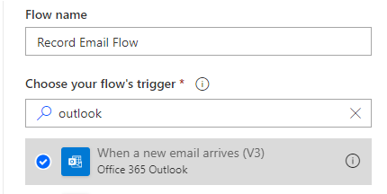

# <a name="automatically-run-scripts-with-automated-power-automate-flows-preview"></a><span data-ttu-id="c836c-103">Ejecutar scripts automáticamente con flujos automatizar automatización (vista previa)</span><span class="sxs-lookup"><span data-stu-id="c836c-103">Automatically run scripts with automated Power Automate flows (preview)</span></span>

<span data-ttu-id="c836c-104">Este tutorial le enseña a usar un script de Office para Excel en la web con un flujo de trabajo automatizado de [Power](https://flow.microsoft.com) automatizada.</span><span class="sxs-lookup"><span data-stu-id="c836c-104">This tutorial teaches you how to use an Office Script for Excel on the web with an automated [Power Automate](https://flow.microsoft.com) workflow.</span></span> <span data-ttu-id="c836c-105">El script se ejecutará automáticamente cada vez que reciba un correo electrónico, registrando información del correo electrónico en un libro de Excel.</span><span class="sxs-lookup"><span data-stu-id="c836c-105">Your script will automatically run each time you receive an email, recording information from the email in an Excel workbook.</span></span>

## <a name="prerequisites"></a><span data-ttu-id="c836c-106">Requisitos previos</span><span class="sxs-lookup"><span data-stu-id="c836c-106">Prerequisites</span></span>

[!INCLUDE [Tutorial prerequisites](../includes/tutorial-prerequisites.md)]

> [!IMPORTANT]
> <span data-ttu-id="c836c-107">En este tutorial, se supone que ha completado la [ejecución de scripts de Office en Excel en la web con el tutorial de Power automatization](excel-power-automate-manual.md) .</span><span class="sxs-lookup"><span data-stu-id="c836c-107">This tutorial assumes you have completed the [Run Office Scripts in Excel on the web with Power Automate](excel-power-automate-manual.md) tutorial.</span></span>

## <a name="prepare-the-workbook"></a><span data-ttu-id="c836c-108">Preparar el libro</span><span class="sxs-lookup"><span data-stu-id="c836c-108">Prepare the workbook</span></span>

<span data-ttu-id="c836c-109">La automatización de energía no puede usar [referencias relativas](../develop/power-automate-integration.md#avoid-using-relative-references) como `Workbook.getActiveWorksheet` para tener acceso a componentes de libros.</span><span class="sxs-lookup"><span data-stu-id="c836c-109">Power Automate can't use [relative references](../develop/power-automate-integration.md#avoid-using-relative-references) like `Workbook.getActiveWorksheet` to access workbook components.</span></span> <span data-ttu-id="c836c-110">Por lo tanto, se necesita un libro y una hoja de cálculo con nombres coherentes para que la automatización de la energía sea de referencia.</span><span class="sxs-lookup"><span data-stu-id="c836c-110">So, we need a workbook and worksheet with consistent names for Power Automate to reference.</span></span>

1. <span data-ttu-id="c836c-111">Cree un nuevo libro denominado mi **libro**.</span><span class="sxs-lookup"><span data-stu-id="c836c-111">Create a new workbook named **MyWorkbook**.</span></span>

2. <span data-ttu-id="c836c-112">Vaya a la ficha **automatizar** y seleccione **Editor de código**.</span><span class="sxs-lookup"><span data-stu-id="c836c-112">Go to the **Automate** tab and select **Code Editor**.</span></span>

3. <span data-ttu-id="c836c-113">Seleccione **nuevo script**.</span><span class="sxs-lookup"><span data-stu-id="c836c-113">Select **New Script**.</span></span>

4. <span data-ttu-id="c836c-114">Reemplace el código existente por el siguiente script y presione **Ejecutar**.</span><span class="sxs-lookup"><span data-stu-id="c836c-114">Replace the existing code with the following script and press **Run**.</span></span> <span data-ttu-id="c836c-115">Esto configurará el libro con nombres coherentes de hoja de cálculo, tabla y tabla dinámica.</span><span class="sxs-lookup"><span data-stu-id="c836c-115">This will setup the workbook with consistent worksheet, table, and PivotTable names.</span></span>

    ```TypeScript
    function main(workbook: ExcelScript.Workbook) {
      // Add a new worksheet to store our email table
      let emailsSheet = workbook.addWorksheet("Emails");

      // Add data and create a table
      emailsSheet.getRange("A1:D1").setValues([
        ["Date", "Day of the week", "Email address", "Subject"]
      ]);
      let newTable = workbook.addTable(emailsSheet.getRange("A1:D2"), true);
      newTable.setName("EmailTable");

      // Add a new PivotTable to a new worksheet
      let pivotWorksheet = workbook.addWorksheet("SubjectPivot");
      let newPivotTable = workbook.addPivotTable("Pivot", "EmailTable", pivotWorksheet.getRange("A3:C20"));

      // Setup the pivot hierarchies
      newPivotTable.addRowHierarchy(newPivotTable.getHierarchy("Day of the week"));
      newPivotTable.addRowHierarchy(newPivotTable.getHierarchy("Email address"));
      newPivotTable.addDataHierarchy(newPivotTable.getHierarchy("Subject"));
    }
    ```

## <a name="create-an-office-script-for-your-automated-workflow"></a><span data-ttu-id="c836c-116">Crear un script de Office para el flujo de trabajo automatizado</span><span class="sxs-lookup"><span data-stu-id="c836c-116">Create an Office Script for your automated workflow</span></span>

<span data-ttu-id="c836c-117">Vamos a crear un script que registre información de un correo electrónico.</span><span class="sxs-lookup"><span data-stu-id="c836c-117">Let's create a script that logs information from an email.</span></span> <span data-ttu-id="c836c-118">Queremos saber qué días de la semana recibimos más correo y cuántos remitentes únicos envían ese correo.</span><span class="sxs-lookup"><span data-stu-id="c836c-118">We want to know how which days of the week we receive the most mail and how many unique senders are sending that mail.</span></span> <span data-ttu-id="c836c-119">Nuestro libro tiene una tabla con las columnas **fecha**, **día de la semana**, **dirección de correo electrónico**y **asunto** .</span><span class="sxs-lookup"><span data-stu-id="c836c-119">Our workbook has a table with **Date**, **Day of the week**, **Email address**, and **Subject** columns.</span></span> <span data-ttu-id="c836c-120">La hoja de cálculo también tiene una tabla dinámica que se dinamiza en el **día de la semana** y en la **dirección de correo electrónico** (las jerarquías de filas).</span><span class="sxs-lookup"><span data-stu-id="c836c-120">Our worksheet also has a PivotTable that is pivoting on the **Day of the week** and **Email address** (those are the row hierarchies).</span></span> <span data-ttu-id="c836c-121">El número de **asuntos** únicos es la información agregada que se muestra (la jerarquía de datos).</span><span class="sxs-lookup"><span data-stu-id="c836c-121">The count of unique **Subjects** is the aggregated information being displayed (the data hierarchy).</span></span> <span data-ttu-id="c836c-122">La tabla dinámica se actualizará después de actualizar la tabla de correo electrónico.</span><span class="sxs-lookup"><span data-stu-id="c836c-122">We'll have our script refresh that PivotTable after updating the email table.</span></span>

1. <span data-ttu-id="c836c-123">En el **Editor de código**, seleccione **nuevo script**.</span><span class="sxs-lookup"><span data-stu-id="c836c-123">From within the **Code Editor**, select **New Script**.</span></span>

2. <span data-ttu-id="c836c-124">El flujo que crearemos más adelante en el tutorial enviará nuestra información de scripts sobre cada correo electrónico que se reciba.</span><span class="sxs-lookup"><span data-stu-id="c836c-124">The flow that we'll create later in the tutorial will send our script information about each email that's received.</span></span> <span data-ttu-id="c836c-125">El script debe aceptar esa entrada a través de los parámetros de la `main` función.</span><span class="sxs-lookup"><span data-stu-id="c836c-125">The script needs to accept that input through parameters in the `main` function.</span></span> <span data-ttu-id="c836c-126">Reemplace el script predeterminado por el siguiente script:</span><span class="sxs-lookup"><span data-stu-id="c836c-126">Replace the default script with the following script:</span></span>

    ```TypeScript
    function main(
      workbook: ExcelScript.Workbook,
      from: string,
      dateReceived: string,
      subject: string) {

    }
    ```

3. <span data-ttu-id="c836c-127">El script necesita acceso a la tabla y a la tabla dinámica del libro.</span><span class="sxs-lookup"><span data-stu-id="c836c-127">The script needs access to the workbook's table and PivotTable.</span></span> <span data-ttu-id="c836c-128">Agregue el siguiente código al cuerpo del script, después de la etiqueta `{` :</span><span class="sxs-lookup"><span data-stu-id="c836c-128">Add the following code to the body of the script, after the opening `{`:</span></span>

    ```TypeScript
    // Get the email table.
    let emailWorksheet = workbook.getWorksheet("Emails");
    let table = emailWorksheet.getTable("EmailTable");
  
    // Get the PivotTable.
    let pivotTableWorksheet = workbook.getWorksheet("SubjectPivot");
    let pivotTable = pivotTableWorksheet.getPivotTable("Pivot");
    ```

4. <span data-ttu-id="c836c-129">El `dateReceived` parámetro es de tipo `string` .</span><span class="sxs-lookup"><span data-stu-id="c836c-129">The `dateReceived` parameter is of type `string`.</span></span> <span data-ttu-id="c836c-130">Vamos a convertirla en un [ `Date` objeto](../develop/javascript-objects.md#date) para que podamos obtener fácilmente el día de la semana.</span><span class="sxs-lookup"><span data-stu-id="c836c-130">Let's convert that to a [`Date` object](../develop/javascript-objects.md#date) so we can easily get the day of the week.</span></span> <span data-ttu-id="c836c-131">Una vez hecho esto, será necesario asignar el valor numérico del día a una versión más legible.</span><span class="sxs-lookup"><span data-stu-id="c836c-131">After doing that, we'll need to map the day's number value to a more readable version.</span></span> <span data-ttu-id="c836c-132">Agregue el código siguiente al final de la secuencia de comandos, antes de la etiqueta `}` :</span><span class="sxs-lookup"><span data-stu-id="c836c-132">Add the following code to the end of your script, before the closing `}`:</span></span>

    ```TypeScript
    // Parse the received date string.
    let date = new Date(dateReceived);

    // Convert number representing the day of the week into the name of the day.
    let dayText : string;
    switch (date.getDay()) {
      case 0:
        dayText = "Sunday";
        break;
      case 1:
        dayText = "Monday";
        break;
      case 2:
        dayText = "Tuesday";
        break;
      case 3:
        dayText = "Wednesday";
        break;
      case 4:
        dayText = "Thursday";
        break;
      case 5:
        dayText = "Friday";
        break;
      default:
        dayText = "Saturday";
        break;
    }
    ```

5. <span data-ttu-id="c836c-133">La `subject` cadena puede incluir la etiqueta de respuesta "re:".</span><span class="sxs-lookup"><span data-stu-id="c836c-133">The `subject` string may include the "RE:" reply tag.</span></span> <span data-ttu-id="c836c-134">Vamos a quitarlo de la cadena para que los mensajes de correo electrónico del mismo subproceso tengan el mismo asunto para la tabla.</span><span class="sxs-lookup"><span data-stu-id="c836c-134">Let's remove that from the string so that emails in the same thread have the same subject for the table.</span></span> <span data-ttu-id="c836c-135">Agregue el código siguiente al final de la secuencia de comandos, antes de la etiqueta `}` :</span><span class="sxs-lookup"><span data-stu-id="c836c-135">Add the following code to the end of your script, before the closing `}`:</span></span>

    ```TypeScript
    // Remove the reply tag from the email subject to group emails on the same thread.
    let subjectText = subject.replace("Re: ", "");
    subjectText = subjectText.replace("RE: ", "");
    ```

6. <span data-ttu-id="c836c-136">Ahora que se ha dado formato a los datos de correo electrónico a nuestra gusto, vamos a agregar una fila a la tabla email.</span><span class="sxs-lookup"><span data-stu-id="c836c-136">Now that the email data has been formatted to our liking, let's add a row to the email table.</span></span> <span data-ttu-id="c836c-137">Agregue el código siguiente al final de la secuencia de comandos, antes de la etiqueta `}` :</span><span class="sxs-lookup"><span data-stu-id="c836c-137">Add the following code to the end of your script, before the closing `}`:</span></span>

    ```TypeScript
    // Add the parsed text to the table.
    table.addRow(-1, [dateReceived, dayText, from, subjectText]);
    ```

7. <span data-ttu-id="c836c-138">Por último, asegúrese de que la tabla dinámica se actualiza.</span><span class="sxs-lookup"><span data-stu-id="c836c-138">Finally, let's make sure the PivotTable is refreshed.</span></span> <span data-ttu-id="c836c-139">Agregue el código siguiente al final de la secuencia de comandos, antes de la etiqueta `}` :</span><span class="sxs-lookup"><span data-stu-id="c836c-139">Add the following code to the end of your script, before the closing `}`:</span></span>

    ```TypeScript
    // Refresh the PivotTable to include the new row.
    pivotTable.refresh();
    ```

8. <span data-ttu-id="c836c-140">Cambie el nombre de la secuencia de comandos **por correo electrónico** y presione **Guardar script**.</span><span class="sxs-lookup"><span data-stu-id="c836c-140">Rename your script **Record Email** and press **Save script**.</span></span>

<span data-ttu-id="c836c-141">El script ya está listo para que el flujo de trabajo se Automatice con eficacia.</span><span class="sxs-lookup"><span data-stu-id="c836c-141">Your script is now ready for a Power Automate workflow.</span></span> <span data-ttu-id="c836c-142">Debe ser similar al siguiente script:</span><span class="sxs-lookup"><span data-stu-id="c836c-142">It should look like the following script:</span></span>

```TypeScript
function main(
  workbook: ExcelScript.Workbook,
  from: string,
  dateReceived: string,
  subject: string) {
  // Get the email table.
  let emailWorksheet = workbook.getWorksheet("Emails");
  let table = emailWorksheet.getTable("EmailTable");

  // Get the PivotTable.
  let pivotTableWorksheet = workbook.getWorksheet("Pivot");
  let pivotTable = pivotTableWorksheet.getPivotTable("SubjectPivot");

  // Parse the received date string.
  let date = new Date(dateReceived);

  // Convert number representing the day of the week into the name of the day.
  let dayText: string;
  switch (date.getDay()) {
    case 0:
      dayText = "Sunday";
      break;
    case 1:
      dayText = "Monday";
      break;
    case 2:
      dayText = "Tuesday";
      break;
    case 3:
      dayText = "Wednesday";
      break;
    case 4:
      dayText = "Thursday";
      break;
    case 5:
      dayText = "Friday";
      break;
    default:
      dayText = "Saturday";
      break;
  }

  // Remove the reply tag from the email subject to group emails on the same thread.
  let subjectText = subject.replace("Re: ", "");
  subjectText = subjectText.replace("RE: ", "");

  // Add the parsed text to the table.
  table.addRow(-1, [dateReceived, dayText, from, subjectText]);

  // Refresh the PivotTable to include the new row.
  pivotTable.refresh();
}
```

## <a name="create-an-automated-workflow-with-power-automate"></a><span data-ttu-id="c836c-143">Crear un flujo de trabajo automatizado con Power automaticing</span><span class="sxs-lookup"><span data-stu-id="c836c-143">Create an automated workflow with Power Automate</span></span>

1. <span data-ttu-id="c836c-144">Inicie sesión en el [sitio de vista previa de Automate Power](https://flow.microsoft.com).</span><span class="sxs-lookup"><span data-stu-id="c836c-144">Sign in to the [Power Automate preview site](https://flow.microsoft.com).</span></span>

2. <span data-ttu-id="c836c-145">En el menú que se muestra en la parte izquierda de la pantalla, presione **crear**.</span><span class="sxs-lookup"><span data-stu-id="c836c-145">In the menu that's displayed on the left side of the screen, press **Create**.</span></span> <span data-ttu-id="c836c-146">Esto le ofrece la lista de formas de crear nuevos flujos de trabajo.</span><span class="sxs-lookup"><span data-stu-id="c836c-146">This brings you to list of ways to create new workflows.</span></span>

    

3. <span data-ttu-id="c836c-148">En la sección **empezar desde en blanco** , seleccione **flujo automatizado**.</span><span class="sxs-lookup"><span data-stu-id="c836c-148">In the **Start from blank** section, select **Automated flow**.</span></span> <span data-ttu-id="c836c-149">Esto crea un flujo de trabajo desencadenado por un evento, como la recepción de un correo electrónico.</span><span class="sxs-lookup"><span data-stu-id="c836c-149">This creates a workflow triggered by an event, such as receiving an email.</span></span>

    

4. <span data-ttu-id="c836c-151">En la ventana de diálogo que aparece, escriba un nombre para el flujo en el cuadro de texto **nombre de flujo** .</span><span class="sxs-lookup"><span data-stu-id="c836c-151">In the dialog window that appears, enter a name for your flow in the **Flow name** text box.</span></span> <span data-ttu-id="c836c-152">A continuación, seleccione **Cuándo llega un nuevo mensaje de correo electrónico** de la lista de opciones bajo **elegir el desencadenador del flujo**.</span><span class="sxs-lookup"><span data-stu-id="c836c-152">Then select **When a new email arrives** from the list of options under **Choose your flow's trigger**.</span></span> <span data-ttu-id="c836c-153">Es posible que necesite buscar la opción mediante el cuadro de búsqueda.</span><span class="sxs-lookup"><span data-stu-id="c836c-153">You may need to search for the option using the search box.</span></span> <span data-ttu-id="c836c-154">Por último, haga clic en **crear**.</span><span class="sxs-lookup"><span data-stu-id="c836c-154">Finally, press **Create**.</span></span>

    

    > [!NOTE]
    > <span data-ttu-id="c836c-156">Este tutorial usa Outlook.</span><span class="sxs-lookup"><span data-stu-id="c836c-156">This tutorial uses Outlook.</span></span> <span data-ttu-id="c836c-157">No dude en usar el servicio de correo electrónico preferido en su lugar, aunque algunas opciones pueden ser diferentes.</span><span class="sxs-lookup"><span data-stu-id="c836c-157">Feel free to use your preferred email service instead, though some options may be different.</span></span>

5. <span data-ttu-id="c836c-158">Presione **nuevo paso**.</span><span class="sxs-lookup"><span data-stu-id="c836c-158">Press **New step**.</span></span>

6. <span data-ttu-id="c836c-159">Seleccione la pestaña **estándar** y, a continuación, seleccione **Excel online (empresa)**.</span><span class="sxs-lookup"><span data-stu-id="c836c-159">Select the **Standard** tab, then select **Excel Online (Business)**.</span></span>

    

7. <span data-ttu-id="c836c-161">En **acciones**, seleccione **Ejecutar script (vista previa)**.</span><span class="sxs-lookup"><span data-stu-id="c836c-161">Under **Actions**, select **Run script (preview)**.</span></span>

    

8. <span data-ttu-id="c836c-163">Especifique las siguientes opciones para el conector de **ejecución de script** :</span><span class="sxs-lookup"><span data-stu-id="c836c-163">Specify the following settings for the **Run script** connector:</span></span>

    - <span data-ttu-id="c836c-164">**Ubicación**: OneDrive para la empresa</span><span class="sxs-lookup"><span data-stu-id="c836c-164">**Location**: OneDrive for Business</span></span>
    - <span data-ttu-id="c836c-165">**Biblioteca de documentos**: OneDrive</span><span class="sxs-lookup"><span data-stu-id="c836c-165">**Document Library**: OneDrive</span></span>
    - <span data-ttu-id="c836c-166">**Archivo**: MyWorkbook.xlsx</span><span class="sxs-lookup"><span data-stu-id="c836c-166">**File**: MyWorkbook.xlsx</span></span>
    - <span data-ttu-id="c836c-167">**Script**: grabar correo electrónico</span><span class="sxs-lookup"><span data-stu-id="c836c-167">**Script**: Record Email</span></span>
    - <span data-ttu-id="c836c-168">**de**: de *(contenido dinámico de Outlook)*</span><span class="sxs-lookup"><span data-stu-id="c836c-168">**from**: From *(dynamic content from Outlook)*</span></span>
    - <span data-ttu-id="c836c-169">**dateReceived**: hora *de recepción (contenido dinámico de Outlook)*</span><span class="sxs-lookup"><span data-stu-id="c836c-169">**dateReceived**: Received Time *(dynamic content from Outlook)*</span></span>
    - <span data-ttu-id="c836c-170">**asunto**: asunto *(contenido dinámico de Outlook)*</span><span class="sxs-lookup"><span data-stu-id="c836c-170">**subject**: Subject *(dynamic content from Outlook)*</span></span>

    <span data-ttu-id="c836c-171">*Tenga en cuenta que los parámetros del script solo aparecerán una vez que se seleccione el script.*</span><span class="sxs-lookup"><span data-stu-id="c836c-171">*Note that the parameters for the script will only appear once the script is selected.*</span></span>

    

9. <span data-ttu-id="c836c-173">Haga clic en **Guardar**.</span><span class="sxs-lookup"><span data-stu-id="c836c-173">Press **Save**.</span></span>

<span data-ttu-id="c836c-174">El flujo ya está habilitado.</span><span class="sxs-lookup"><span data-stu-id="c836c-174">Your flow is now enabled.</span></span> <span data-ttu-id="c836c-175">Se ejecutará automáticamente el script cada vez que reciba un correo electrónico a través de Outlook.</span><span class="sxs-lookup"><span data-stu-id="c836c-175">It will automatically run your script each time you receive an email through Outlook.</span></span>

## <a name="manage-the-script-in-power-automate"></a><span data-ttu-id="c836c-176">Administrar el script con la automatización de la alimentación</span><span class="sxs-lookup"><span data-stu-id="c836c-176">Manage the script in Power Automate</span></span>

1. <span data-ttu-id="c836c-177">En la Página principal de Power automatizar, seleccione **Mis flujos**.</span><span class="sxs-lookup"><span data-stu-id="c836c-177">From the main Power Automate page, select **My flows**.</span></span>

    

2. <span data-ttu-id="c836c-179">Seleccione su flujo.</span><span class="sxs-lookup"><span data-stu-id="c836c-179">Select your flow.</span></span> <span data-ttu-id="c836c-180">Aquí puede ver el historial de ejecución.</span><span class="sxs-lookup"><span data-stu-id="c836c-180">Here you can see the run history.</span></span> <span data-ttu-id="c836c-181">Puede actualizar la página o presionar el botón actualizar **todas las ejecuciones** para actualizar el historial.</span><span class="sxs-lookup"><span data-stu-id="c836c-181">You can refresh the page or press the refresh **All runs** button to update the history.</span></span> <span data-ttu-id="c836c-182">El flujo se activará poco después de que se reciba un correo electrónico.</span><span class="sxs-lookup"><span data-stu-id="c836c-182">The flow will trigger shortly after an email is received.</span></span> <span data-ttu-id="c836c-183">Pruebe el flujo mediante el envío de correo electrónico.</span><span class="sxs-lookup"><span data-stu-id="c836c-183">Test the flow by sending yourself mail.</span></span>

<span data-ttu-id="c836c-184">Cuando el flujo se desencadene y se ejecute correctamente el script, debería ver la tabla del libro y la actualización de la tabla dinámica.</span><span class="sxs-lookup"><span data-stu-id="c836c-184">When the flow is triggered and successfully runs your script, you should see the workbook's table and PivotTable update.</span></span>


## <a name="next-steps"></a><span data-ttu-id="c836c-187">Siguientes pasos</span><span class="sxs-lookup"><span data-stu-id="c836c-187">Next steps</span></span>

<span data-ttu-id="c836c-188">Visite [ejecutar scripts de Office con Power Automate](../develop/power-automate-integration.md) para obtener más información sobre la conexión de scripts de Office con la automatización de energía.</span><span class="sxs-lookup"><span data-stu-id="c836c-188">Visit [Run Office Scripts with Power Automate](../develop/power-automate-integration.md) to learn more about connecting Office Scripts with Power Automate.</span></span>

<span data-ttu-id="c836c-189">También puede consultar el escenario de [ejemplo de avisos de tareas automatizadas](../resources/scenarios/task-reminders.md) para obtener información sobre cómo combinar scripts de Office y automatizar la automatización con tarjetas adaptables de Teams.</span><span class="sxs-lookup"><span data-stu-id="c836c-189">You can also check out the [Automated task reminders sample scenario](../resources/scenarios/task-reminders.md) to learn how to combine Office Scripts and Power Automate with Teams Adaptive Cards.</span></span>
