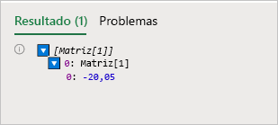
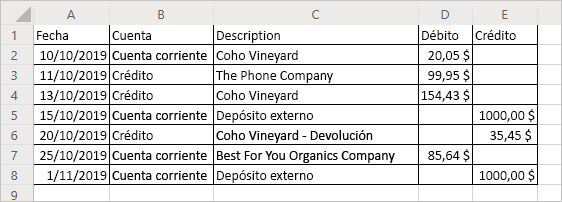

# <a name="read-workbook-data-with-office-scripts-in-excel-on-the-web"></a>Leer datos de libros con scripts de Office en Excel en la Web

Este tutorial le enseña a leer datos de un libro con un script de Office para Excel en la Web. A continuación, deberá modificar los datos leídos y volver a colocarlos en el libro.

> [!TIP]
> Si no está familiarizado con los scripts de Office, le recomendamos que empiece con el tutorial de [Guardar, editar y crear scripts de Office en Excel en la Web](excel-tutorial.md).

## <a name="prerequisites"></a>Requisitos previos

[!INCLUDE [Tutorial prerequisites](../includes/tutorial-prerequisites.md)]

> [!IMPORTANT]
> Este tutorial está diseñado para las personas con conocimientos a nivel intermedio de JavaScript o TypeScript. Si no está familiarizado con JavaScript, le recomendamos que revise el [Tutorial de JavaScript de Mozilla](https://developer.mozilla.org/docs/Web/JavaScript/Guide/Introduction). Para obtener más información sobre el entorno de los scripts, visite [Scripts de Office en Excel en la Web](../overview/excel.md).

## <a name="read-a-cell"></a>Leer una celda

Los scripts creados con la Grabadora de acciones solo pueden escribir información en el libro. Con el Editor de código, puede además editar y escribir scripts que lean datos de un libro.

Creemos un script que lea datos y actúe en función de lo que lee. Vamos a trabajar con un ejemplo de extracto bancario. Este ejemplo es una declaración combinada de cuenta corriente y crédito. Lamentablemente, los informes de saldo muestran los cambios de forma diferente. La declaración de cuenta corriente muestra los ingresos como crédito positivo y los costes como débito negativo. En cambio, la declaración de crédito funciona de manera contraria.

En el resto del tutorial, armonizaremos los datos de ambos con un script. En primer lugar, veamos cómo leer los datos del libro.

1. Cree una nueva hoja de cálculo en el libro que ha usado para el resto del tutorial.
2. Copie los siguientes datos y péguelos en la nueva hoja de cálculo, comenzando por la celda **A1**.

    |Fecha |Cuenta |Descripción |Débito |Crédito |
    |:--|:--|:--|:--|:--|
    |10/10/2019 |Cuenta corriente |Coho Vineyard |-20,05 | |
    |11/10/2019 |Crédito |The Phone Company |99,95 | |
    |13/10/2019 |Crédito |Coho Vineyard |154,43 | |
    |15/10/2019 |Cuenta corriente |Depósito externo | |1000 |
    |20/10/2019 |Crédito |Coho Vineyard - Devolución | |- 35,45 |
    |25/10/2019 |Cuenta corriente |Best For You Organics Company | - 85,64 | |
    |01/11/2019 |Cuenta corriente |Depósito externo | |1000 |

3. Abra el **Editor de código** y seleccione **Nuevo script**.
4. Limpiemos un poco el formato. Este es un documento financiero, así que cambie el formato de número de las columnas **Débito** y **Crédito** para mostrar los valores como cantidades en euros. También hay que ajustar el ancho de columna a los datos.

    Reemplace el contenido del script por el siguiente código:

    ```TypeScript
    function main(workbook: ExcelScript.Workbook) {
        // Get the current worksheet.
        let selectedSheet = workbook.getActiveWorksheet();

        // Format the range to display numerical dollar amounts.
        selectedSheet.getRange("D2:E8").setNumberFormat("$#,##0.00");

        // Fit the width of all the used columns to the data.
        selectedSheet.getUsedRange().getFormat().autofitColumns();
    }
    ```

5. Ahora, leamos un valor de una de las columnas de número. Agregue el código siguiente al final del script (antes del `}` de cierre):

    ```TypeScript
    // Get the value of cell D2.
    let range = selectedSheet.getRange("D2");
    console.log(range.getValues());
    ```

6. Ejecute el script.
7. Debe ver `[Array[1]]` en la consola. No es un número por que los rangos son matrices bidimensionales de datos. Este rango bidimensional se ha registrado en la consola directamente. Afortunadamente, el Editor de código le permite ver el contenido de la matriz.
8. Cuando se registra una matriz bidimensional en la consola, se agrupan los valores de columna en cada fila. Expanda el registro de matriz pulsando en el triángulo azul.
9. Expanda el segundo nivel de la matriz pulsando en el triángulo azul que ha descubierto recientemente. Ahora debería ver lo siguiente:

    

## <a name="modify-the-value-of-a-cell"></a>Cambiar el valor de una celda

Ahora que podemos leer datos, vamos a usarlos para modificar el libro. Haremos que el valor de la celda **D2** sea positivo con la función `Math.abs`. El objeto [Math](https://developer.mozilla.org/docs/web/javascript/reference/global_objects/math) contiene varias funciones a las que tienen acceso los scripts. Puede encontrar más información sobre `Math` y otros objetos integrados en [Usar objetos integrados de JavaScript en los scripts de Office](../develop/javascript-objects.md).

1. Agregue el siguiente código al final del script:

    ```TypeScript
    // Run the `Math.abs` function with the value at D2 and apply that value back to D2.
    let positiveValue = Math.abs(range.getValue());
    range.setValue(positiveValue);
    ```

    Tenga en cuenta que estamos usando `getValue` y `setValue`. Estos métodos funcionan en una sola celda. Cuando trabaje con rangos de varias celdas, es mejor usar `getValues` y `setValues`.

2. El valor de la celda **D2** debería ahora ser positivo.

## <a name="modify-the-values-of-a-column"></a>Modificar los valores de una columna

Ahora que sabemos cómo leer y escribir en una sola celda, vamos a aplicar este conocimiento a todas las columnas **Débito** y **Crédito**.

1. Quite el código que afecta a una sola celda (el código de valor absoluto anterior), para que el script tenga el siguiente aspecto:

    ```TypeScript
    function main(workbook: ExcelScript.Workbook) {
        // Get the current worksheet.
        let selectedSheet = workbook.getActiveWorksheet();

        // Format the range to display numerical dollar amounts.
        selectedSheet.getRange("D2:E8").setNumberFormat("$#,##0.00");

        // Fit the width of all the used columns to the data.
        selectedSheet.getUsedRange().getFormat().autofitColumns();
    }
    ```

2. Agregue un bucle al final del script que itere las filas de las dos últimas columnas. En cada celda, el script establece el valor absoluto del valor actual iterado.

    Tenga en cuenta que la matriz que define las ubicaciones de la celda está basada en cero. Esto significa que la celda **A1** es `range[0][0]`.

    ```TypeScript
    // Get the values of the used range.
    let range = selectedSheet.getUsedRange();
    let rangeValues = range.getValues();

    // Iterate over the fourth and fifth columns and set their values to their absolute value.
    let rowCount = range.getRowCount();
    for (let i = 1; i < rowCount; i++) {
        // The column at index 3 is column "4" in the worksheet.
        if (rangeValues[i][3] != 0) {
            let positiveValue = Math.abs(rangeValues[i][3]);
            selectedSheet.getCell(i, 3).setValue(positiveValue);
        }

        // The column at index 4 is column "5" in the worksheet.
        if (rangeValues[i][4] != 0) {
            let positiveValue = Math.abs(rangeValues[i][4]);
            selectedSheet.getCell(i, 4).setValue(positiveValue);
        }
    }
    ```

    Esta parte del script realiza varias tareas importantes. En primer lugar, obtiene los valores y cuenta las filas del rango usado. Esto nos permite ver los valores y averiguar cuándo detenernos. En segundo lugar, itera el rango usado, verificando cada celda en las columnas **Débito** y **Crédito**. Por último, si el valor de la celda no es 0, se reemplaza por su valor absoluto. Evitamos el cero para no cambiar las celdas en blanco.

3. Ejecute el script.

    Ahora, su declaración bancaria debería tener el siguiente aspecto:

    

## <a name="next-steps"></a>Pasos siguientes

Abra el Editor de código y pruebe algunos de nuestros [Ejemplos para scripts de Office en Excel en la Web](../resources/excel-samples.md). Para obtener más información sobre la creación de scripts de Office, consulte también [Fundamentos para scripts de Office en Excel en la Web](../develop/scripting-fundamentals.md).
