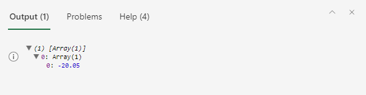

# <a name="read-workbook-data-with-office-scripts-in-excel-on-the-web"></a><span data-ttu-id="0ef7c-103">Leer datos de libros con scripts de Office en Excel en la Web</span><span class="sxs-lookup"><span data-stu-id="0ef7c-103">Read workbook data with Office Scripts in Excel on the web</span></span>

<span data-ttu-id="0ef7c-104">Este tutorial le enseñará a leer datos de un libro con un script de Office para Excel en la Web.</span><span class="sxs-lookup"><span data-stu-id="0ef7c-104">This tutorial will teach you how to read data from a workbook with an Office Script for Excel on the web.</span></span> <span data-ttu-id="0ef7c-105">A continuación, deberá modificar los datos leídos y volver a colocarlos en el libro.</span><span class="sxs-lookup"><span data-stu-id="0ef7c-105">You'll then edit the data you read and put it back in the workbook.</span></span>

> [!TIP]
> <span data-ttu-id="0ef7c-106">Si no está familiarizado con los scripts de Office, le recomendamos que empiece con el tutorial de [Guardar, editar y crear scripts de Office en Excel en la Web](excel-tutorial.md).</span><span class="sxs-lookup"><span data-stu-id="0ef7c-106">If you are new to Office Scripts, we recommend starting with the [Record, edit, and create Office Scripts in Excel on the web](excel-tutorial.md) tutorial.</span></span>

## <a name="prerequisites"></a><span data-ttu-id="0ef7c-107">Requisitos previos</span><span class="sxs-lookup"><span data-stu-id="0ef7c-107">Prerequisites</span></span>

[!INCLUDE [Preview note](../includes/preview-note.md)]

<span data-ttu-id="0ef7c-108">Antes de iniciar este tutorial, necesitará acceder a los scripts de Office. Esto requiere lo siguiente:</span><span class="sxs-lookup"><span data-stu-id="0ef7c-108">Before starting this tutorial, you'll need access to Office Scripts, which requires the following:</span></span>

- <span data-ttu-id="0ef7c-109">[Excel en la Web](https://www.office.com/launch/excel)</span><span class="sxs-lookup"><span data-stu-id="0ef7c-109">[Excel on the web](https://www.office.com/launch/excel).</span></span>
- <span data-ttu-id="0ef7c-110">Pida a su administrador que [habilite los scripts de Office para su organización](https://support.office.com/article/office-scripts-settings-in-m365-19d3c51a-6ca2-40ab-978d-60fa49554dcf), lo que agrega la barra de herramientas **Automatizar** a la cinta de opciones.</span><span class="sxs-lookup"><span data-stu-id="0ef7c-110">Ask your administrator to [enable Office Scripts for your organization](https://support.office.com/article/office-scripts-settings-in-m365-19d3c51a-6ca2-40ab-978d-60fa49554dcf), which adds the **Automate** tab to the ribbon.</span></span>

> [!IMPORTANT]
> <span data-ttu-id="0ef7c-111">Este tutorial está diseñado para las personas con conocimientos a nivel intermedio de JavaScript o TypeScript.</span><span class="sxs-lookup"><span data-stu-id="0ef7c-111">This tutorial is intended for people with beginner to intermediate-level knowledge of JavaScript or TypeScript.</span></span> <span data-ttu-id="0ef7c-112">Si no está familiarizado con JavaScript, le recomendamos que revise el [Tutorial de JavaScript de Mozilla](https://developer.mozilla.org/docs/Web/JavaScript/Guide/Introduction).</span><span class="sxs-lookup"><span data-stu-id="0ef7c-112">If you're new to JavaScript, we recommend reviewing the [Mozilla JavaScript tutorial](https://developer.mozilla.org/docs/Web/JavaScript/Guide/Introduction).</span></span> <span data-ttu-id="0ef7c-113">Para obtener más información sobre el entorno de los scripts, visite [Scripts de Office en Excel en la Web](../overview/excel.md).</span><span class="sxs-lookup"><span data-stu-id="0ef7c-113">Visit [Office Scripts in Excel on the web](../overview/excel.md) to learn more about the script environment.</span></span>

## <a name="read-a-cell"></a><span data-ttu-id="0ef7c-114">Leer una celda</span><span class="sxs-lookup"><span data-stu-id="0ef7c-114">Read a cell</span></span>

<span data-ttu-id="0ef7c-115">Los scripts creados con la Grabadora de acciones solo pueden escribir información en el libro.</span><span class="sxs-lookup"><span data-stu-id="0ef7c-115">Scripts made with the Action Recorder can only write information to the workbook.</span></span> <span data-ttu-id="0ef7c-116">Con el Editor de código, puede además editar y escribir scripts que lean datos de un libro.</span><span class="sxs-lookup"><span data-stu-id="0ef7c-116">With the Code Editor, you can edit and make scripts that also read data from a workbook.</span></span>

<span data-ttu-id="0ef7c-117">Creemos un script que lea datos y actúe en función de lo que lee.</span><span class="sxs-lookup"><span data-stu-id="0ef7c-117">Let's make a script that reads data and acts based on what was read.</span></span> <span data-ttu-id="0ef7c-118">Vamos a trabajar con un ejemplo de extracto bancario.</span><span class="sxs-lookup"><span data-stu-id="0ef7c-118">We're going to work with a sample banking statement.</span></span> <span data-ttu-id="0ef7c-119">Este ejemplo es una declaración combinada de cuenta corriente y crédito.</span><span class="sxs-lookup"><span data-stu-id="0ef7c-119">This statement is a combined checking and credit statement.</span></span> <span data-ttu-id="0ef7c-120">Lamentablemente, los informes de saldo muestran los cambios de forma diferente.</span><span class="sxs-lookup"><span data-stu-id="0ef7c-120">Unfortunately, they report balance changes differently.</span></span> <span data-ttu-id="0ef7c-121">La declaración de cuenta corriente muestra los ingresos como crédito positivo y los costes como débito negativo.</span><span class="sxs-lookup"><span data-stu-id="0ef7c-121">The checking statement gives income as positive credit and costs as negative debit.</span></span> <span data-ttu-id="0ef7c-122">En cambio, la declaración de crédito funciona de manera contraria.</span><span class="sxs-lookup"><span data-stu-id="0ef7c-122">The credit statement does the opposite.</span></span>

<span data-ttu-id="0ef7c-123">En el resto del tutorial, armonizaremos los datos de ambos con un script.</span><span class="sxs-lookup"><span data-stu-id="0ef7c-123">Over the rest of the tutorial, we will normalize this data using a script.</span></span> <span data-ttu-id="0ef7c-124">En primer lugar, veamos cómo leer los datos del libro.</span><span class="sxs-lookup"><span data-stu-id="0ef7c-124">First, let's learn how to read data from the workbook.</span></span>

1. <span data-ttu-id="0ef7c-125">Cree una nueva hoja de cálculo en el libro que ha usado para el resto del tutorial.</span><span class="sxs-lookup"><span data-stu-id="0ef7c-125">Create a new worksheet in the workbook you've used for the rest of the tutorial.</span></span>
2. <span data-ttu-id="0ef7c-126">Copie los siguientes datos y péguelos en la nueva hoja de cálculo, comenzando por la celda **A1**.</span><span class="sxs-lookup"><span data-stu-id="0ef7c-126">Copy the following data and paste it into the new worksheet, starting at cell **A1**.</span></span>

    |<span data-ttu-id="0ef7c-127">Fecha</span><span class="sxs-lookup"><span data-stu-id="0ef7c-127">Date</span></span> |<span data-ttu-id="0ef7c-128">Cuenta</span><span class="sxs-lookup"><span data-stu-id="0ef7c-128">Account</span></span> |<span data-ttu-id="0ef7c-129">Descripción</span><span class="sxs-lookup"><span data-stu-id="0ef7c-129">Description</span></span> |<span data-ttu-id="0ef7c-130">Débito</span><span class="sxs-lookup"><span data-stu-id="0ef7c-130">Debit</span></span> |<span data-ttu-id="0ef7c-131">Crédito</span><span class="sxs-lookup"><span data-stu-id="0ef7c-131">Credit</span></span> |
    |:--|:--|:--|:--|:--|
    |<span data-ttu-id="0ef7c-132">10/10/2019</span><span class="sxs-lookup"><span data-stu-id="0ef7c-132">10/10/2019</span></span> |<span data-ttu-id="0ef7c-133">Cuenta corriente</span><span class="sxs-lookup"><span data-stu-id="0ef7c-133">Checking</span></span> |<span data-ttu-id="0ef7c-134">Coho Vineyard</span><span class="sxs-lookup"><span data-stu-id="0ef7c-134">Coho Vineyard</span></span> |<span data-ttu-id="0ef7c-135">-20,05</span><span class="sxs-lookup"><span data-stu-id="0ef7c-135">-20.05</span></span> | |
    |<span data-ttu-id="0ef7c-136">11/10/2019</span><span class="sxs-lookup"><span data-stu-id="0ef7c-136">10/11/2019</span></span> |<span data-ttu-id="0ef7c-137">Crédito</span><span class="sxs-lookup"><span data-stu-id="0ef7c-137">Credit</span></span> |<span data-ttu-id="0ef7c-138">The Phone Company</span><span class="sxs-lookup"><span data-stu-id="0ef7c-138">The Phone Company</span></span> |<span data-ttu-id="0ef7c-139">99,95</span><span class="sxs-lookup"><span data-stu-id="0ef7c-139">99.95</span></span> | |
    |<span data-ttu-id="0ef7c-140">13/10/2019</span><span class="sxs-lookup"><span data-stu-id="0ef7c-140">10/13/2019</span></span> |<span data-ttu-id="0ef7c-141">Crédito</span><span class="sxs-lookup"><span data-stu-id="0ef7c-141">Credit</span></span> |<span data-ttu-id="0ef7c-142">Coho Vineyard</span><span class="sxs-lookup"><span data-stu-id="0ef7c-142">Coho Vineyard</span></span> |<span data-ttu-id="0ef7c-143">154,43</span><span class="sxs-lookup"><span data-stu-id="0ef7c-143">154.43</span></span> | |
    |<span data-ttu-id="0ef7c-144">15/10/2019</span><span class="sxs-lookup"><span data-stu-id="0ef7c-144">10/15/2019</span></span> |<span data-ttu-id="0ef7c-145">Cuenta corriente</span><span class="sxs-lookup"><span data-stu-id="0ef7c-145">Checking</span></span> |<span data-ttu-id="0ef7c-146">Depósito externo</span><span class="sxs-lookup"><span data-stu-id="0ef7c-146">External Deposit</span></span> | |<span data-ttu-id="0ef7c-147">1000</span><span class="sxs-lookup"><span data-stu-id="0ef7c-147">1000</span></span> |
    |<span data-ttu-id="0ef7c-148">20/10/2019</span><span class="sxs-lookup"><span data-stu-id="0ef7c-148">10/20/2019</span></span> |<span data-ttu-id="0ef7c-149">Crédito</span><span class="sxs-lookup"><span data-stu-id="0ef7c-149">Credit</span></span> |<span data-ttu-id="0ef7c-150">Coho Vineyard - Devolución</span><span class="sxs-lookup"><span data-stu-id="0ef7c-150">Coho Vineyard - Refund</span></span> | |<span data-ttu-id="0ef7c-151">- 35,45</span><span class="sxs-lookup"><span data-stu-id="0ef7c-151">-35.45</span></span> |
    |<span data-ttu-id="0ef7c-152">25/10/2019</span><span class="sxs-lookup"><span data-stu-id="0ef7c-152">10/25/2019</span></span> |<span data-ttu-id="0ef7c-153">Cuenta corriente</span><span class="sxs-lookup"><span data-stu-id="0ef7c-153">Checking</span></span> |<span data-ttu-id="0ef7c-154">Best For You Organics Company</span><span class="sxs-lookup"><span data-stu-id="0ef7c-154">Best For You Organics Company</span></span> | <span data-ttu-id="0ef7c-155">- 85,64</span><span class="sxs-lookup"><span data-stu-id="0ef7c-155">-85.64</span></span> | |
    |<span data-ttu-id="0ef7c-156">01/11/2019</span><span class="sxs-lookup"><span data-stu-id="0ef7c-156">11/01/2019</span></span> |<span data-ttu-id="0ef7c-157">Cuenta corriente</span><span class="sxs-lookup"><span data-stu-id="0ef7c-157">Checking</span></span> |<span data-ttu-id="0ef7c-158">Depósito externo</span><span class="sxs-lookup"><span data-stu-id="0ef7c-158">External Deposit</span></span> | |<span data-ttu-id="0ef7c-159">1000</span><span class="sxs-lookup"><span data-stu-id="0ef7c-159">1000</span></span> |

3. <span data-ttu-id="0ef7c-160">Abra el **Editor de código** y seleccione **Nuevo script**.</span><span class="sxs-lookup"><span data-stu-id="0ef7c-160">Open the **Code Editor** and select **New Script**.</span></span>
4. <span data-ttu-id="0ef7c-161">Limpiemos un poco el formato.</span><span class="sxs-lookup"><span data-stu-id="0ef7c-161">Let's clean up the formatting.</span></span> <span data-ttu-id="0ef7c-162">Este es un documento financiero, así que cambie el formato de número de las columnas **Débito** y **Crédito** para mostrar los valores como cantidades en euros.</span><span class="sxs-lookup"><span data-stu-id="0ef7c-162">This is a financial document, so let's change the number formatting in the **Debit** and **Credit** columns to show values as dollar amounts.</span></span> <span data-ttu-id="0ef7c-163">También hay que ajustar el ancho de columna a los datos.</span><span class="sxs-lookup"><span data-stu-id="0ef7c-163">Let's also fit the column width to the data.</span></span>

    <span data-ttu-id="0ef7c-164">Reemplace el contenido del script por el siguiente código:</span><span class="sxs-lookup"><span data-stu-id="0ef7c-164">Replace the script contents with the following code:</span></span>

    ```TypeScript
    async function main(context: Excel.RequestContext) {
      // Get the current worksheet.
      let workbook = context.workbook;
      let worksheets = workbook.worksheets;
      let selectedSheet = worksheets.getActiveWorksheet();

      // Format the range to display numerical dollar amounts.
      selectedSheet.getRange("D2:E8").numberFormat = [["$#,##0.00"]];

      // Fit the width of all the used columns to the data.
      selectedSheet.getUsedRange().format.autofitColumns();
    }
    ```

5. <span data-ttu-id="0ef7c-165">Ahora, leamos un valor de una de las columnas de número.</span><span class="sxs-lookup"><span data-stu-id="0ef7c-165">Now let's read a value from one of the number columns.</span></span> <span data-ttu-id="0ef7c-166">Agregue el siguiente código al final del script:</span><span class="sxs-lookup"><span data-stu-id="0ef7c-166">Add the following code to the end of the script:</span></span>

    ```TypeScript
    // Get the value of cell D2.
    let range = selectedSheet.getRange("D2");
    range.load("values");
    await context.sync();
  
    // Print the value of D2.
    console.log(range.values);
    ```

    <span data-ttu-id="0ef7c-167">Observe las llamadas a `load` y `sync`.</span><span class="sxs-lookup"><span data-stu-id="0ef7c-167">Note the calls to `load` and `sync`.</span></span> <span data-ttu-id="0ef7c-168">Puede obtener más información sobre estos métodos en [Aspectos básicos de scripts de Office en Excel en la Web](../develop/scripting-fundamentals.md#sync-and-load).</span><span class="sxs-lookup"><span data-stu-id="0ef7c-168">You can learn the details of those methods in [Scripting Fundamentals for Office Scripts in Excel on the web](../develop/scripting-fundamentals.md#sync-and-load).</span></span> <span data-ttu-id="0ef7c-169">Por ahora, sepa que debe solicitar que se lean los datos y se sincronice el script con el libro para leer esos datos.</span><span class="sxs-lookup"><span data-stu-id="0ef7c-169">For now, know that you must request data to be read and then sync your script with the workbook to read that data.</span></span>

6. <span data-ttu-id="0ef7c-170">Ejecute el script.</span><span class="sxs-lookup"><span data-stu-id="0ef7c-170">Run the script.</span></span>
7. <span data-ttu-id="0ef7c-171">Abra la consola.</span><span class="sxs-lookup"><span data-stu-id="0ef7c-171">Open the console.</span></span> <span data-ttu-id="0ef7c-172">Vaya al menú de **Puntos suspensivos** y presione **Registros...**.</span><span class="sxs-lookup"><span data-stu-id="0ef7c-172">Go to the **Ellipses** menu and press **Logs...**.</span></span>
8. <span data-ttu-id="0ef7c-173">Debe ver `[Array[1]]` en la consola.</span><span class="sxs-lookup"><span data-stu-id="0ef7c-173">You should see `[Array[1]]` in the console.</span></span> <span data-ttu-id="0ef7c-174">No es un número por que los rangos son matrices bidimensionales de datos.</span><span class="sxs-lookup"><span data-stu-id="0ef7c-174">This is not a number because ranges are two-dimensional arrays of data.</span></span> <span data-ttu-id="0ef7c-175">Este rango bidimensional se ha registrado en la consola directamente.</span><span class="sxs-lookup"><span data-stu-id="0ef7c-175">That two-dimensional range is being logged to the console directly.</span></span> <span data-ttu-id="0ef7c-176">Afortunadamente, el Editor de código le permite ver el contenido de la matriz.</span><span class="sxs-lookup"><span data-stu-id="0ef7c-176">Luckily, the Code Editor does let you see the contents of the array.</span></span>
9. <span data-ttu-id="0ef7c-177">Cuando se registra una matriz bidimensional en la consola, se agrupan los valores de columna en cada fila.</span><span class="sxs-lookup"><span data-stu-id="0ef7c-177">When a two-dimensional array is logged to the console, it groups column values under each row.</span></span> <span data-ttu-id="0ef7c-178">Expanda el registro de matriz pulsando en el triángulo azul.</span><span class="sxs-lookup"><span data-stu-id="0ef7c-178">Expand the array log by pressing the blue triangle.</span></span>
10. <span data-ttu-id="0ef7c-179">Expanda el segundo nivel de la matriz pulsando en el triángulo azul que ha descubierto recientemente.</span><span class="sxs-lookup"><span data-stu-id="0ef7c-179">Expand the second level of the array by pressing the newly revealed blue triangle.</span></span> <span data-ttu-id="0ef7c-180">Ahora debería ver lo siguiente:</span><span class="sxs-lookup"><span data-stu-id="0ef7c-180">You should now see this:</span></span>

    

## <a name="modify-the-value-of-a-cell"></a><span data-ttu-id="0ef7c-182">Cambiar el valor de una celda</span><span class="sxs-lookup"><span data-stu-id="0ef7c-182">Modify the value of a cell</span></span>

<span data-ttu-id="0ef7c-183">Ahora que podemos leer datos, vamos a usarlos para modificar el libro.</span><span class="sxs-lookup"><span data-stu-id="0ef7c-183">Now that we can read data, let's use that data to modify the workbook.</span></span> <span data-ttu-id="0ef7c-184">Haremos que el valor de la celda **D2** sea positivo con la función `Math.abs`.</span><span class="sxs-lookup"><span data-stu-id="0ef7c-184">We'll make the value of the cell **D2** positive with the `Math.abs` function.</span></span> <span data-ttu-id="0ef7c-185">El objeto [Math](https://developer.mozilla.org/docs/web/javascript/reference/global_objects/math) contiene varias funciones a las que tienen acceso los scripts.</span><span class="sxs-lookup"><span data-stu-id="0ef7c-185">The [Math](https://developer.mozilla.org/docs/web/javascript/reference/global_objects/math) object contains many functions to which your scripts have access.</span></span> <span data-ttu-id="0ef7c-186">Puede encontrar más información sobre `Math` y otros objetos integrados en [Usar objetos integrados de JavaScript en los scripts de Office](../develop/javascript-objects.md).</span><span class="sxs-lookup"><span data-stu-id="0ef7c-186">More information about `Math` and other built-in objects can be found at [Using built-in JavaScript objects in Office Scripts](../develop/javascript-objects.md).</span></span>

1. <span data-ttu-id="0ef7c-187">Agregue el siguiente código al final del script:</span><span class="sxs-lookup"><span data-stu-id="0ef7c-187">Add the following code to the end of the script:</span></span>

    ```TypeScript
    // Run the `Math.abs` function with the value at D2 and apply that value back to D2.
    let positiveValue = Math.abs(range.values[0][0]);
    range.values = [[positiveValue]];
    ```

2. <span data-ttu-id="0ef7c-188">El valor de la celda **D2** debería ahora ser positivo.</span><span class="sxs-lookup"><span data-stu-id="0ef7c-188">The value of cell **D2** should now be positive.</span></span>

## <a name="modify-the-values-of-a-column"></a><span data-ttu-id="0ef7c-189">Modificar los valores de una columna</span><span class="sxs-lookup"><span data-stu-id="0ef7c-189">Modify the values of a column</span></span>

<span data-ttu-id="0ef7c-190">Ahora que sabemos cómo leer y escribir en una sola celda, vamos a aplicar este conocimiento a todas las columnas **Débito** y **Crédito**.</span><span class="sxs-lookup"><span data-stu-id="0ef7c-190">Now that we know how to read and write to a single cell, let's generalize the script to work on the entire **Debit** and **Credit** columns.</span></span>

1. <span data-ttu-id="0ef7c-191">Quite el código que afecta a una sola celda (el código de valor absoluto anterior), para que el script tenga el siguiente aspecto:</span><span class="sxs-lookup"><span data-stu-id="0ef7c-191">Remove the code that affects only a single cell (the previous absolute value code), such that your script now looks like this:</span></span>

    ```TypeScript
    async function main(context: Excel.RequestContext) {
      // Get the current worksheet.
      let workbook = context.workbook;
      let worksheets = workbook.worksheets;
      let selectedSheet = worksheets.getActiveWorksheet();

      // Format the range to display numerical dollar amounts.
      selectedSheet.getRange("D2:E8").numberFormat = [["$#,##0.00"]];

      // Fit the width of all the used columns to the data.
      selectedSheet.getUsedRange().format.autofitColumns();
    }
    ```

2. <span data-ttu-id="0ef7c-192">Agregue un bucle que itere las filas de las dos últimas columnas.</span><span class="sxs-lookup"><span data-stu-id="0ef7c-192">Add a loop that iterates through the rows in the last two columns.</span></span> <span data-ttu-id="0ef7c-193">En cada celda, el script establece el valor absoluto del valor actual iterado.</span><span class="sxs-lookup"><span data-stu-id="0ef7c-193">For each cell, the script sets the value to the current value's absolute value.</span></span>

    <span data-ttu-id="0ef7c-194">Tenga en cuenta que la matriz que define las ubicaciones de la celda está basada en cero.</span><span class="sxs-lookup"><span data-stu-id="0ef7c-194">Note that the array defining cell locations is zero-based.</span></span> <span data-ttu-id="0ef7c-195">Esto significa que la celda **A1** es `range[0][0]`.</span><span class="sxs-lookup"><span data-stu-id="0ef7c-195">That means cell **A1** is `range[0][0]`.</span></span>

    ```TypeScript
    // Get the values of the used range.
    let range = selectedSheet.getUsedRange();
    range.load("rowCount,values");
    await context.sync();

    // Iterate over the fourth and fifth columns and set their values to their absolute value.
    for (let i = 1; i < range.rowCount; i++) {
      // The column at index 3 is column "4" in the worksheet.
      if (range.values[i][3] != 0) {
        let positiveValue = Math.abs(range.values[i][3]);
        selectedSheet.getCell(i, 3).values = [[positiveValue]];
      }

      // The column at index 4 is column "5" in the worksheet.
      if (range.values[i][4] != 0) {
        let positiveValue = Math.abs(range.values[i][4]);
        selectedSheet.getCell(i, 4).values = [[positiveValue]];
      }
    }
    ```

    <span data-ttu-id="0ef7c-196">Esta parte del script realiza varias tareas importantes.</span><span class="sxs-lookup"><span data-stu-id="0ef7c-196">This portion of the script does several important tasks.</span></span> <span data-ttu-id="0ef7c-197">En primer lugar, carga los valores y cuenta las filas del rango usado.</span><span class="sxs-lookup"><span data-stu-id="0ef7c-197">First, it loads the values and row count of the used range.</span></span> <span data-ttu-id="0ef7c-198">Esto nos permite ver los valores y averiguar cuándo detenernos.</span><span class="sxs-lookup"><span data-stu-id="0ef7c-198">This lets us look at values and know when to stop.</span></span> <span data-ttu-id="0ef7c-199">En segundo lugar, itera el rango usado, verificando cada celda en las columnas **Débito** y **Crédito**.</span><span class="sxs-lookup"><span data-stu-id="0ef7c-199">Second, it iterates through the used range, checking each cell in the **Debit** or **Credit** columns.</span></span> <span data-ttu-id="0ef7c-200">Por último, si el valor de la celda no es 0, se reemplaza por su valor absoluto.</span><span class="sxs-lookup"><span data-stu-id="0ef7c-200">Finally, if the value in the cell is not 0, it is replaced by its absolute value.</span></span> <span data-ttu-id="0ef7c-201">Evitamos el cero para no cambiar las celdas en blanco.</span><span class="sxs-lookup"><span data-stu-id="0ef7c-201">We're avoiding zeroes so we can leave the blank cells as they were.</span></span>

3. <span data-ttu-id="0ef7c-202">Ejecute el script.</span><span class="sxs-lookup"><span data-stu-id="0ef7c-202">Run the script.</span></span>

    <span data-ttu-id="0ef7c-203">Ahora, su declaración bancaria debería tener el siguiente aspecto:</span><span class="sxs-lookup"><span data-stu-id="0ef7c-203">Your banking statement should now look like this:</span></span>

    

## <a name="next-steps"></a><span data-ttu-id="0ef7c-205">Pasos siguientes</span><span class="sxs-lookup"><span data-stu-id="0ef7c-205">Next steps</span></span>

<span data-ttu-id="0ef7c-206">Abra el Editor de código y pruebe algunos de nuestros [Ejemplos para scripts de Office en Excel en la Web.</span><span class="sxs-lookup"><span data-stu-id="0ef7c-206">Open the Code Editor and try out some of our [Sample scripts for Office Scripts in Excel on the web](../resources/excel-samples.md).</span></span> <span data-ttu-id="0ef7c-207">Para obtener más información sobre la creación de scripts de Office, consulte también [Fundamentos para scripts de Office en Excel en la Web](../develop/scripting-fundamentals.md).</span><span class="sxs-lookup"><span data-stu-id="0ef7c-207">You can also visit [Scripting Fundamentals for Office Scripts in Excel on the web](../develop/scripting-fundamentals.md) to learn more about creating Office Scripts.</span></span>
