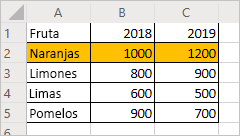
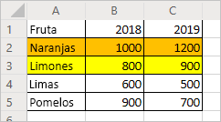
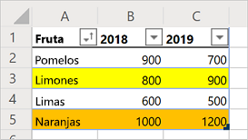

# <a name="record-edit-and-create-office-scripts-in-excel-on-the-web"></a><span data-ttu-id="2e2f8-103">Grabar, editar y crear scripts de Office en Excel en la Web</span><span class="sxs-lookup"><span data-stu-id="2e2f8-103">Record, edit, and create Office Scripts in Excel on the web</span></span>

<span data-ttu-id="2e2f8-104">En este tutorial se le enseñan los conceptos básicos de la grabación, la edición y la escritura de un script de Office para Excel en la Web.</span><span class="sxs-lookup"><span data-stu-id="2e2f8-104">This tutorial teaches you the basics of recording, editing, and writing an Office Script for Excel on the web.</span></span> <span data-ttu-id="2e2f8-105">Va a grabar un script que dé formato a una hoja de cálculo con registros de ventas.</span><span class="sxs-lookup"><span data-stu-id="2e2f8-105">You'll record a script that applies some formatting to a sales record worksheet.</span></span> <span data-ttu-id="2e2f8-106">A continuación, editará el script grabado para dar más formato, crear una tabla y ordenar la tabla.</span><span class="sxs-lookup"><span data-stu-id="2e2f8-106">You'll then edit the recorded script to apply more formatting, create a table, and sort that table.</span></span> <span data-ttu-id="2e2f8-107">Este método de grabar y luego editar le permite ver el código que resulta de las acciones que ha realizado en Excel.</span><span class="sxs-lookup"><span data-stu-id="2e2f8-107">This record-then-edit pattern is an important tool to see what your Excel actions look like as code.</span></span>

## <a name="prerequisites"></a><span data-ttu-id="2e2f8-108">Requisitos previos</span><span class="sxs-lookup"><span data-stu-id="2e2f8-108">Prerequisites</span></span>

[!INCLUDE [Tutorial prerequisites](../includes/tutorial-prerequisites.md)]

> [!IMPORTANT]
> <span data-ttu-id="2e2f8-109">Este tutorial está diseñado para las personas con conocimientos de nivel intermedio de JavaScript o TypeScript.</span><span class="sxs-lookup"><span data-stu-id="2e2f8-109">This tutorial is intended for people with beginner to intermediate-level knowledge of JavaScript or TypeScript.</span></span> <span data-ttu-id="2e2f8-110">Si no está familiarizado con JavaScript, le recomendamos que comience con el [Tutorial de JavaScript de Mozilla](https://developer.mozilla.org/docs/Web/JavaScript/Guide/Introduction).</span><span class="sxs-lookup"><span data-stu-id="2e2f8-110">If you're new to JavaScript, we recommend starting with the [Mozilla JavaScript tutorial](https://developer.mozilla.org/docs/Web/JavaScript/Guide/Introduction).</span></span> <span data-ttu-id="2e2f8-111">Para obtener más información sobre el entorno de los scripts, visite [Entorno del Editor de código de Scripts de Office](../overview/code-editor-environment.md).</span><span class="sxs-lookup"><span data-stu-id="2e2f8-111">Visit [Office Scripts Code Editor environment](../overview/code-editor-environment.md) to learn more about the script environment.</span></span>

## <a name="add-data-and-record-a-basic-script"></a><span data-ttu-id="2e2f8-112">Agregar datos y grabar un script básico</span><span class="sxs-lookup"><span data-stu-id="2e2f8-112">Add data and record a basic script</span></span>

<span data-ttu-id="2e2f8-113">En primer lugar, necesitaremos algunos datos y un pequeño script inicial.</span><span class="sxs-lookup"><span data-stu-id="2e2f8-113">First, we'll need some data and a small starting script.</span></span>

1. <span data-ttu-id="2e2f8-114">Cree un libro nuevo en Excel para la Web.</span><span class="sxs-lookup"><span data-stu-id="2e2f8-114">Create a new workbook in Excel for the Web.</span></span>
2. <span data-ttu-id="2e2f8-115">Copie los siguientes datos de ventas de frutas y péguelos en la hoja de cálculo, comenzando por la celda **A1**.</span><span class="sxs-lookup"><span data-stu-id="2e2f8-115">Copy the following fruit sales data and paste it into the worksheet, starting at cell **A1**.</span></span>

    |<span data-ttu-id="2e2f8-116">Fruta</span><span class="sxs-lookup"><span data-stu-id="2e2f8-116">Fruit</span></span> |<span data-ttu-id="2e2f8-117">2018</span><span class="sxs-lookup"><span data-stu-id="2e2f8-117">2018</span></span> |<span data-ttu-id="2e2f8-118">2019</span><span class="sxs-lookup"><span data-stu-id="2e2f8-118">2019</span></span> |
    |:---|:---|:---|
    |<span data-ttu-id="2e2f8-119">Naranjas</span><span class="sxs-lookup"><span data-stu-id="2e2f8-119">Oranges</span></span> |<span data-ttu-id="2e2f8-120">1000</span><span class="sxs-lookup"><span data-stu-id="2e2f8-120">1000</span></span> |<span data-ttu-id="2e2f8-121">1200</span><span class="sxs-lookup"><span data-stu-id="2e2f8-121">1200</span></span> |
    |<span data-ttu-id="2e2f8-122">Limones</span><span class="sxs-lookup"><span data-stu-id="2e2f8-122">Lemons</span></span> |<span data-ttu-id="2e2f8-123">800</span><span class="sxs-lookup"><span data-stu-id="2e2f8-123">800</span></span> |<span data-ttu-id="2e2f8-124">900</span><span class="sxs-lookup"><span data-stu-id="2e2f8-124">900</span></span> |
    |<span data-ttu-id="2e2f8-125">Limas</span><span class="sxs-lookup"><span data-stu-id="2e2f8-125">Limes</span></span> |<span data-ttu-id="2e2f8-126">600</span><span class="sxs-lookup"><span data-stu-id="2e2f8-126">600</span></span> |<span data-ttu-id="2e2f8-127">500</span><span class="sxs-lookup"><span data-stu-id="2e2f8-127">500</span></span> |
    |<span data-ttu-id="2e2f8-128">Pomelos</span><span class="sxs-lookup"><span data-stu-id="2e2f8-128">Grapefruits</span></span> |<span data-ttu-id="2e2f8-129">900</span><span class="sxs-lookup"><span data-stu-id="2e2f8-129">900</span></span> |<span data-ttu-id="2e2f8-130">700</span><span class="sxs-lookup"><span data-stu-id="2e2f8-130">700</span></span> |

3. <span data-ttu-id="2e2f8-131">Abra la pestaña **Automatizar**. Si no ve la pestaña **Automatizar**, presione la flecha desplegable para comprobar el desbordamiento de la cinta de opciones.</span><span class="sxs-lookup"><span data-stu-id="2e2f8-131">Open the **Automate** tab. If you do not see the **Automate** tab, check the ribbon overflow by pressing the drop-down arrow.</span></span>
4. <span data-ttu-id="2e2f8-132">Haga clic en el botón **Guardar acciones**.</span><span class="sxs-lookup"><span data-stu-id="2e2f8-132">Press the **Record Actions** button.</span></span>
5. <span data-ttu-id="2e2f8-133">Seleccione las celdas **A2:C2** (la fila "Naranjas") y configure el color de relleno como naranja.</span><span class="sxs-lookup"><span data-stu-id="2e2f8-133">Select cells **A2:C2** (the "Oranges" row) and set the fill color to orange.</span></span>
6. <span data-ttu-id="2e2f8-134">Detenga la grabación pulsando el botón **Detener**.</span><span class="sxs-lookup"><span data-stu-id="2e2f8-134">Stop the recording by pressing the **Stop** button.</span></span>
7. <span data-ttu-id="2e2f8-135">Rellene el campo **Nombre del script** con un nombre que luego vaya a recordar.</span><span class="sxs-lookup"><span data-stu-id="2e2f8-135">Fill in the **Script Name** field with a memorable name.</span></span>
8. <span data-ttu-id="2e2f8-136">*Opcional:* rellenar el campo **Descripción** con una descripción relevante.</span><span class="sxs-lookup"><span data-stu-id="2e2f8-136">*Optional:* Fill in the **Description** field with a meaningful description.</span></span> <span data-ttu-id="2e2f8-137">Esto ofrece un contexto sobre lo que hace el script.</span><span class="sxs-lookup"><span data-stu-id="2e2f8-137">This is used to provide context as to what the script does.</span></span> <span data-ttu-id="2e2f8-138">Para el tutorial, puede usar "Distinguiendo las filas de una tabla con colores".</span><span class="sxs-lookup"><span data-stu-id="2e2f8-138">For the tutorial, you can use "Color-codes rows of a table".</span></span>

   > [!TIP]
   > <span data-ttu-id="2e2f8-139">Puede editar una descripción del script más adelante desde el panel de **Detalles del script**, que se encuentra en el menú **...** del Editor de código.</span><span class="sxs-lookup"><span data-stu-id="2e2f8-139">You can edit a script's description later from the **Script Details** pane, which is located under the Code Editor's **...** menu.</span></span>

9. <span data-ttu-id="2e2f8-140">Para guardar el script, presione el botón **Guardar**.</span><span class="sxs-lookup"><span data-stu-id="2e2f8-140">Save the script by pressing the **Save** button.</span></span>

    <span data-ttu-id="2e2f8-141">La hoja de cálculo debe tener este aspecto (no se preocupe si el color es diferente):</span><span class="sxs-lookup"><span data-stu-id="2e2f8-141">Your worksheet should look like this (don't worry if the color is different):</span></span>

    

## <a name="edit-an-existing-script"></a><span data-ttu-id="2e2f8-143">Editar un script existente</span><span class="sxs-lookup"><span data-stu-id="2e2f8-143">Edit an existing script</span></span>

<span data-ttu-id="2e2f8-144">El script anterior pinta la fila "Naranja" de color naranja.</span><span class="sxs-lookup"><span data-stu-id="2e2f8-144">The previous script colored the "Oranges" row to be orange.</span></span> <span data-ttu-id="2e2f8-145">Ahora, agreguemos una fila amarilla a "Limones".</span><span class="sxs-lookup"><span data-stu-id="2e2f8-145">Let's add a yellow row for the "Lemons".</span></span>

1. <span data-ttu-id="2e2f8-146">En el panel **Detalles** ya abierto, presione el botón **Editar**.</span><span class="sxs-lookup"><span data-stu-id="2e2f8-146">From the now-open **Details** pane, press the **Edit** button.</span></span>
2. <span data-ttu-id="2e2f8-147">Debería ver algo parecido a este código:</span><span class="sxs-lookup"><span data-stu-id="2e2f8-147">You should see something similar to this code:</span></span>

    ```TypeScript
    function main(workbook: ExcelScript.Workbook) {
      // Set fill color to FFC000 for range Sheet1!A2:C2
      let selectedSheet = workbook.getActiveWorksheet();
      selectedSheet.getRange("A2:C2").getFormat().getFill().setColor("FFC000");
    }
    ```

    <span data-ttu-id="2e2f8-148">Este código obtiene la hoja de cálculo actual del libro.</span><span class="sxs-lookup"><span data-stu-id="2e2f8-148">This code gets the current worksheet from the workbook.</span></span> <span data-ttu-id="2e2f8-149">Después, establece el color de relleno del rango **A2:C2**.</span><span class="sxs-lookup"><span data-stu-id="2e2f8-149">Then, it sets the fill color of the range **A2:C2**.</span></span>

    <span data-ttu-id="2e2f8-150">Los rangos son una parte fundamental de las secuencias de comandos de Office en Excel en la Web.</span><span class="sxs-lookup"><span data-stu-id="2e2f8-150">Ranges are a fundamental part of Office Scripts in Excel on the web.</span></span> <span data-ttu-id="2e2f8-151">Un rango es un bloque de celdas contiguo y rectangular que contiene valores, fórmulas y formatos.</span><span class="sxs-lookup"><span data-stu-id="2e2f8-151">A range is a contiguous, rectangular block of cells that contains values, formula, and formatting.</span></span> <span data-ttu-id="2e2f8-152">Constituyen la estructura básica de las celdas y se usan para realizar la mayoría de las tareas de scripts.</span><span class="sxs-lookup"><span data-stu-id="2e2f8-152">They are the basic structure of cells through which you'll perform most of your scripting tasks.</span></span>

3. <span data-ttu-id="2e2f8-153">Agregue la línea siguiente al final del script (entre el lugar en el que se establece el `color` y aparece el `}` de cierre):</span><span class="sxs-lookup"><span data-stu-id="2e2f8-153">Add the following line to the end of the script (between where the `color` is set and the closing `}`):</span></span>

    ```TypeScript
    selectedSheet.getRange("A3:C3").getFormat().getFill().setColor("yellow");
    ```

4. <span data-ttu-id="2e2f8-154">Para probar el script, presione **Ejecutar**.</span><span class="sxs-lookup"><span data-stu-id="2e2f8-154">Test the script by pressing **Run**.</span></span> <span data-ttu-id="2e2f8-155">El libro tendrá ahora el siguiente aspecto:</span><span class="sxs-lookup"><span data-stu-id="2e2f8-155">Your workbook should now look like this:</span></span>

    

## <a name="create-a-table"></a><span data-ttu-id="2e2f8-157">Crear una tabla</span><span class="sxs-lookup"><span data-stu-id="2e2f8-157">Create a table</span></span>

<span data-ttu-id="2e2f8-158">Vamos a convertir estos datos de ventas de frutas en una tabla.</span><span class="sxs-lookup"><span data-stu-id="2e2f8-158">Let's convert this fruit sales data into a table.</span></span> <span data-ttu-id="2e2f8-159">Usaremos nuestro script para todo este proceso.</span><span class="sxs-lookup"><span data-stu-id="2e2f8-159">We'll use our script for the entire process.</span></span>

1. <span data-ttu-id="2e2f8-160">Agregue la línea siguiente al final del script (antes del `}` de cierre):</span><span class="sxs-lookup"><span data-stu-id="2e2f8-160">Add the following line to the end of the script (before the closing `}`):</span></span>

    ```TypeScript
    let table = selectedSheet.addTable("A1:C5", true);
    ```

2. <span data-ttu-id="2e2f8-161">Esa llamada devuelve un objeto de `Table`.</span><span class="sxs-lookup"><span data-stu-id="2e2f8-161">That call returns a `Table` object.</span></span> <span data-ttu-id="2e2f8-162">Vamos a usar la tabla para ordenar los datos.</span><span class="sxs-lookup"><span data-stu-id="2e2f8-162">Let's use that table to sort the data.</span></span> <span data-ttu-id="2e2f8-163">Ordenaremos los datos de menor a mayor en función de los valores de la columna "Frutas".</span><span class="sxs-lookup"><span data-stu-id="2e2f8-163">We'll sort the data in ascending order based on the values in the "Fruit" column.</span></span> <span data-ttu-id="2e2f8-164">Agregue la siguiente línea después de la creación de tabla:</span><span class="sxs-lookup"><span data-stu-id="2e2f8-164">Add the following line after the table creation:</span></span>

    ```TypeScript
    table.getSort().apply([{ key: 0, ascending: true }]);
    ```

    <span data-ttu-id="2e2f8-165">Su script debe tener este aspecto:</span><span class="sxs-lookup"><span data-stu-id="2e2f8-165">Your script should look like this:</span></span>

    ```TypeScript
    function main(workbook: ExcelScript.Workbook) {
        // Set fill color to FFC000 for range Sheet12!A2:C2
        let selectedSheet = workbook.getActiveWorksheet();
        selectedSheet.getRange("A2:C2").getFormat().getFill().setColor("FFC000");
        selectedSheet.getRange("A3:C3").getFormat().getFill().setColor("yellow");
        let table = selectedSheet.addTable("A1:C5", true);
        table.getSort().apply([{ key: 0, ascending: true }]);
    }
    ```

    <span data-ttu-id="2e2f8-166">Las tablas tienen un objeto `TableSort` al que se accede mediante el método `Table.getSort`.</span><span class="sxs-lookup"><span data-stu-id="2e2f8-166">Tables have a `TableSort` object, accessed through the `Table.getSort` method.</span></span> <span data-ttu-id="2e2f8-167">Puede aplicar un criterio de ordenación a ese objeto.</span><span class="sxs-lookup"><span data-stu-id="2e2f8-167">You can apply sorting criteria to that object.</span></span> <span data-ttu-id="2e2f8-168">El método `apply` acepta una matriz de objetos `SortField`.</span><span class="sxs-lookup"><span data-stu-id="2e2f8-168">The `apply` method takes in an array of `SortField` objects.</span></span> <span data-ttu-id="2e2f8-169">En este caso, solo tenemos un criterio de ordenación, por lo que solo usamos un `SortField`.</span><span class="sxs-lookup"><span data-stu-id="2e2f8-169">In this case, we only have one sorting criteria, so we only use one `SortField`.</span></span> <span data-ttu-id="2e2f8-170">`key: 0` establece los valores que definen la ordenación de la columna como "0" (que es la primera columna de la tabla **A** en este caso).</span><span class="sxs-lookup"><span data-stu-id="2e2f8-170">`key: 0` sets the column with the sort-defining values to "0" (which is the first column on the table, **A** in this case).</span></span> <span data-ttu-id="2e2f8-171">`ascending: true` ordena los datos de menor a mayor (en lugar de mayor a menor).</span><span class="sxs-lookup"><span data-stu-id="2e2f8-171">`ascending: true` sorts the data in ascending order (instead of descending order).</span></span>

3. <span data-ttu-id="2e2f8-172">Ejecute el script.</span><span class="sxs-lookup"><span data-stu-id="2e2f8-172">Run the script.</span></span> <span data-ttu-id="2e2f8-173">Debería ver una tabla como esta:</span><span class="sxs-lookup"><span data-stu-id="2e2f8-173">You should see a table like this:</span></span>

    

    > [!NOTE]
    > <span data-ttu-id="2e2f8-175">Si vuelve a ejecutar el script, se producirá un error.</span><span class="sxs-lookup"><span data-stu-id="2e2f8-175">If you re-run the script, you'll get an error.</span></span> <span data-ttu-id="2e2f8-176">Esto se debe a que no se puede crear una tabla encima de otra.</span><span class="sxs-lookup"><span data-stu-id="2e2f8-176">This is because you cannot create a table on top of another table.</span></span> <span data-ttu-id="2e2f8-177">Sin embargo, puede ejecutar el script en otra hoja de cálculo o en un libro.</span><span class="sxs-lookup"><span data-stu-id="2e2f8-177">However, you can run the script on a different worksheet or workbook.</span></span>

### <a name="re-run-the-script"></a><span data-ttu-id="2e2f8-178">Ejecute el script de nuevo</span><span class="sxs-lookup"><span data-stu-id="2e2f8-178">Re-run the script</span></span>

1. <span data-ttu-id="2e2f8-179">Crear una nueva hoja de cálculo en el libro actual.</span><span class="sxs-lookup"><span data-stu-id="2e2f8-179">Create a new worksheet in the current workbook.</span></span>
2. <span data-ttu-id="2e2f8-180">Copie los datos de frutas del principio del tutorial y péguelos en la nueva hoja de cálculo, comenzando en la celda **A1**.</span><span class="sxs-lookup"><span data-stu-id="2e2f8-180">Copy the fruit data from the beginning of the tutorial and paste it into the new worksheet, starting at cell **A1**.</span></span>
3. <span data-ttu-id="2e2f8-181">Ejecute el script.</span><span class="sxs-lookup"><span data-stu-id="2e2f8-181">Run the script.</span></span>

## <a name="next-steps"></a><span data-ttu-id="2e2f8-182">Pasos siguientes</span><span class="sxs-lookup"><span data-stu-id="2e2f8-182">Next steps</span></span>

<span data-ttu-id="2e2f8-183">Complete el tutorial [Leer datos de libros con scripts de Office en Excel en la Web](excel-read-tutorial.md).</span><span class="sxs-lookup"><span data-stu-id="2e2f8-183">Complete the [Read workbook data with Office Scripts in Excel on the web](excel-read-tutorial.md) tutorial.</span></span> <span data-ttu-id="2e2f8-184">En él aprenderá a leer datos de un libro con un script de Office.</span><span class="sxs-lookup"><span data-stu-id="2e2f8-184">It teaches you how to read data from a workbook with an Office Script.</span></span>
